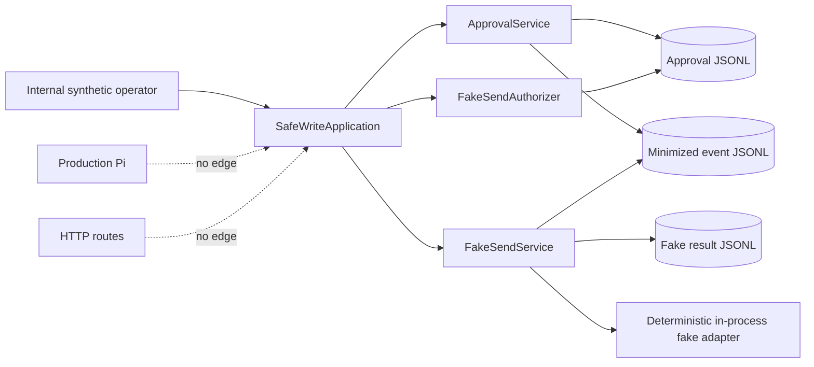

# Session Specification

**Session ID**: `phase01-session06-safe-write-integration-and-evidence`
**Phase**: 01 - Durable Approval and Safe Write
**Status**: Not Started
**Created**: 2026-08-04
**Base Commit**: ae4af5aff10894095eb5043249be4e352e16ac84

---

## 1. Session Overview

This session composes the durable approval store/service, exact approved-action
authorizer, reservation/result store, deterministic fake adapter, and minimized
event store behind one internal application boundary. A deterministic
authorized-operator harness proves the entire fake-write vertical slice without
registering a Pi tool, exposing an HTTP route, selecting a provider, or making a
network write.

The production allowlist decision is explicit: keep fake execution excluded.
No human review is fabricated by autonomous work. The repository maintainer is
the required reviewer before any future write-capable registration or allowlist
change; because this session makes no such change, the safe gate remains closed.

## 2. Objectives

1. Add one internal composition boundary that owns approval request/decision,
   exact authorized execution, and durable file/event wiring.
2. Prove every Task `03` required path plus rejected-result evidence through
   real file-backed adapters and independent application instances.
3. Record the permission/tool/diff review status and a machine-testable decision
   that production fake/write capability remains absent.
4. Complete Week 2 evidence and close Phase 01 only after full verification,
   production-agent verification, security/privacy review, and documentation
   synchronization pass.

## 3. Prerequisites

- [x] Session 05 is pushed at `ae4af5a` with durable idempotency, timeout,
  restart, downstream-failure, and one-effect tests passing.
- [x] Durable approval projections resolve exact immutable approved state after
  restart and deny invalid state before an effect.
- [x] The required future human-review owner is the repository maintainer; no
  autonomous human-review claim or write-capable allowlist change is permitted.
- [x] Baseline passes 140/140 tests, 5/5 evals, and dependency audit with the
  exact frozen three-tool production allowlist.

## 4. Scope

### In Scope

- `SafeWriteApplication` (or equivalently focused name) that composes one
  `JsonlEventStore`, `FileApprovalStore`, `ApprovalService`,
  `FakeSendAuthorizer`, `FileFakeSendResultStore`, and `FakeSendService`.
- Closed explicit paths and dependency options for deterministic tests while
  keeping authorization actor sets application-owned and snapshotted.
- Internal methods for approval request, approval decision, approval read/list,
  and fake execution; no transport or Pi adapter.
- A closed permission decision stating no fake-send tool is registered or
  production-allowlisted and human review is required before either changes.
- End-to-end file-backed tests for valid approval, missing input, target
  mismatch, pending/declined state, timeout, duplicate/restart, permission
  denial, downstream failure, and rejected outcome.
- Proof that validation, actor authorization, exact approval/target identity,
  and durable reservation all precede the deterministic fake effect.
- Cross-file result/event agreement, minimized evidence, exact line counts,
  no second effect, late-settlement suppression, and restart projection.
- Complete Task `03` permission table, stable-key proof, test matrix, redacted
  event examples, failure guidance, explicit review/allowlist decision,
  verification output, and final diff review.
- Phase 01 closeout documents and version metadata after session validation.

### Out Of Scope

- Any Pi fake-send/write tool, production allowlist expansion, prompt change,
  public/private HTTP write route, actor authentication, or tenant boundary.
- Real send provider, SDK, credential, DNS/socket/HTTP write, subprocess, real
  message, or customer/personal data.
- Multi-process/distributed claim safety, lease expiry, automatic indeterminate
  retry, compensation, record repair tooling, or transactional cross-file log.
- Whole-run replay/resume, production eval gates, Phase 02 planning/building, or
  any Phase 02 artifact.

## 5. Technical Approach

### Internal Composition

Construct file adapters once per application instance and share approval/event
truth across the approval and fake execution services. Snapshot actor sets at
composition so later caller mutation cannot expand permission. Delegate to the
already reviewed services rather than duplicating authorization or persistence
logic.

### Permission Decision

Expose a frozen, closed constant with `registered: false`,
`productionAllowlisted: false`, and `humanReviewRequiredBeforeChange: true`.
Tests compare it with the exact production tool allowlist and inspect Pi/HTTP
source composition. This is evidence of a denied capability, not a substitute
for authentication or a human review.

### End-To-End Matrix

Use temporary directories and actual JSONL adapters. Create pending approvals
through the application boundary, decide through an authorized synthetic
reviewer, and execute through an authorized synthetic operator. Inject only the
adapter/clock/ID dependencies needed to deterministically force accepted,
rejected, timeout, and downstream outcomes. Reconstruct a new application on
the same paths for duplicate/restart proof.

## 6. Deliverables

| File | Purpose |
|------|---------|
| `src/safe-write-application.ts` | Internal durable approval-to-fake-execution composition and frozen permission decision |
| `tests/safe-write-application.test.ts` | Complete Task `03` file-backed vertical-slice matrix and production exclusion proof |
| `docs/build-log-week2.md` | Consolidated implementation, permission, evidence, failure, review, and verification record |
| `docs/ARCHITECTURE.md`, `docs/development.md`, `docs/environments.md` | Current internal composition, safe usage, paths, and exclusions |
| `docs/TODO.md`, `docs/CHANGELOG.md`, README | Phase/session tracking and completed bounded behavior |
| Session workflow reports | Planning, implementation, review, security, validation, and closeout evidence |

## 7. Success Criteria

### Functional

- [ ] Valid approved synthetic action produces one accepted fake result with
  matching durable approval/result/event evidence.
- [ ] Missing input, target mismatch, pending/declined approval, and permission
  denial invoke the fake adapter zero times.
- [ ] Timeout, rejected, and downstream paths persist and return exact typed
  terminal results without false completion.
- [ ] A duplicate across a new application instance returns the exact original
  result with one total effect and no new result records.
- [ ] Approval, event, and result files reconstruct the exact expected state and
  contain only the documented synthetic/minimized fields.

### Permission And Quality

- [ ] Production registration and allowlisting remain false; exact Pi allowlist,
  prompt, and HTTP routes are unchanged.
- [ ] The conditional human gate names the repository maintainer, states that no
  human review occurred, and blocks any future write-capable change until one is
  recorded.
- [ ] Contract-first RED precedes application composition and every Task `03`
  required path has deterministic direct coverage.
- [ ] No dependency, provider, credential, subprocess, network, real data,
  distributed-safety, compensation, or Phase 02 capability/artifact is added.
- [ ] Formatting, strict types, full tests/evals, dependency audit,
  production-agent verification, ASCII/LF, security/privacy, persistence,
  permission, and complete-diff review gates pass.

## 8. Assumptions And Conflict Resolutions

- Task `03` says a network-writing Pi tool may be added only after safety and
  human review. The master PRD and strict user cutoff prohibit real network
  capability here, so no such tool is created and the allowlist decision is
  `excluded`.
- Session 06 asks for a recorded human review while the requested run is
  autonomous. Truthful completion records the untriggered conditional gate and
  named future reviewer role; it never labels AI review as human review.
- The internal operator actor ID is a deterministic test/harness permission,
  not authenticated identity. Absence of a transport keeps it unreachable from
  the current public runtime.
- Phase completion may document Phase 02 as the next phase name already present
  in the master roadmap, but must not create, edit, split, plan, or build Phase
  02 work.

## 9. Next Step

Run `implement` for Session 06. Do not run `phasebuild` or begin Phase 02.
