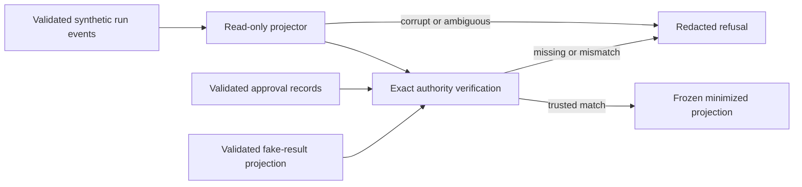

# Security & Compliance Report

**Session ID**: `phase02-session02-run-projection-and-corruption-refusal`
**Reviewed**: 2026-08-11
**Result**: PASS

## Scope

**Files reviewed**:

- `src/run-projection.ts` - closed projection, checkpoint, terminal, authority,
  failure, pure fold, and store-backed read contracts.
- `tests/run-projection.test.ts` and `tests/run-event-test-helpers.ts` -
  deterministic trust, ordering, authority, corruption, restart, and mutation
  evidence.
- `docs/build-log-week3.md`, `docs/TODO.md`, and `docs/CHANGELOG.md` -
  implemented projection boundary, active status, and release evidence.
- Session specification, checklist, notes, and resolved code review plus Phase
  02 workflow state.

**Review method**: Static analysis of the exact base-commit surface, focused
trust and authority tests, complete verification and coverage, dependency
audit, exact permission inspection, sensitive-data and capability scans,
restart and damaged-history exercises, and the Apex security/GDPR checklist.

## Evidence

- Command/check: `npm run verify` and `npm run test:coverage`.
  - Result: PASS.
  - Evidence: format, lint, strict TypeScript, 198/198 deterministic tests,
    5/5 evals, 95.87% lines, 85.12% branches, and 97.14% functions pass.
- Command/check: `npm audit --omit=dev`.
  - Result: PASS.
  - Evidence: npm reports zero vulnerabilities and no dependency changed.
- Command/check: exact static assertion of `PRODUCTION_TOOL_NAMES`.
  - Result: PASS.
  - Evidence: the allowlist remains `qualify_lead`, `draft_follow_up`, and
    `request_send_approval` in that order.
- Command/check: production composition diff from base and capability scan of
  the new source.
  - Result: PASS.
  - Evidence: zero Pi, HTTP, tool, approval, fake-send, or safe-write
    composition changes and zero process, shell, HTTP-client, or network
    primitives in the projector.
- Command/check: sensitive-name, ASCII, CRLF, whitespace, and Markdown target
  scans.
  - Result: PASS.
  - Evidence: no credential value, non-ASCII byte, CRLF, whitespace error, or
    missing relative target was found.
- Targeted inspection: observed event state versus dedicated approval and
  fake-result truth.
  - Result: PASS.
  - Evidence: unverified approval cannot produce trusted `approved` state, and
    an unverified accepted event remains `effect_indeterminate`; verified
    authority requires exact identity, result, duration, and temporal order.

## Security Assessment

### Overall: PASS

| Category | Status | Severity | Details |
|----------|--------|----------|---------|
| Injection | PASS | -- | No SQL, shell, command, template, LDAP, provider, or network interpreter is introduced; unknown input crosses TypeBox and semantic guards. |
| Authorization | PASS | -- | Operational events remain observation only; exact dedicated approval and fake-result records own permission and effect truth. |
| Sensitive Data Exposure | PASS | -- | Context contains bounded identifiers, qualification facts, draft hash, and observed state, but no transcript, full draft, lead profile, credential, raw Pi object, or caught detail. |
| Hardcoded Secrets | PASS | -- | Scans found no credential or private-key value; all fixtures use synthetic identifiers. |
| Failure Handling | PASS | -- | Failures are canonical and redacted; corrupt, interrupted, duplicate, ordered, authority, and unavailable states remain distinguishable without partial output. |
| Mutation Safety | PASS | -- | Inputs are cloned before validation and successful projections are deeply frozen. |
| Persistence Trust | PASS | -- | Store outcomes are runtime validated; structural store failures preserve actionable projection categories. |
| Availability | PASS | -- | Projection is synchronous, read-only, bounded by closed array/schema limits, and not exposed through HTTP; whole-run step/deadline bounds remain Session 03. |
| Dependencies | PASS | -- | No dependency changed and npm reports zero vulnerabilities. |
| Security Misconfiguration | PASS | -- | No route, credential, environment variable, file writer, tool permission, provider, or deployment setting changed. |

### Security Findings

No unresolved security findings. Code review repaired one high and three medium
trust defects before validation: unverified lifecycle elevation, unbound
not-found evidence, collapsed structural failures, and future-dated result
authority. Every repair has a deterministic regression.

## Data Flow and Trust Boundaries

- Event records own run lifecycle and observable checkpoints.
- Approval records own human authorization.
- Fake-result projections own reservation and effect identity.
- The projector owns no permission transition or side effect.
- A failure returns no partial projection value.

## Privacy and Data Minimization

The working context retains only:

- run, lead, event, draft, approval, and idempotency identities;
- qualification result or canonical failure;
- draft SHA-256, never draft content;
- observed approval/fake status and verified authority status;
- checkpoint, terminal, event count, and last event identity.

It excludes raw conversation history, assistant output, lead name/company,
contact data, full follow-up content, credentials, request headers, SDK payloads,
stack traces, filesystem paths, and arbitrary dependency messages.

## GDPR Compliance Assessment

### Overall: N/A

Session 02 introduces no real personal-data collection, purpose, consent,
retention, erasure, access, or third-party transfer behavior. All test and
documentation evidence is synthetic, and real customer data remains
prohibited.

**Categories reviewed**: Data Collection & Purpose, Consent Mechanism, Data
Minimization, Right to Erasure, PII in Logs, and Third-Party Data Transfers.

### Personal Data Inventory

No real personal data is collected or processed in this session.

### GDPR Findings

No GDPR findings within the synthetic-only scope. Task `04` retention,
redaction, deletion, and recovery policy remains assigned to Session 04 before
real data can be considered.

## Remaining Conditions

- Session 03 must preserve the projection's trusted status and canonical
  failure semantics while adding step/deadline bounds.
- Session 04 must require verified dedicated authority before any recovery
  action, stop on an indeterminate fake reservation, and document retention and
  deletion policy.
- The current single-process, no-real-write, synthetic-only boundary must
  remain explicit until later production evidence changes it.

These are later-session acceptance conditions, not unresolved Session 02
defects.

## Sign-Off

- **Result**: PASS
- **Reviewed by**: AI validation (`validate`)
- **Date**: 2026-08-11
