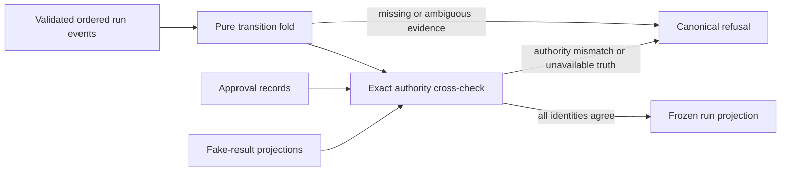

# Session Specification

**Session ID**: `phase02-session02-run-projection-and-corruption-refusal`
**Phase**: 02 - Recovery and Evaluation Gates
**Status**: Not Started
**Created**: 2026-08-11
**Base Commit**: 918bc4c2970711751296f3c015ce185ae87acfd4

---

## 1. Session Overview

This session turns the closed, durable event history from Session 01 into one
deterministic, read-only run projection. The projection reports lifecycle
state, terminal outcome, latest safe recovery checkpoint, and minimized
replaceable working context only when the complete ordered evidence is
unambiguous.

The projector fails closed on missing prerequisites, incompatible branches,
cross-run identity, duplicate terminal evidence, and event or authority-store
identity disagreement. Approval records and fake-result projections remain the
only authorization and idempotency truth: operational events may make those
facts observable, but can never grant permission or prove an effect.

---

## 2. Objectives

1. Define closed lifecycle, checkpoint, terminal, working-context, authority,
   and actionable projection-failure contracts.
2. Fold one complete validated ordered run history through explicit legal
   transitions with no transcript or mutable in-memory dependency.
3. Cross-check approval and fake-result evidence by exact identity without
   confusing operational observation with authority.
4. Prove restart equivalence and visible refusal for corrupt, incomplete,
   duplicated, conflicting, cross-run, and out-of-order evidence.

---

## 3. Prerequisites

### Required Sessions

- [x] `phase02-session01-durable-run-event-contract-and-store` - Provides the
  closed event union, complete-file validation, durable ordering, and typed
  append/read outcomes.
- [x] `phase01-session03-durable-approval-integration` - Provides exact durable
  approval records and projection semantics.
- [x] `phase01-session05-idempotent-fake-send-execution` - Provides exact fake
  reservation/result identity and indeterminate reservation semantics.

### Required Tools Or Knowledge

- Node.js 24.15 or newer, npm 12.0.2, strict TypeScript, TypeBox, and
  `node:test` through TSX.
- Task `04`, Phase 02 PRD, repository governance, Session 01 event contracts,
  and Phase 01 approval and fake-result authority contracts.

### Environment Requirements

- `npm run verify` passes at the Session 02 base commit.
- `.spec_system/scripts/check-prereqs.sh --json --env` reports pass.
- Fixtures remain synthetic and no provider credential, raw transcript, or
  production record is used.

---

## 4. Scope

### In Scope (MVP)

- Caller receives a frozen success projection or one canonical redacted
  failure; partial or inferred success is never returned.
- Projection explicitly represents running, waiting, completed, and failed
  lifecycle state; safe checkpoints after start, qualification, draft, and
  approval request; terminal outcome and stop reason; and a bounded structured
  working context.
- Event order is checked semantically, including one start, paired
  qualification attempt/outcome, prerequisite identity agreement, monotonic
  progression, one run terminal, and only compatible approval/fake-send
  operational evidence after that terminal.
- Repeated or incompatible qualification, draft, approval, fake-result, and
  terminal evidence is refused when it would make recovery ambiguous.
- All event `runId`, lead, draft, approval, idempotency, and result identities
  are checked at the boundaries where those identities become available.
- Optional approval records and fake-result projections are runtime validated
  and compared exactly with observed events; absence remains untrusted rather
  than becoming permission.
- A store-backed read-only boundary validates the adapter outcome before
  projection and maps dependency throws or malformed outcomes to canonical
  failures.
- Projection is reproducible across new projector and event-store instances
  from the same complete JSONL history.

### Out Of Scope (Deferred)

- Resuming Pi execution, retrying a tool, creating an approval, or invoking a
  fake effect - Session 04 owns recovery execution.
- Whole-run deadlines, step limits, cancellation, and complete attempt/outcome
  instrumentation - Session 03 owns bounded lifecycle behavior.
- Golden-set evaluation and deployment gating - Sessions 05-07 own Task `05`.
- Real data, provider calls, public endpoints, distributed locks, migration of
  legacy event files, and automatic corruption repair.

---

## 5. Technical Approach

### Architecture

Create `src/run-projection.ts` as a Pi-independent pure boundary. Runtime
schemas define the projection input, authority evidence, output, and canonical
failures. A transition fold first clones and validates all external values,
then enforces exact run identity and legal event order before producing a
frozen projection. A thin store-backed function accepts only a valid
`RunEventStore` outcome and never exposes partial history.

The transition fold records only durable facts: run and lead identity,
qualification result, draft identity and hash, approval identity and observed
state, fake-result identity and observed state, last event identity, status,
checkpoint, terminal outcome, and stop reason. Draft content, raw model text,
SDK payloads, credentials, and arbitrary errors never enter working context.

### Legal Transition Model

1. `run.started` is exactly first and unique.
2. `qualification.attempted` may occur once after start and must be followed by
   exactly one matching completion or failure before downstream progress.
3. A successful qualification must name the started lead before a draft may
   exist; a qualification failure can only lead to a compatible terminal stop.
4. One draft may follow successful qualification and must retain exact lead,
   draft, and SHA-256 identity.
5. One approval request may follow the draft and must match run, lead, and
   draft identity. Approval observations never authorize by themselves.
6. Fake-send observations require the matching approval path and consistent
   approval/idempotency identity; exact effect identity remains owned by the
   fake-result store.
7. One compatible `run.completed` or `run.failed` event closes agent execution;
   later core run, qualification, draft, approval-request, or Pi evidence,
   duplicate terminals, and incompatible stop reasons fail. Exact approval
   decisions and fake-send observations may form a legal post-run suffix.
8. Normalized `pi.lifecycle` records are retained as observable sequencing
   evidence before the run terminal but cannot create domain checkpoints or
   authority.

### Design Patterns

- Pure deterministic fold: identical complete input yields deep-equal output.
- Closed transition table: legal predecessor and successor rules are explicit.
- Evidence-before-state: no checkpoint exists until all prerequisites agree.
- Authority separation: operational events observe; dedicated stores decide.
- Clone, validate, freeze: caller mutation and malformed adapters cannot alter
  trusted projection values.
- Actionable redaction: failures identify a stable code and event index or ID
  when safe, without echoing customer or dependency data.

---

## 6. Deliverables

### Files To Create

| File | Purpose | Est. Lines |
|------|---------|------------|
| `src/run-projection.ts` | Closed projection contracts, transition fold, authority cross-checks, and store-backed read boundary | ~500 |
| `tests/run-projection.test.ts` | Contract, legal-order, restart-equivalence, corruption, ambiguity, and identity tests | ~500 |

### Files To Modify

| File | Changes | Est. Lines |
|------|---------|------------|
| `tests/run-event-test-helpers.ts` | Reusable deterministic event-history fixture construction | ~60 |
| `docs/build-log-week3.md` | Projection rules, legal order, context boundary, and refusal examples | ~120 |
| `docs/TODO.md` | Record Session 02 implementation progress | ~3 |
| `docs/CHANGELOG.md` | Record deterministic projection and corruption refusal | ~6 |

---

## 7. Success Criteria

### Functional Requirements

- [ ] The same complete event history produces the same frozen lifecycle,
  checkpoint, terminal outcome, and working context after restart.
- [ ] Qualification, draft, and approval-request checkpoints are explicit and
  require all exact prerequisite identities.
- [ ] Missing start or prerequisite, cross-run identity, invalid timestamp or
  order, duplicate or conflicting evidence, incompatible terminal, illegal
  core evidence after terminal, and invalid post-run operational evidence
  return canonical failure with no projection value.
- [ ] Approval or fake-send events alone never grant authorization or prove an
  effect; supplied dedicated records must validate and match exactly.
- [ ] The projection contains no transcript, full draft, credential, raw SDK
  payload, arbitrary dependency message, or invented fact.

### Testing Requirements

- [ ] Contract-first tests cover every public schema, guard, failure, frozen
  outcome, and caller-mutation boundary.
- [ ] Legal-order tests cover start, qualification success/failure, draft,
  approval observation, fake-result observation, completion, and failure.
- [ ] Refusal tests cover empty, malformed, cross-run, missing, duplicate,
  conflicting, out-of-order, post-terminal, and mismatched authority evidence.
- [ ] A real private JSONL fixture rebuilt through fresh store and projector
  instances produces deep-equal projections.
- [ ] Existing event, approval, fake-send, permission, and full verification
  suites remain green.

### Non-Functional Requirements

- [ ] The projector performs no write, effect, permission transition, model
  invocation, or network operation.
- [ ] Failure messages are bounded and canonical; optional location fields are
  identifiers or indexes only.
- [ ] Inputs and returned outputs are defensively copied and deeply frozen.
- [ ] The production Pi allowlist remains exactly three tools and fake execution
  remains unreachable from Pi and HTTP.

### Quality Gates

- [ ] All files are ASCII-encoded with Unix LF line endings.
- [ ] Code follows strict TypeScript, ESM, naming, and testing conventions.
- [ ] Behavioral quality trust, permission, recovery, persistence, failure, and
  contract checks pass.

---

## 8. Implementation Notes

### Working Assumptions

- A projection may represent an active incomplete run when its prefix is
  internally ordered and unambiguous. An open qualification attempt remains
  visible without advancing the safe checkpoint, and an attempted fake effect
  remains visibly indeterminate; a result without its prerequisite, partial
  authority identity, or incompatible terminal is corruption.
- The latest safe checkpoint is the last fully evidenced domain milestone, not
  the last event. `pi.lifecycle` and operational failure events do not advance
  it.
- One qualification, draft, and approval path is sufficient for the workshop
  run model. Repeated domain milestones are refused in this session instead of
  being interpreted as retries; Session 03 will add explicit attempt/outcome
  instrumentation before broader retry semantics exist.
- `run.completed` stop reasons retain the Session 01 vocabulary. Session 03 may
  extend the closed event contract for deadline and step-limit reasons.

### Conflict Resolutions

- Task `04` calls the event log the source of truth, while Phase 01 makes
  approval and fake-result stores authoritative. Events own lifecycle and
  checkpoint projection; exact dedicated records own authorization and effect
  identity. A disagreement fails closed.
- The session stub asks for cross-store validation when durable records are
  supplied to recovery policy, but resume policy is deferred. This session
  implements pure authority-evidence hooks and tests them without making a
  recovery action.
- Event-store structural ordering already rejects decreasing per-run times.
  This projector adds semantic domain ordering and repeats timestamp checks at
  the trust boundary so injected adapters cannot bypass store guarantees.

### Risks And Mitigations

- **Plausible state from incomplete evidence**: every milestone requires exact
  predecessors; dangling or conflicting evidence returns no projection.
- **Audit event grants permission**: projection uses separate observed and
  authoritative fields and never exposes an authorization decision from events.
- **Cross-store identity drift**: compare run, lead, draft, hash, approval, and
  idempotency identities before accepting authority evidence.
- **Mutable caller input changes recovery**: clone before validation and deep
  freeze all successful outputs.
- **Over-retained working context**: whitelist structured durable identifiers
  and results; never carry full draft content or transcript material.

---

## 9. Testing Strategy

### Unit Tests

- Projection schema and canonical failure validation.
- Every legal prefix and terminal transition.
- Checkpoint and structured-context derivation.
- Mutation, malformed adapter, and thrown dependency handling.

### Integration Tests

- Fresh `JsonlEventStore` instances reading one private JSONL history.
- Exact approval-record and fake-result-projection cross-checks.
- Existing event producer histories projected without permission changes.

### Edge Cases

- Empty history; start not first; duplicate start or terminal; illegal core
  event after terminal; result without attempt; open attempt without checkpoint
  advancement; draft without successful qualification; approval without draft;
  fake result without approval; legal approval/fake-send evidence after the run
  terminal.
- Equal timestamps in deterministic file order; decreasing timestamps;
  syntactically valid event for another run; mismatched lead, draft, hash,
  approval, idempotency, or authority status.
- Malformed, cloned-throwing, or mutation-prone inputs and adapter outcomes.

### Verification Commands

- `npx tsx --test tests/run-projection.test.ts tests/run-event.test.ts tests/event-store.test.ts`
- `npm run check`
- `npm run test`
- `npm run eval`
- `npm run verify`
- `npm audit --omit=dev`
- Production-agent verification skill checks and repository permission/data
  scans.

---

## 10. Definition Of Done

- [ ] All 18 tasks complete with evidence in `implementation-notes.md`.
- [ ] Projection and authority contracts are closed, runtime validated, and
  documented.
- [ ] Restart equivalence and the full corruption/refusal matrix pass.
- [ ] Approval and fake-result authority remain unchanged and separately
  evidenced.
- [ ] Documentation, TODO, and changelog match implemented behavior.
- [ ] Review, security/compliance validation, and full verification pass.

---

## 11. Next Session Preview

Session 03 will extend the durable lifecycle with complete attempt/outcome
instrumentation, maximum-step enforcement, whole-run deadline cancellation,
one terminal stop event, and late-settlement suppression. It will consume this
projection but will not weaken its corruption or authority checks.
