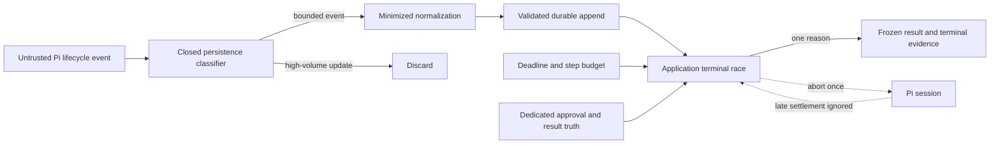

# Security & Compliance Report

**Session ID**: `phase02-session03-bounded-run-lifecycle`
**Reviewed**: 2026-08-11
**Result**: PASS

## Scope

**Files reviewed**:

- `src/run-lifecycle.ts`, `src/pi-agent.ts`, `src/run-event.ts`, and
  `src/run-projection.ts` - bound validation, lifecycle race, minimized Pi
  evidence, composition, schema-v2 terminals, and projection rules.
- Lifecycle, Pi, event, and projection tests - deterministic boundary,
  failure, correlation, late-settlement, permission, and regression evidence.
- Runtime/operator documentation, cumulative considerations and security
  posture, session specification/checklist/notes/summary, and resolved review.

**Review method**: Exact base-commit diff review, focused boundary tests, full
verification and coverage, dependency audit, exact permission inspection,
sensitive-data/capability/encoding scans, hostile timer/session/store exercises,
and the Apex security/GDPR checklist.

## Evidence

- Command/check: `npm run verify` and `npm run test:coverage`.
  - Result: PASS.
  - Evidence: format, lint, strict TypeScript, 221/221 deterministic tests, 5/5
    evals, 96.96% lines, 85.71% branches, and 97.47% functions pass.
- Command/check: `npm audit --omit=dev`.
  - Result: PASS.
  - Evidence: npm reports zero vulnerabilities and no dependency changed.
- Command/check: exact `PRODUCTION_TOOL_NAMES` assertion plus permission tests.
  - Result: PASS.
  - Evidence: the allowlist remains `qualify_lead`, `draft_follow_up`, and
    `request_send_approval` in that order; fake/write execution remains absent.
- Command/check: production composition and capability scan.
  - Result: PASS.
  - Evidence: no shell, process, filesystem tool, HTTP client, socket, fake
    effect, safe write, credential, or approval-decision capability was added.
- Command/check: sensitive-name/value, ASCII, CRLF, whitespace, and Markdown
  target scans.
  - Result: PASS.
  - Evidence: no credential value, non-ASCII byte, carriage return, whitespace
    error, or missing relative target was found.
- Targeted inspection: terminal race and evidence volume.
  - Result: PASS.
  - Evidence: one immutable application winner owns abort, cleanup, terminal
    evidence, and returned reason; high-volume SDK updates are not persisted.

## Security Assessment

### Overall: PASS

| Category | Status | Severity | Details |
|----------|--------|----------|---------|
| Injection | PASS | -- | No SQL, shell, command, template, process, or network interpreter is introduced; replaceable input crosses closed runtime validation. |
| Authorization | PASS | -- | Pi retains exactly three non-effect tools; lifecycle observations cannot decide approval or prove a fake effect. |
| Sensitive Data Exposure | PASS | -- | Evidence uses bounded identifiers, codes, counts, versions, usage, and cost only; it excludes prompt/transcript text, raw arguments/results, drafts, profiles, credentials, and dependency prose. |
| Hardcoded Secrets | PASS | -- | Scans found no credential/private-key value; tests and docs use synthetic identifiers. |
| Failure Handling | PASS | -- | Deadline, step, dependency, and storage paths are canonical; a missing terminal cannot become completion and late settlement is ignored. |
| Mutation Safety | PASS | -- | Bounds and public outcomes are frozen; completion values are cloned and deeply frozen before return. |
| Persistence Trust | PASS | -- | Lifecycle append outcomes must match exact input; open tool attempts receive one stopped outcome before the bounded terminal. |
| Availability | PASS | -- | Whole setup/prompt/application work has positive bounded time and steps; provider update noise is filtered before synchronous durable storage. |
| Dependencies | PASS | -- | No dependency changed and npm reports zero vulnerabilities. |
| Security Misconfiguration | PASS | -- | Invalid bounds fail before IDs, paths, stores, sessions, timers, listeners, or runtime files are created. |

### STRIDE Review

| Threat | Status | Evidence |
|--------|--------|----------|
| Spoofing | PASS | Runtime events cannot grant human approval; exact dedicated approval/result identities remain authoritative. |
| Tampering | PASS | Schema-v2 events and exact append outcomes fail closed; projection rejects incompatible or late core evidence. |
| Repudiation | PASS | Run, tool call, step, duration, version, attempt/outcome, and one terminal identity remain durable and correlated. |
| Information disclosure | PASS | Normalization is whitelist-based and strips content, arbitrary messages, arguments, results, stacks, and credentials. |
| Denial of service | PASS for controlled scope | Deadline/step bounds and high-volume update filtering bound provider work/evidence; public identity/shared quota remain SC-001. |
| Elevation of privilege | PASS | No new tool, route, actor authority, approval transition, fake execution, or network capability exists. |

### Security Findings

No unresolved security finding. Code review repaired one high availability
defect, one medium terminal-consistency defect, and one low governance-ledger
defect before validation. Each code repair has deterministic regression
coverage; the cumulative ledger now accurately marks SC-004 resolved.

## Data Flow and Trust Boundaries

- Pi events are untrusted observations, not permission or effect authority.
- Dedicated approval and fake-result stores remain separate truth boundaries.
- The application owns deadline, step count, abort request, terminal, and
  returned reason.
- A storage failure returns no trustworthy completion.

## Privacy and Data Minimization

New lifecycle evidence may retain only bounded run/event/tool/call/message
identifiers, source type, step, duration, retry count, closed result/error/stop
codes, model/prompt/application versions, token counts, and cost when available.
Unavailable fields are explicit `null`.

It excludes prompts, assistant text, raw model messages, streaming deltas, tool
arguments/results, full drafts, lead names/companies/contact data, approval
content, credentials, headers, stack traces, filesystem paths, and arbitrary
dependency messages.

## GDPR Compliance Assessment

### Overall: N/A

Session 03 introduces no real personal-data collection, purpose, consent,
retention, access, erasure, export, backup, or third-party-transfer behavior.
All deterministic evidence is synthetic and real customer data remains
prohibited by SC-002.

### Personal Data Inventory

No real personal data is collected or processed in this session.

### GDPR Findings

No GDPR finding within the controlled synthetic scope. Session 04 still owns
recovery-aligned retention, deletion, and operator policy; SC-002 remains a
release blocker before real data.

## Remaining Conditions

- Keep `/runs` controlled until caller identity, authorization, tenant,
  distributed-rate, and edge controls close SC-001.
- Keep data synthetic until automated lifecycle, scoped export/erasure,
  backup/restore, lawful-basis, and provider-transfer controls close SC-002.
- Keep fake/write execution unreachable until distributed idempotency and
  explicit maintainer authorization close SC-006.
- Session 04 must classify recovery from trusted projection, preserve the
  original run identity, and stop on indeterminate effect reservations.
- Sessions 05-07 must add deterministic production-eval contracts and critical
  deployment gates without requiring provider credentials in CI.

These are later release conditions, not unresolved Session 03 defects.

## Sign-Off

- **Result**: PASS
- **Reviewed by**: AI independent review (`creview`)
- **Date**: 2026-08-11
