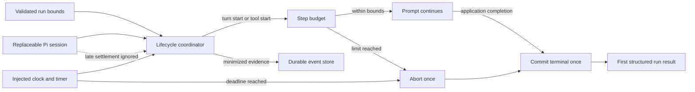

# Session Specification

**Session ID**: `phase02-session03-bounded-run-lifecycle`
**Phase**: 02 - Recovery and Evaluation Gates
**Status**: Complete
**Created**: 2026-08-11
**Completed**: 2026-08-11
**Validated**: 2026-08-11
**Base Commit**: c39f94b2ddb95b338bdfb4548235d85fb82bdb74

---

## 1. Session Overview

This session makes the production-agent run lifecycle application-owned and
bounded. One validated whole-run deadline and one maximum-step budget govern
the model turn and tool-start boundaries, while durable evidence records the
same `runId`, step, timing, attempt, outcome, and one terminal result.

The lifecycle coordinator is independent from provider prose and accepts
replaceable session, timer, clock, and event-store boundaries. It aborts once,
persists once, and returns the first application-decided result even when a Pi
prompt or tool settles late. Existing approval and fake-result stores remain
the only authorization and effect truth, and the Pi allowlist remains exactly
three tools.

---

## 2. Objectives

1. Define closed positive bounds, step semantics, terminal stop reasons, and
   minimized lifecycle evidence.
2. Implement deterministic abort-once, terminal-once run coordination around
   the existing Pi session without provider-dependent tests.
3. Record complete Pi tool attempts and outcomes, including application-made
   synthetic outcomes for work open at a bounded stop.
4. Prove completion, deadline, late settlement, step exhaustion, dependency
   failure, invalid configuration, and event-storage failure behavior.

---

## 3. Prerequisites

### Required Sessions

- [x] `phase02-session02-run-projection-and-corruption-refusal` - Provides the
  trusted lifecycle projection and closed terminal invariants.
- [x] `phase02-session01-durable-run-event-contract-and-store` - Provides the
  versioned minimized envelope and hardened append-only store.
- [x] `phase01-session05-idempotent-fake-send-execution` - Provides the proven
  abort-once, persist-once, late-result suppression pattern.

### Required Tools Or Knowledge

- Node.js 24.15 or newer, npm 12.0.2, strict TypeScript, TypeBox, and
  `node:test` through TSX.
- Pi Coding Agent SDK 0.83.0 session events and awaitable `session.abort()`.
- Task `04`, Phase 02 PRD, repository governance, and Session 02 projection
  handoff.

### Environment Requirements

- `npm run verify` passes at the Session 03 base commit with 198 tests and 5/5
  deterministic evals.
- `.spec_system/scripts/check-prereqs.sh --json --env` reports pass.
- Tests use injected sessions and fake time only; no provider credential or
  network effect is required.

---

## 4. Scope

### In Scope (MVP)

- Closed application configuration for `RUN_DEADLINE_MS` and `RUN_MAX_STEPS`
  with bounded integer defaults and fail-fast environment validation.
- Invalid bounds fail before event paths, stores, resource loaders, sessions,
  timers, listeners, or durable runtime files are created.
- Exactly `turn_start` and `tool_execution_start` consume one step each.
  Agent, message, streaming update, tool update/outcome, turn outcome, retry,
  settlement, and disposal events do not consume the budget.
- High-volume `message_update`, `tool_execution_update`, queue, entry, and bash
  update events are neither charged nor persisted. Bounded agent/turn/message
  boundary, tool attempt/outcome, retry, compaction, and model-selection events
  remain minimized durable evidence.
- Closed `deadline_exceeded`, `step_limit_exceeded`, `dependency_failed`, and
  existing completed terminal semantics with one terminal event.
- A Pi-independent lifecycle coordinator with injected clock, timer, session,
  event append/read, ID/version, and post-prompt completion boundaries.
- Minimized Pi evidence with step number, duration, retry count, model/prompt/
  application versions, token usage, and cost represented when available and
  explicit `null` otherwise.
- Every Pi tool start produces one matching outcome. Normal Pi outcomes retain
  `isError`; an open call at deadline or step stop receives one canonical
  application-generated stopped outcome without raw arguments or results.
- Application-owned abort executes at most once. The first terminal decision
  wins, late prompt/tool settlement is ignored, listeners are removed, timers
  are cleared, and the session is disposed once.
- Limit and dependency results are structured non-success outcomes and cannot
  become successful completion from assistant prose.
- Existing tool/domain attempt and outcome events remain authoritative for
  validation, permission, storage, timeout, and dependency details; the Pi
  lifecycle pair supplies complete call-level correlation.
- Run projection accepts bounded terminal events and refuses core late evidence
  or duplicate terminals.
- Deterministic focused and integration tests plus Week 3 Build Log evidence.

### Out Of Scope (Deferred)

- Replaying or resuming an interrupted run - Session 04 owns execution from a
  trusted checkpoint.
- Automatic retries, compensation, public cancellation, distributed workers,
  provider-specific token/cost budgets, or a real network effect.
- Production eval contracts and deployment gates - Sessions 05-07 own Task
  `05`.

---

## 5. Technical Approach

### Architecture

Create `src/run-lifecycle.ts` as the provider-independent coordination layer.
It validates configuration, normalizes bounded lifecycle evidence, counts
steps, tracks open tool calls, owns the deadline timer, requests one abort, and
commits one terminal outcome through a runtime-validated append boundary.
`src/pi-agent.ts` becomes a thin production composition that constructs Pi only
after configuration succeeds and delegates prompt execution to the lifecycle.

### Terminal Ownership

1. Configuration validates before any runtime construction.
2. `run.started` is persisted before the prompt and uses the generated run ID.
3. A deadline timer and Pi listener are installed only for the active run.
4. Each budget-consuming event increments the step before its lifecycle event
   is persisted. Reaching the configured maximum decides
   `step_limit_exceeded` and requests abort once.
5. Deadline expiry decides `deadline_exceeded` and requests abort once.
6. Prompt completion is not terminal by itself: application evidence is read
   and validated before deciding an existing completed stop reason.
7. Dependency or evidence failure decides `dependency_failed`; storage failure
   remains a thrown availability error when the terminal itself cannot be
   durably proven.
8. The first terminal decision is immutable. A late resolve, reject, tool
   outcome, or agent event cannot append evidence, change the result, or create
   another terminal.

### Design Patterns

- Validate-before-effects: environment input is closed before any object with
  I/O or timer behavior is constructed.
- Explicit step classifier: only named Pi source events consume budget.
- Race winner token: deadline, step limit, prompt completion, and dependency
  failure contend for one application-owned terminal decision.
- Abort once and settle independently: result delivery does not wait forever
  for a provider that ignores cancellation.
- Persist once: terminal append is guarded separately from abort and return.
- Evidence minimization: no prompt, raw arguments, raw tool result, transcript,
  stack, credential, or dependency prose enters lifecycle events.

---

## 6. Deliverables

### Files To Create

| File | Purpose | Est. Lines |
|------|---------|------------|
| `src/run-lifecycle.ts` | Bounds, step classification, lifecycle coordination, terminal-once behavior, and injected contracts | ~450 |
| `tests/run-lifecycle.test.ts` | Configuration, completion, deadline, step, late-settlement, tool-pair, terminal, and storage tests | ~500 |

### Files To Modify

| File | Changes | Est. Lines |
|------|---------|------------|
| `src/run-event.ts` | Closed bounded-terminal variants and step metadata | ~50 |
| `src/run-projection.ts` | Project bounded terminal outcomes and reject late core evidence | ~40 |
| `src/pi-agent.ts` | Validate bounds first and compose the injected bounded lifecycle around Pi | ~140 |
| `tests/run-event.test.ts` | Terminal and metadata contract coverage | ~40 |
| `tests/run-projection.test.ts` | Bounded terminal projection and duplicate/late refusal | ~45 |
| `tests/pi-agent.test.ts` | Stop-reason/result and exact allowlist regressions | ~30 |
| `docs/build-log-week3.md` | Step rules, terminal timeline, race proof, and verification evidence | ~100 |
| `docs/TODO.md` | Record Session 03 implementation progress | ~3 |
| `docs/CHANGELOG.md` | Record bounded lifecycle behavior | ~6 |

---

## 7. Success Criteria

### Functional Requirements

- [x] Every composed run completes within the configured deadline and maximum
  steps or returns the exact non-success bounded stop reason.
- [x] Deadline, step-limit, dependency-failure, and normal completion paths
  persist exactly one compatible terminal event under the original `runId`.
- [x] Invalid bounds fail before runtime construction and leave files, timers,
  sessions, and listeners untouched.
- [x] Every observed Pi tool attempt has exactly one correlated outcome; open
  work at application stop receives one minimized synthetic stopped outcome.
- [x] Late settlement cannot append a second terminal or alter the returned
  result.
- [x] Permission denial, timeout, storage failure, missing evidence, and
  dependency failure cannot be mapped to completion by model text.

### Testing Requirements

- [x] Contract-first tests cover bounds, source-event classification, terminal
  variants, metadata, closed outcomes, freeze, and hostile dependency values.
- [x] Fake-time tests cover exact deadline, earlier completion, late resolve,
  late reject, abort rejection, and timer/listener cleanup.
- [x] Step tests cover exact limit, model/tool counting,
  excluded high-volume events, open tool synthesis, and same-run correlation.
- [x] Failure tests cover prompt, append, read, post-processing, malformed
  replaceable outcomes, duplicate terminal attempts, and terminal append
  failure.
- [x] Existing projection, event, approval, fake-send, qualification, HTTP
  permission, and exact three-tool regressions remain green.

### Non-Functional Requirements

- [x] Required tests are provider-independent and use no real credential,
  network, wall-clock delay, transcript, or customer data.
- [x] Public failures and durable evidence are bounded, canonical, and free of
  raw dependency messages, arguments, results, stack traces, and secrets.
- [x] The production Pi allowlist remains exactly three tools and no fake send
  becomes reachable from Pi or HTTP.
- [x] Source and documentation remain ASCII with Unix LF line endings.

### Quality Gates

- [x] Focused tests, `npm run verify`, coverage, dependency audit, production
  boundary verification, security scans, and final diff review pass.
- [x] Behavioral quality trust, permission, recovery, persistence, failure,
  deadline, and contract checks pass.

---

## 8. Implementation Notes

### Working Assumptions

- A step is work initiation, not every emitted SDK event. One model turn and
  one tool call each consume one step; their completion/update notifications
  do not double charge the same work.
- The maximum is inclusive: the model or tool start that reaches `maxSteps` is
  recorded and immediately becomes `step_limit_exceeded`; no event with a step
  above the configured maximum is accepted.
- An awaitable Pi abort is requested but result delivery is controlled by the
  application terminal decision; an uncooperative provider cannot hold the
  HTTP caller indefinitely after the deadline.
- Existing domain tool events carry canonical validation and permission
  details. Pi start/end evidence supplies the universal attempt/outcome pair
  without duplicating or weakening domain authority.
- Tokens and cost are `null` unless the normalized SDK boundary can provide
  validated values; unavailable never means zero.

### Conflict Resolutions

- Session 02 currently models `run.failed` only as `agent_run_failed` and
  `run.completed` for domain stop reasons. Session 03 adds `run.stopped` for
  deadline, step-limit, and dependency failures so bounds cannot be mislabeled
  as completion while existing domain stops retain their compatible contract.
- The Session stub asks for a completed terminal variant. Existing
  `run.completed` remains that closed variant; it is extended by application
  coordination rather than replaced.
- Event-store failure can prevent durable terminal proof. In that case the
  lifecycle must never manufacture a structured completed/stopped result; it
  throws the existing canonical availability error after abort/cleanup.

### Risks And Mitigations

- **Double terminal during races**: one synchronous winner token guards all
  terminal paths and is tested with same-tick deadline/prompt settlements.
- **Abort waits forever**: request abort without making provider settlement a
  prerequisite for returning the already decided application result.
- **Tool attempt has no outcome**: track open call IDs and append one canonical
  stopped outcome at the winning bounded terminal.
- **Step updates create excessive records**: persist normalized lifecycle
  events but charge only two explicit source types.
- **Lifecycle evidence leaks payloads**: whitelist identifiers and booleans;
  discard arguments, results, message content, and arbitrary errors.

---

## 9. Testing Strategy

### Unit Tests

- Bound configuration, step classifier, metadata normalization, tool tracking,
  terminal state machine, first-result immutability, and guards.
- Fake clock/timer/session tests for every race and cleanup path.

### Integration Tests

- File-backed event store with a replaceable fake Pi session under the same
  production lifecycle composition.
- Run projection of bounded stops and refusal of late/duplicate core evidence.
- Exact three-tool allowlist and zero-effect permission regression.

### Manual Verification

- Inspect the complete base diff and untracked files.
- Confirm no new network/client capability, public cancellation route,
  provider credential, raw payload retention, or Session 04 resume behavior.

---

## 10. Dependencies And Blockers

### Dependencies

- Session 01 run-event/store contracts and Session 02 projection.
- Existing Pi session construction, qualification tools, and approval service.

### Known Blockers

None.

---

## 11. Next Steps

Run the `implement` workflow for Session 03. Do not begin replay/resume work
from Session 04 in this session.
