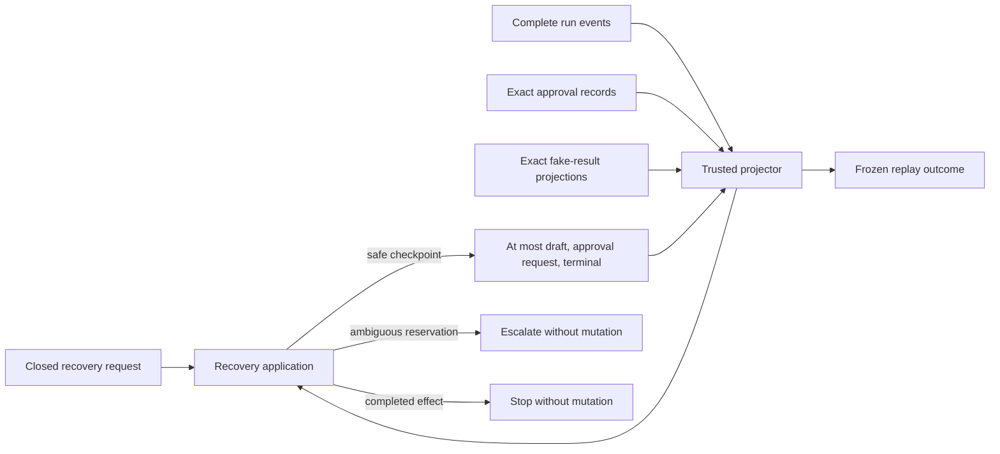

# Security & Compliance Report

**Session ID**: `phase02-session04-replay-and-resume-integration`
**Reviewed**: 2026-08-11
**Result**: PASS

## Scope and Method

Reviewed the exact base diff, recovery source and tests, three-store trust
flow, mutation and replay behavior, cumulative governance/docs, resolved code
review, full deterministic gates, dependency audit, permission/capability
surface, sensitive-data handling, and ASCII/LF hygiene.

## Security Assessment

### Overall: PASS

| Category | Status | Details |
|----------|--------|---------|
| Injection | PASS | No shell, process, SQL, template, URL, or network interpreter; every request and replaceable boundary is runtime validated. |
| Authorization | PASS | Approval records remain human authority; recovery cannot decide approval and cannot treat event observations as permission. |
| Effect safety | PASS | Same-run reservations escalate, completed results stop, compensation is unsupported, and no effect adapter is imported. |
| Persistence trust | PASS | Complete events plus exact approval/result authority are projected before mutation and after each safe write. |
| Failure handling | PASS | Storage, damage, ordering, identity, authority, terminal, and indeterminate-effect failures are canonical and frozen. |
| Sensitive data | PASS | Events retain bounded identity/hash/status evidence only; synthetic draft content remains in its dedicated approval record or transient exact-hash input. |
| Secrets | PASS | No credential/private-key value or runtime secret configuration was added. |
| Availability | PASS for scope | Stable replay suppresses duplicates; distinct paths prevent lexical cross-domain file aliasing; distributed locking remains deferred. |
| Dependencies | PASS | No package changed; production audit reports zero vulnerabilities. |
| Security configuration | PASS | Exact distinct paths and hostile options fail before application construction with canonical detail. |

### STRIDE Review

| Threat | Status | Evidence |
|--------|--------|----------|
| Spoofing | PASS | Run, lead, draft, approval, hash, and fake-result identities must agree across dedicated stores. |
| Tampering | PASS | Closed schemas and whole-history projection reject malformed, duplicate, out-of-order, cross-run, or conflicting evidence. |
| Repudiation | PASS | Resume preserves original run identity and leaves one draft, approval request, and compatible terminal trail. |
| Information disclosure | PASS | Public outcomes use canonical bounded messages; raw dependency errors, transcripts, arguments, results, stacks, and credentials are excluded. |
| Denial of service | PASS for controlled scope | Recovery is explicit and bounded to validated local synthetic stores; public quotas and distributed workers remain release blockers. |
| Elevation of privilege | PASS | No new Pi/HTTP tool, actor set, decision path, fake service, or real network write exists. |

## Trust Flow

- Events prove lifecycle order and checkpoints but not human permission or an
  effect result.
- Approval and fake-result stores remain separate authority domains.
- Recovery has only the narrow mutation set shown above and reprojects after
  each write.

## Privacy and Data Lifecycle

All evidence remains synthetic. Run events exclude full draft content and
retain only bounded IDs, hashes, codes, checkpoint/terminal state, and existing
minimized metadata. Approval records retain the exact synthetic draft because
human review requires it; recovery accepts replacement content only after exact
SHA-256 agreement.

The documented lifecycle treats event, approval, and result files as one
coordinated environment: stop writers, export or preserve all three, respect an
incident hold, and delete the whole environment within 30 days or at teardown.
Individual append-only records are not edited or deleted because that would
invalidate ordering and authority evidence.

## GDPR Assessment

### Overall: N/A

No real personal data is collected, processed, exported, erased, backed up, or
transferred by Session 04. Automated retention, scoped data-subject access and
erasure, tenant isolation, lawful basis, purpose, backup/restore, data location,
and provider-transfer controls remain required before real data.

## Findings and Remaining Conditions

No unresolved Session 04 security finding. Code review repaired two medium
contract/configuration findings and one low path-isolation finding.

- Keep `/runs` controlled until caller identity, authorization, tenant,
  distributed-rate, and edge controls close SC-001.
- Keep all data synthetic until automated lifecycle and real-data governance
  close SC-002.
- Keep fake/write execution unreachable until distributed idempotency and
  explicit maintainer authorization close SC-006.
- Complete Sessions 05-07 before claiming a production deployment gate.

## Sign-Off

- **Result**: PASS
- **Reviewed by**: AI independent review (`creview`)
- **Date**: 2026-08-11
