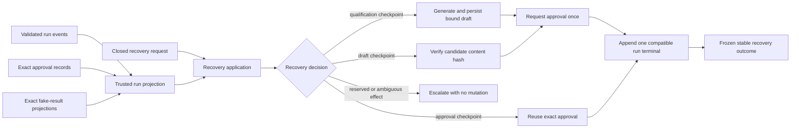

# Session Specification

**Session ID**: `phase02-session04-replay-and-resume-integration`
**Phase**: 02 - Recovery and Evaluation Gates
**Status**: Complete
**Created**: 2026-08-11
**Completed**: 2026-08-11
**Validated**: 2026-08-11
**Base Commit**: ec7824ddca245af1d5b972888dc642bfba6fb5e7

---

## 1. Session Overview

This session completes Task `04` with one internal application-owned recovery
entrypoint. It loads complete run history, exact approval records, and exact
fake-result projections through runtime-validated boundaries; selects a closed
recovery action; and resumes only the latest safe qualification, draft, or
approval-request checkpoint under the original `runId`.

Durable events retain identity, order, checkpoint, and draft hash. Dedicated
approval and result records retain permission and effect truth. Replaceable
draft content may be supplied after restart only when its SHA-256 matches the
durable draft event, or may be regenerated from a completed qualification by
the application from a known synthetic lead and bounded angle. The recovery
boundary can create a draft event, request approval, and close the agent run;
it cannot decide approval or invoke any fake or real effect.

---

## 2. Objectives

1. Define closed retry, resume, compensate, escalate, and stop policy with
   explicit evidence requirements and no automatic effect recovery.
2. Implement file-backed recovery for the three Task `04` checkpoints with
   exact cross-store authority and stable same-request replay outcomes.
3. Prove fresh-instance restart, damaged-history refusal, indeterminate-effect
   escalation, zero duplicate approval/effect, retention rules, and complete
   Week 3 evidence.

---

## 3. Prerequisites

### Required Sessions

- [x] `phase02-session03-bounded-run-lifecycle` - Provides schema-v2 step and
  terminal evidence plus one application-owned terminal decision.
- [x] `phase02-session02-run-projection-and-corruption-refusal` - Provides
  trusted checkpoints, minimized working context, and exact authority checks.
- [x] `phase01-session05-idempotent-fake-send-execution` - Provides durable
  reservation/result identity, duplicate suppression, and indeterminate state.
- [x] `phase01-session03-durable-approval-integration` - Provides restart-safe
  exact approval requests and decisions.

### Required Tools Or Knowledge

- Node.js 24.15 or newer, npm 12.0.2, strict TypeScript, TypeBox, and
  `node:test` through TSX.
- Closed run projection, private JSONL event/approval/result stores, approval
  service duplicate behavior, and deterministic synthetic draft creation.
- Task `04`, Phase 02 PRD, repository governance, and Session 03 handoff.

### Environment Requirements

- `npm run verify` passes at the Session 04 base with 221 tests and 5/5 evals.
- `.spec_system/scripts/check-prereqs.sh --json --env` reports pass.
- Recovery tests use temporary private files and injected hostile readers; no
  provider credential, network call, or manual JSONL edit is required.

---

## 4. Scope

### In Scope (MVP)

- A frozen policy table for `retry`, `resume`, `compensate`, `escalate`, and
  `stop`, including required durable evidence, automatic-action eligibility,
  and current compensation support.
- Closed recovery request, result, failure, and action contracts with runtime
  guards, defensive cloning, deep freeze, and canonical bounded messages.
- Exact non-empty event, approval, and fake-result paths validated before any
  file boundary is constructed.
- Runtime-validated loading of the complete run projection plus only the exact
  same-run approval and fake-result authority records.
- Qualification-checkpoint resume without another qualification attempt:
  derive one application-owned draft from the exact known synthetic lead and a
  bounded caller angle, create a stable content-bound draft ID, request one
  approval, and close at human approval.
- Draft-checkpoint resume from the durable `draftId` and SHA-256. Replaceable
  content must exactly match the durable hash; deterministic regeneration is
  accepted only when it yields that same hash.
- Approval-request checkpoint resume by returning the exact durable pending
  approval and appending only a missing compatible run terminal.
- Same-request replay after any successful resume returns the same frozen run,
  lead, draft, approval, and stop outcome without a second qualification,
  draft, approval record, terminal, reservation, or adapter invocation.
- Missing terminal evidence may be safely completed after the exact approval
  checkpoint. Existing compatible completed evidence is replayed; stopped,
  failed, incompatible, or non-approval terminals are not reopened.
- Verified reservation-only or observed-but-unverified fake state returns
  `escalate`; verified completed fake state returns `stop`. Recovery never
  calls an effect adapter, retries an idempotency reservation, or compensates.
- Canonical mapping for missing, malformed, truncated, corrupt, duplicate,
  cross-run, out-of-order, incompatible, authority, and storage failures.
- Fresh store/service restart tests at qualification, draft, and approval
  checkpoints using application APIs only, with exact line/event/effect counts.
- Coordinated synthetic retention, redaction, deletion, export, and compaction
  policy plus recovery decision table, Mermaid restart timelines, replay proof,
  failure exercise, and verification evidence in the Week 3 Build Log.

### Out Of Scope (Deferred)

- Public recovery routes, caller authentication, tenant isolation, distributed
  locks/workers, automatic retries, scheduled recovery, or operator UI.
- Approval decisions, fake-effect execution, real network writes, automatic
  compensation, or retry of an indeterminate reservation.
- Per-record real-data erasure/export, automated retention, backups/restores,
  or mixed-version event migration.
- Task `05` golden-set, scorecard, critical deployment gate, and deliberate
  boundary regression exercises.

---

## 5. Technical Approach

### Architecture

Create `src/recovery-application.ts` as a provider-independent composition. A
default file-backed constructor uses the existing event, approval, and result
parsers. Injected store/reader options keep failure and race tests deterministic
without editing JSONL files.

### Recovery Sequence

1. Validate request and path/options before constructing stores.
2. Read exact same-run approvals and all validated fake-result records, filter
   them to the requested run, and project complete event history with supplied
   authority.
3. Reject lead mismatch, damaged evidence, authority mismatch, unsafe terminal,
   or any indeterminate effect before mutation.
4. At qualification, derive content with `makeDraft`, bind a stable draft ID to
   run, lead, and SHA-256, and append one draft event.
5. At draft, require exact content/hash agreement; never infer content from a
   hash or accept a different candidate.
6. Request approval through the existing durable service. Exact duplicate
   records are reloaded rather than recreated.
7. Reproject all stores, append only a missing `approval_pending` terminal,
   reproject again, and return the same minimized recovery result on replay.

### Design Patterns

- Projection before mutation: no recovery write occurs until all three stores
  validate and agree.
- Hash-anchored replaceable context: full draft content is not added to run
  events, but supplied content cannot be substituted.
- Stable application identity: draft identity is derived from original run,
  lead, and content hash; approval request fingerprint remains stable.
- Repair only known-safe gaps: a missing run terminal after exact pending
  approval may be appended; ambiguous approval/effect persistence escalates.
- No effect dependency: the recovery module imports no fake-send service or
  adapter and cannot invoke a side effect.

---

## 6. Deliverables

### Files To Create

| File | Purpose | Est. Lines |
|------|---------|------------|
| `src/recovery-application.ts` | Policy, contracts, file-backed composition, trusted loading, three-checkpoint resume, and stable replay | ~650 |
| `tests/recovery-application.test.ts` | Fresh restart, exact replay, authority, indeterminate effect, corruption, and hostile-boundary tests | ~800 |

### Files To Modify

| File | Changes | Est. Lines |
|------|---------|------------|
| `docs/build-log-week3.md` | Decision table, three timelines, replay proof, retention decision, failure and verification evidence | ~180 |
| `docs/ARCHITECTURE.md` | Internal recovery composition and trust boundaries | ~20 |
| `docs/development.md` | Deterministic recovery harness and data handling | ~10 |
| `docs/environments.md` | Coordinated three-file synthetic lifecycle rules | ~12 |
| `docs/runbooks/incident-response.md` | Recovery action/operator mapping | ~12 |
| `docs/TODO.md`, `docs/CHANGELOG.md` | Active Session 04 and Task `04` completion evidence | ~12 |
| `.spec_system/CONSIDERATIONS.md`, `.spec_system/SECURITY-COMPLIANCE.md` | Close internal replay gap while retaining production release blockers | ~10 |

---

## 7. Success Criteria

### Functional Requirements

- [x] Qualification, draft, and approval interruptions resume from complete
  validated durable evidence under the original `runId` and reach the same
  exact pending-approval outcome across fresh instances.
- [x] Qualification resume appends no second qualification outcome; draft
  resume reuses the exact durable ID/hash; approval resume creates no second
  approval.
- [x] Replaying the same recovery request returns a deeply equal frozen outcome
  and changes no event, approval, result, or adapter count.
- [x] Every successful recovery appends at most one missing compatible terminal
  and never reopens a stopped, failed, incompatible, or completed effect run.
- [x] Reservation-only, ambiguous, or unverified effect evidence always
  escalates before mutation; completed effect evidence always stops.
- [x] Damaged or inconsistent evidence returns an actionable canonical failure
  with retry, escalate, or stop and no partial success.

### Testing Requirements

- [x] Contract-first tests cover request/result/failure/action guards, policy
  table, clone/freeze, stable draft identity, and hostile values.
- [x] Fresh private file tests cover interruption after qualification, draft,
  and approval with no manual durable-file editing.
- [x] Replay tests prove stable outcomes, one approval, one terminal, no repeat
  qualification/draft, unchanged result file, and zero effect calls.
- [x] Authority tests cover pending/terminal approval, reservation-only and
  completed fake result, extra/cross-run authority, and missing event evidence.
- [x] Failure tests cover storage, malformed adapter, corrupt, truncated,
  duplicate, cross-run, out-of-order, draft mismatch, and terminal mismatch.

### Non-Functional Requirements

- [x] Recovery is internal and provider-independent with no Pi/HTTP route,
  credential, network, wall-clock wait, or effect adapter.
- [x] Events retain only minimized facts; full synthetic draft content remains
  in the exact approval record or replaceable hash-verified input.
- [x] Production Pi remains exactly three tools and fake/write execution stays
  unreachable from Pi and HTTP.
- [x] Source and documentation remain ASCII with Unix LF line endings.

### Quality Gates

- [x] Focused tests, `npm run verify`, coverage, build, dependency audit,
  production boundary, security/data, links, encoding, and final diff pass.
- [x] Task `04` acceptance evidence and Week 3 documentation are complete
  without claiming public, distributed, deployed, or real-data recovery.

---

## 8. Implementation Notes

### Working Assumptions

- The required interruptions are valid prefixes with no run terminal. A
  durable stopped or failed terminal is a final decision and is not reopened.
- Approval content is authoritative once an approval exists. Before that,
  draft event identity/hash anchors replaceable content without storing it in
  the operational event log.
- A deterministic generated draft can be reused at either qualification or
  draft checkpoint only when the resulting hash exactly matches durable facts.
- `retry` is limited to clearly pre-mutation/transient reads or safe missing
  work. `compensate` is an explicit unsupported operator decision in the
  current fake-only system, never an automatic action.
- Recovery may append a missing terminal after exact pending approval because
  this is idempotent lifecycle closure, not approval or effect authority.

### Potential Risks

- **Candidate draft substitution**: hash the complete candidate and require
  exact durable SHA-256/draft ID before approval.
- **Cross-store race**: project before mutation and reproject after approval and
  terminal writes; ambiguous partial writes escalate or retry only a safe gap.
- **Duplicate approval**: use stable draft identity and existing approval
  service fingerprint; reload exact duplicate authority.
- **Hidden fake reservation**: validate and filter the complete fake-result
  file by run before projection; any extra or reservation-only state blocks.
- **Replay after terminal**: reconstruct and return the same exact approval
  stop outcome without appending another terminal.
- **Compaction destroys audit facts**: compact only replaceable in-memory
  context; durable source events are retained unchanged until coordinated
  synthetic deletion.

---

## 9. Testing Strategy

### Unit Tests

- Recovery policy/action schemas, stable draft ID, candidate verification,
  outcome freeze, failure mapping, and hostile replaceable boundaries.

### Integration Tests

- Three fresh `JsonlEventStore`/approval/result application instances resume
  valid prefixes and reproject the same exact completed lifecycle.
- Exact duplicate replay preserves line counts and never constructs or calls an
  effect adapter.
- Reservation-only and completed fake authority prove escalate/stop behavior.

### Manual Verification

- Inspect the complete base diff and every untracked artifact.
- Confirm no recovery import from Pi, server, fake-send service/adapter, shell,
  process, network client, or provider credential boundary.
- Confirm the Week 3 evidence covers every Task `04` acceptance criterion.

---

## 10. Dependencies And Blockers

### Dependencies

- Sessions 01-03 run-event, store, projection, and lifecycle contracts.
- Phase 01 approval store/service and fake-result record/projector contracts.
- Existing synthetic lead fixtures and application-owned draft helper.

### Known Blockers

None.

---

## 11. Next Steps

Run the `implement` workflow for Session 04. Do not begin Task `05` eval work
within this session.
