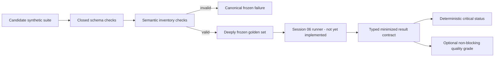

# Security & Compliance Report

**Session ID**: `phase02-session05-production-eval-contract-and-golden-set`
**Reviewed**: 2026-08-11
**Result**: PASS

## Scope and Method

Reviewed the exact base diff, all closed eval/result contracts, the 18-case
synthetic inventory, rubric authority, metric/version handling, permission and
effect declarations, focused and full deterministic gates, dependency audit,
capability/import surface, sensitive-data handling, and documentation claims.

## Security Assessment

### Overall: PASS

| Category | Status | Details |
|----------|--------|---------|
| Injection | PASS | Data definitions and validators introduce no shell, process, SQL, template, URL, provider, or network interpreter. |
| Authorization | PASS | Permission evidence is declarative; denial requires unauthorized authority, no fake execution, and no adapter invocation. |
| Effect safety | PASS | The suite cannot execute; cases predeclare first, duplicate, reservation-only, and no-request behavior for Session 06. |
| Evidence integrity | PASS | Labels require matching selectors and expectations; critical observations, failures, scores, and status agree exactly. |
| Failure handling | PASS | Invalid suites/results return bounded canonical validation failures and cannot partially validate. |
| Sensitive data | PASS | Bounded synthetic fixtures only; result contracts retain minimized typed traces and claims with no transcript/provider payload. |
| Secrets | PASS | No credential, secret configuration, provider key, or private-key value was added. |
| Availability | PASS for scope | Suite size and string/array bounds prevent unbounded definition input; executable resource bounds belong to Session 06. |
| Dependencies | PASS | No package changed; dependency audit reports zero vulnerabilities. |
| Deployment authority | PASS | No workflow or release path consumes the suite yet, so Session 05 cannot manufacture a deployment pass. |

### STRIDE Review

| Threat | Status | Evidence |
|--------|--------|----------|
| Spoofing | PASS | Closed IDs, categories, boundaries, versions, tool names, selectors, and expected identities are validated. |
| Tampering | PASS | Validation clones inputs; accepted suites are deeply frozen and require unique IDs/titles plus full coverage. |
| Repudiation | PASS | Each future result requires ordered minimized trace entries and dimension observations tied to one case/suite version. |
| Information disclosure | PASS | Fixtures are synthetic and bounded; raw model/provider payloads, credentials, stacks, and dependency errors are excluded. |
| Denial of service | PASS for definition scope | Inventory, content, trace, observation, claim, and metric shapes are bounded; execution deadlines/steps already exist. |
| Elevation of privilege | PASS | No new tool, actor permission, approval transition, effect adapter, Pi route, network client, or deployment action exists. |

## Trust Flow

The Session 05 trust boundary ends at the frozen golden set and result shape.
No arrow from the suite reaches a tool, adapter, provider, deployment workflow,
or persistent result store in this session.

## Privacy and Data Lifecycle

All request content, actors, lead IDs, targets, drafts, errors, and outputs in
the inventory are bounded synthetic fixtures. The future result contract uses
typed claims and minimized traces rather than full transcripts or provider
payloads. Provider-dependent latency, token, and cost values explicitly record
unavailability instead of inventing zero.

Session 06 must apply the existing controlled synthetic retention rules when it
adds artifact persistence. No Session 05 runtime store or new retained field
exists.

## GDPR Assessment

### Overall: N/A

No real personal data is collected, processed, persisted, exported, erased,
backed up, or transferred. Automated retention, data-subject access/erasure,
tenant isolation, lawful basis, purpose, location, backup/restore, and provider
transfer controls remain required before real data.

## Findings and Remaining Conditions

No unresolved Session 05 security finding. Code review repaired one high, two
medium, and one low contract/evidence issue.

- Keep `/runs` controlled until caller identity, authorization, tenant,
  distributed-rate, and edge controls close SC-001.
- Keep all data synthetic until automated lifecycle and real-data governance
  close SC-002.
- Keep fake/write execution unreachable until distributed idempotency and
  explicit maintainer authorization close SC-006.
- Do not claim a production eval or deployment gate until Session 06 executes
  all 18 cases and Session 07 retains red/fix/green boundary evidence.

## Sign-Off

- **Result**: PASS
- **Reviewed by**: AI independent review (`creview`)
- **Date**: 2026-08-11
