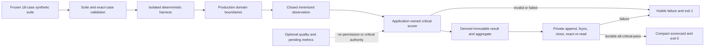

# Security & Compliance Report

**Session ID**: `phase02-session06-critical-eval-gate-and-scorecard`
**Reviewed**: 2026-08-11
**Result**: PASS

## Scope and Method

Reviewed the exact base surface, closed runner/scorer/store contracts, all 18
synthetic execution paths, authority derivation, safe final-output ownership,
artifact minimization and durability, scorecard/exit behavior, controlled
failure exercises, focused/full gates, dependency audit, capability imports,
changed-value sensitive-data scans, and documentation claims.

## Security Assessment

### Overall: PASS

| Category | Status | Details |
|----------|--------|---------|
| Injection | PASS | No shell, process, SQL, template, URL, provider, or network interpreter is introduced. |
| Authorization | PASS | Exact approval/result records remain authoritative; event observations and model prose cannot grant approval or effect status. |
| Effect safety | PASS | Fake execution is deterministic and in-process, requires exact durable authority, and has no Pi/HTTP or real-network edge. |
| Evidence integrity | PASS | Suite/case identity is exact, results/aggregates are derived, artifact/result versions agree, and persistence is append/flush/close/re-read verified. |
| Failure handling | PASS | Executor, validation, critical, storage, and hostile-configuration failures are canonical, bounded, visible, and exit non-zero. |
| Sensitive data | PASS | Artifacts and scorecards omit draft bodies, lead profiles, transcripts, provider payloads, full approval records, stacks, and raw errors. |
| Secrets | PASS | No credential, provider key, secret value, or private key was added or read. |
| Availability | PASS for scope | Eighteen finite cases, bounded schemas, whole-run deadlines/steps, bounded strings/arrays/paths, and exact cleanup limit local work. |
| Dependencies | PASS | No dependency changed; npm audit reports zero vulnerabilities. |
| Deployment authority | PASS | The repository gate blocks on any critical/evidence failure but does not claim Coolify, provider, rollback, restore, or public-production evidence. |

### STRIDE Review

| Threat | Status | Evidence |
|--------|--------|----------|
| Spoofing | PASS | Runner revalidates the complete suite and exact registered case; observations, run IDs, versions, and artifacts use closed guards. |
| Tampering | PASS | Inputs are cloned; accepted results/outcomes are frozen; artifacts require exact aggregate, ordering, version, append, and re-read equality. |
| Repudiation | PASS | Every case retains ordered minimized trace, per-dimension expected/observed evidence, versions, duration, and one run/timestamp identity. |
| Information disclosure | PASS | Synthetic-only selectors and bounded evidence persist; protected application/provider/dependency payloads are excluded and tested. |
| Denial of service | PASS for local scope | Case count and data shapes are finite, temporary paths are exact, lifecycle bounds apply, and path length is capped. |
| Elevation of privilege | PASS | Production allowlist remains three tools; no approval-decision, fake-write, shell, filesystem, credential, provider, deployment, or network capability is exposed. |

## Trust Flow

The harness may reach existing production-domain functions only with synthetic
fixtures and injected deterministic substitutes. No arrow reaches HTTP, a Pi
provider session, a real adapter, a public approval decision, or deployment.

## Privacy and Data Lifecycle

`PRODUCTION_EVAL_LOG_PATH` defaults to ignored local
`./data/production-evals.jsonl`. Each private append-only record contains case
IDs, minimized traces, bounded dimension evidence, scores, versions, duration,
explicit metric availability, and run/timestamp identity. It excludes full
drafts, names, companies, problems, transcripts, provider payloads,
credentials, stack traces, raw dependency messages, and full approval records.

Eval artifacts join the existing coordinated synthetic 30-day-or-teardown
whole-file lifecycle. There is no public export, per-record erasure, backup,
restore, automated retention, or approved real-data use.

## GDPR Assessment

### Overall: N/A

No real personal data is collected, processed, persisted, exported, erased,
backed up, or transferred. Automated retention, data-subject rights, tenant
isolation, lawful basis, purpose, location, backup/restore, and provider
transfer controls remain required before real data.

## Findings and Remaining Conditions

No unresolved Session 06 security finding. Code review repaired one high, four
medium, and two low evidence/durability issues.

- Keep `/runs` controlled until caller identity, authorization, tenant,
  distributed-rate, and edge controls close SC-001.
- Keep all data synthetic until automated lifecycle and real-data governance
  close SC-002.
- Keep fake/write execution unreachable until distributed ownership and the
  recorded maintainer authorization gate close SC-006.
- Treat the eval artifact store as single-process; do not share one file among
  concurrent runners or claim distributed release evidence.
- Do not close Task `05` or Phase 02 until Session 07 captures, repairs, and
  exactly reverts all three controlled boundary regressions.

## Sign-Off

- **Result**: PASS
- **Reviewed by**: AI independent review (`creview`)
- **Date**: 2026-08-11
