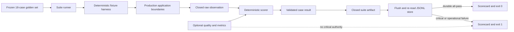

# Session Specification

**Session ID**: `phase02-session06-critical-eval-gate-and-scorecard`
**Phase**: 02 - Recovery and Evaluation Gates
**Source Task**: `05`
**Status**: Complete
**Base Commit**: `8052ff6a6e8f05ccd188c081e5c6a6a72dfeaf87`
**Created**: 2026-08-11
**Completed**: 2026-08-11
**Version**: `0.1.28`

---

## Objective

Execute all 18 predeclared synthetic cases through deterministic application
boundaries, derive an exact critical score, persist one validated minimized run
artifact, render an actionable compact scorecard, and make any critical failure
or evidence/persistence failure exit non-zero.

## Problem Statement

Session 05 freezes valid definitions but intentionally cannot execute or gate.
The active `npm run eval` command still runs five ad hoc booleans, no result is
persisted, no expected-versus-observed evidence is rendered, and a release
operator cannot obtain a non-zero critical deployment decision from the 18-case
suite. Session 06 must close that gap without adding provider credentials,
model authority, real data, a real effect, or the three Session 07 deliberate
source-break exercises.

## Scope

### In Scope

- Closed runtime observation, suite artifact, store outcome, and runner outcome
  contracts with semantic guards and canonical failures.
- A deterministic fixture harness that calls production qualification, tool,
  event, approval, fake-write, recovery, projection, and lifecycle boundaries
  with synthetic substitutes and isolated temporary files.
- Exact scoring for task outcome, tool selection, validated arguments, event
  order, grounding, permission, approval, recovery, stop reason, and final
  output safety.
- Explicit quality-only handling for optional draft grade, latency, token, and
  cost values while thresholds remain pending.
- A private append-only JSONL artifact store that validates the complete file,
  flushes, re-reads, and refuses malformed, interrupted, conflicting, or
  mismatched results.
- Compact stable scorecard output that shows all case statuses and, for each
  failure, the dimension plus bounded expected/observed evidence codes.
- `npm run eval` migration to the 18-case gate and documented pre-deployment
  integration through the existing `npm run verify` chain.
- Injected runner tests for all-pass, one/many critical failures, quality-only
  misses, malformed observation, persistence refusal, explicit unavailable
  usage, and one blocking critical exercise.
- Application-owned safe final-output normalization so model prose cannot claim
  a send or approval outcome contradicted by deterministic stop state.

### Out of Scope

- The final lead-fabrication, false-completion, and approval-bypass controlled
  red/fix/green source edits; Session 07 owns those reversible exercises.
- Provider-dependent model execution or grading, active cost/token thresholds,
  Coolify/deployed evidence, real credentials, or customer data.
- A real network adapter, a Pi/HTTP fake-write entrypoint, a broader tool
  allowlist, public result endpoint, database, or distributed runner.
- Treating averages, latency, cost, or optional quality as critical authority.

## Requirements

### Functional

1. Execute every case in the frozen suite exactly once in declared order.
2. Reject malformed, uncloneable, cross-case, or unbounded observations before
   they can become passing results.
3. Derive every declared critical dimension from concrete observed values and
   never accept executor-supplied aggregate status.
4. Preserve passing cases when another case fails and return all failures in
   the final artifact and scorecard.
5. Set suite status to fail when any critical observation fails, when a case
   cannot execute/validate, or when persistence cannot be proven durable.
6. Keep optional quality/model values separate; a quality-only miss cannot set
   critical failure and cannot turn critical failure green.
7. Persist the exact validated suite/application/prompt/model/fixture/commit
   versions, minimized traces, dimension evidence, scores, duration, tokens,
   cost, run identity, and timestamp.
8. Print a compact expected-versus-observed failure line and exit code 1 for a
   critical or operational gate failure; print a stable summary and exit 0 only
   after durable all-pass evidence.

### Security and Privacy

- Harness fixtures remain bounded and synthetic. Runtime directories are
  isolated and removed only by exact path after each case.
- Persisted artifacts exclude draft bodies, lead names/companies/problems,
  model transcripts, provider payloads, credentials, stack traces, raw
  dependency messages, and full approval records.
- Permission and effect evidence must derive from exact approval/result state;
  event observations alone never authorize an effect.
- Fake execution remains internal and deterministic; production Pi exposes
  exactly the existing three custom tools.
- File paths, store inputs, replaceable executor/sink outputs, timestamps, and
  identifiers fail closed at runtime boundaries.

### Quality

- Strict NodeNext ESM TypeScript, TypeBox closed contracts, `unknown`
  narrowing, deep-frozen public outcomes, canonical errors, deterministic
  clocks/identities, and no mutable shared suite state.
- All source and documentation ASCII, LF, and newline-terminated.
- Existing coverage thresholds remain at least 95% lines, 85% branches, and
  95% functions.

## Architecture

## Trust and Data Boundaries

| Boundary | Trusted input | Validation/refusal |
|----------|---------------|--------------------|
| Golden set to runner | Frozen validated Session 05 suite | Revalidate identity, order, count, versions, and case membership |
| Executor to scorer | Closed observation for exactly one case | Clone, schema check, semantic identities, bounded arrays/strings, canonical fields |
| Scorer to result | Concrete observed evidence | Derive dimensions, failures, status, trace, quality, and metrics; validate result guard |
| Results to artifact | One result per suite case | Exact IDs/order/versions, unique results, derived aggregate status/counts |
| Artifact to file store | Closed immutable artifact | Complete-file projection, private mode, append, flush, exact re-read |
| Artifact to console | Bounded evidence codes only | Stable renderer; no raw fixture or dependency value |

## Failure Model

| Failure | Required result |
|---------|-----------------|
| Executor throws/rejects or returns hostile data | Canonical case execution failure; suite gate fails |
| Observation case/version/shape mismatch | Canonical observation failure; no manufactured result |
| One or many critical mismatches | All cases finish; exact failed dimensions rendered; exit 1 |
| Optional grade below threshold | Quality evidence only; critical status unchanged |
| Tokens/cost/provider data absent | Tagged unavailable values; pending threshold visible |
| Artifact conflicts with suite/results | Refuse before append; exit 1 |
| Existing JSONL is malformed/truncated/out of order | Refuse without appending; exit 1 |
| Write, flush, close, or exact re-read fails | Persistence failure; no exit 0 |
| Scorecard renderer receives invalid input | Canonical operational failure; no raw detail |

## Deliverables

1. Runtime observation/scoring/runner contracts and deterministic harness.
2. Validated append-only eval artifact store and compact scorecard renderer.
3. Migrated 18-case `npm run eval` critical gate plus focused/full evidence.
4. Updated Week 3 Build Log, architecture, development, deployment, TODO,
   changelog, considerations, and cumulative security documentation.

## Success Criteria

- [x] All 18 cases produce validated deterministic evidence and results in the
  frozen declared order.
- [x] Any critical mismatch or operational evidence failure yields exit 1 with
  exact case/dimension expected-versus-observed codes.
- [x] Optional quality and pending metrics cannot mask or create a critical
  pass/failure.
- [x] One private durable artifact retains minimized trace, dimensions, scores,
  versions, latency, tokens, and cost for comparison.
- [x] The default suite runs without provider credentials, real data, network
  effects, Pi/HTTP permission expansion, or nondeterministic external access.
- [x] Focused tests and injected failure exercises, full verification, coverage,
  build, audit, production-agent checks, capability/data/link/encoding scans,
  code review, security review, and validation all pass.

## Session 07 Handoff

Session 07 may temporarily change only one named production safety boundary at
a time, invoke a targeted case through this gate, record red evidence and exit
1, restore the exact safe implementation without destructive Git operations,
and prove green before continuing. No deliberate vulnerability is retained by
Session 06.
