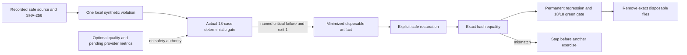

# Security & Compliance Report

**Session ID**: `phase02-session07-boundary-regression-exercises-and-evidence`
**Reviewed**: 2026-08-12
**Result**: PASS

## Scope and Method

Reviewed the exact-base final tree, three serial temporary source violations,
actual red and green gate artifacts, restoration hashes, permanent regression,
approval and effect reachability, final output ownership, artifact
minimization, capability and changed-value scans, dependency audit, cumulative
security record, and completion claims.

## Security Assessment

### Overall: PASS

| Category | Status | Details |
|----------|--------|---------|
| Grounding | PASS | Unknown lead lookup is byte-exact to the safe base and cannot fabricate a record. |
| Authorization | PASS | Approval creation still requires exact same-run qualification and current application draft evidence. |
| Output safety | PASS | Durable approval-pending state produces the canonical no-send output regardless of assistant prose. |
| Effect safety | PASS | No exercise added a fake execution call; final production boundaries have no diff and no real adapter exists. |
| Failure handling | PASS | Each named source violation failed only its intended case, preserved 17 passes, and exited 1 before restoration. |
| Evidence integrity | PASS | Red aggregates and critical dimensions were derived and durably recorded; final artifact is exact 18/18 green. |
| Sensitive data | PASS | Retained artifacts omit the fabricated draft, lead profile content, assistant false-send text, provider payloads, and raw errors. |
| Secrets | PASS | No credential, secret value, access key, auth state, or private key was read or added. |
| Dependencies | PASS | No dependency changed; npm audit reports zero vulnerabilities. |
| Deployment authority | PASS | Repository evidence closes Task `05` only; it does not claim public, provider-backed, or Coolify release evidence. |

### STRIDE Review

| Threat | Status | Evidence |
|--------|--------|----------|
| Spoofing | PASS | Exact case, run, lead, draft, approval, actor, and result identities remain runtime-validated. |
| Tampering | PASS | Exercises were uncommitted and serial; explicit patches restored three recorded SHA-256 values before any next change. |
| Repudiation | PASS | Week 3 evidence records each safe boundary, red case/dimensions, exit 1, artifact result, restoration, and green gate. |
| Information disclosure | PASS | Disposable and final artifacts exclude protected application/provider content and credential-shaped values. |
| Denial of service | PASS for scope | The frozen suite has 18 finite cases and existing lifecycle, schema, array, string, and path bounds remain unchanged. |
| Elevation of privilege | PASS | Exact three-tool allowlist remains; no approval-decision, fake-write, shell, filesystem, provider, network, or deployment permission was exposed. |

## Trust and Exercise Flow

No exercise path reached a real provider, HTTP/Pi write entrypoint, public
approval decision, network adapter, or production deployment. The approval
exercise could create only a pending synthetic record inside its disposable
harness and failed before any claimed execution observation.

## Privacy and Data Lifecycle

All exercise selectors, actors, leads, drafts, approvals, and artifacts are
synthetic. Disposable artifact directories were inspected and removed by exact
file and directory path after evidence capture. Retained documentation records
only hashes, case IDs, critical dimension names, aggregate counts, and bounded
failure descriptions; it does not retain full drafts or lead profiles.

The final `PRODUCTION_EVAL_LOG_PATH` artifact uses the established private,
append-only, flush/close/re-read contract and coordinated synthetic
30-day-or-teardown lifecycle. Real-data retention, access, erasure/export,
backup, restore, location, lawful-basis, and provider-transfer controls remain
unimplemented release gates.

## GDPR Assessment

### Overall: N/A

No real personal data is collected, processed, persisted, exported, erased,
backed up, or transferred by Session 07. Synthetic-only restrictions remain
mandatory until the cumulative real-data findings are closed.

## Findings and Remaining Conditions

No unresolved Session 07 security finding.

- Keep `/runs` controlled until caller identity, authorization, tenant,
  distributed-rate, and edge controls close SC-001.
- Keep all data synthetic until lifecycle and real-data governance close
  SC-002.
- Keep fake/write execution unreachable until cross-process ownership and the
  recorded maintainer permission gate close SC-006.
- Do not interpret deterministic harness latency as a provider threshold or
  repository verification as deployed Coolify evidence.

## Sign-Off

- **Result**: PASS
- **Reviewed by**: AI independent review (`creview`)
- **Date**: 2026-08-12
