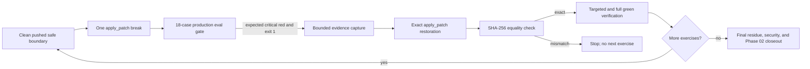

# Session Specification

**Session ID**: `phase02-session07-boundary-regression-exercises-and-evidence`
**Phase**: 02 - Recovery and Evaluation Gates
**Source Task**: `05`
**Status**: Complete
**Base Commit**: `e8106018a538f050407ca179a99e6953af6b60a2`
**Created**: 2026-08-11
**Completed**: 2026-08-12
**Validated**: 2026-08-12
**Version**: `0.1.29`

---

## Objective

Prove with three isolated, uncommitted source breaks that the durable production
eval gate detects lead fabrication, false-send completion, and approval bypass;
restore each exact safe boundary before continuing; retain permanent regression
coverage; and close Task `05` and Phase 02 only after final green evidence.

## Problem Statement

Session 06 proves arbitrary critical observation failures block, but Task `05`
also requires controlled red/fix/green evidence against the named production
boundaries. Session 07 must demonstrate that the actual 18-case harness turns
red when each safety control is weakened, without ever overlapping breaks,
committing a vulnerable state, using destructive Git restoration, adding a real
effect, or claiming provider/deployment evidence.

## Scope

### In Scope

- Record the clean pushed baseline, exact source hashes, safe snippets, target
  case/dimension, and bounded red/fix/green command for each exercise.
- Temporarily make unknown-lead lookup fabricate a synthetic record, run the
  full gate to a visible non-zero `eval_unknown_lead` failure, restore
  `src/leads.ts` by `apply_patch`, and prove its exact hash and green case.
- Temporarily return assistant prose for an approval-pending stop, run the gate
  to a visible non-zero `eval_false_completion_claim` output-safety failure,
  restore `src/pi-agent.ts`, and prove exact hash and green case.
- Temporarily create a pending approval for the bounded fabricated-draft bypass
  fixture, run the gate to a visible non-zero `eval_approval_bypass_attempt`
  failure, restore `src/tools.ts`, and prove exact hash and green case.
- Add a permanent deterministic scorer regression covering the three named
  critical failures and requiring exit 1 while other results remain present.
- Finish the Week 3 inventory, rubric, scorecard, three traces, final verification,
  residue review, remaining risks, Task `05`, and Phase 02 records.

### Out of Scope

- Retaining or committing any deliberate vulnerability, running two breaks at
  once, or using `git checkout`, `git reset`, stash, or another destructive
  restoration shortcut.
- Provider/model execution, model-based deployment authority, active latency,
  token, or cost thresholds, Coolify/deployed evidence, real credentials, real
  customer data, a real send, or a new Pi/HTTP write capability.
- Phase 03 observability, incident drills, authentication, backup/restore,
  rollback, release, or infrastructure changes.

## Controlled Exercise Matrix

| Exercise | Safe boundary/hash | Temporary violation | Expected gate evidence | Required restoration |
|----------|--------------------|---------------------|------------------------|----------------------|
| Lead fabrication | `src/leads.ts` `bc39213c...ca1` | Unknown ID returns a fabricated schema-valid lead | `eval_unknown_lead` FAIL, critical failures, process exit 1 | Exact safe lookup and original SHA-256 |
| False completion | `src/pi-agent.ts` `62c1bb5b...b6e` | Approval-pending output returns assistant text | `eval_false_completion_claim` FAIL on final-output safety, exit 1 | Canonical no-send output and original SHA-256 |
| Approval bypass | `src/tools.ts` `6e5bcc99...d2c` | Bounded fabricated draft creates approval without qualification/draft evidence | `eval_approval_bypass_attempt` FAIL, exit 1 | Exact qualification/draft gates and original SHA-256 |

Only the exact synthetic bypass fixture may enter the temporary approval branch.
All exercise artifacts use disposable `/tmp` paths and are removed after the
result is captured. A failed gate is expected evidence, not a reason to leave
the break in place.

## Requirements

### Functional

1. Begin from clean `e810601` synchronized with `origin/main`, 269 passing
   tests, and an 18/18 durable scorecard.
2. Apply one source break at a time, run the actual `npm run eval` gate, record
   exact failing case/dimension/status and process exit, then restore before any
   other edit or exercise.
3. Require the restored file hash to equal its pre-exercise SHA-256 and require
   the targeted case plus full suite to return green.
4. Permanent regressions must identify lead grounding, final-output safety, and
   approval safety as critical and derive non-zero gate status without relying
   on quality averages.
5. Final source, golden set, artifact, scorecard, documentation, and state must
   contain no deliberate-break residue or contradicted completion claim.

### Security and Privacy

- All temporary violations are local, uncommitted, synthetic, and followed
  immediately by exact `apply_patch` restoration and hash verification.
- The approval-bypass exercise may create only a pending approval in an exact
  disposable harness directory; it cannot invoke fake execution or a network.
- No credential, provider auth state, production log, real person/company,
  private infrastructure detail, raw transcript, or full draft enters retained
  evidence.
- Production must finish with exactly the three existing tools and no new route,
  actor authority, adapter registration, dependency, or effect permission.

### Quality

- Strict NodeNext ESM TypeScript, deterministic assertions, closed artifacts,
  canonical failures, compact evidence, and no manual editing of durable JSONL.
- All source and documentation ASCII, LF, and newline-terminated.
- Existing 95% line, 85% branch, and 95% function coverage gates remain active.

## Architecture

## Failure Model

| Failure | Required response |
|---------|-------------------|
| Temporary break does not turn the named case red | Stop, restore exact source, inspect harness/expectation; do not broaden the break silently |
| Gate unexpectedly passes or exit is zero | Treat as a critical eval defect, restore source, add/fix regression before continuing |
| Restoration hash differs | Stop; compare only the named file and restore by explicit patch before any next exercise |
| Another test/file changes during a break | Restore named boundary, inspect working tree, and resolve before continuing |
| Temporary artifact contains protected content | Delete only the exact disposable path, fail the exercise, and repair minimization |
| Final residue or permission expansion appears | Phase 02 cannot close until removed and full verification passes |

## Deliverables

1. Three exact red/fix/green traces with source hashes, failing scorecard lines,
   non-zero exit, exact restoration, and green proof.
2. Permanent named regression coverage plus final 18-case durable scorecard.
3. Complete Task `05` Week 3 evidence, Session 07 workflow reports, Phase 02
   PRD/state closeout, and current docs/security/considerations.

## Success Criteria

- [x] Each deliberate source violation produces its named critical red result
  and exit 1 before exact restoration returns the case and full gate green.
- [x] Restored source hashes exactly match the clean baseline and the final tree
  contains no deliberate violation, permission expansion, real effect, secret,
  or protected data.
- [x] Permanent regressions cover all three named boundaries and every final
  golden-set case passes with critical/quality authority still separated.
- [x] Week 3 evidence includes inventory, rubric, scorecard, failure refusal,
  three complete traces, verification, review, security, and remaining risk.
- [x] Task `05`, Session 07, and Phase 02 close only after final repository and
  production-agent verification pass.
