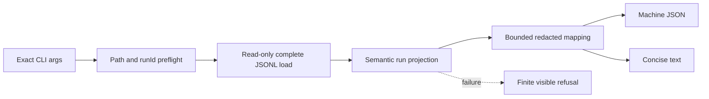

# Session Specification

**Session ID**: `phase03-session02-run-timeline-query-and-redaction`
**Phase**: 03 - Operations and Coolify Release
**Source Task**: `06`
**Status**: Complete
**Created**: 2026-08-12
**Base Commit**: 8053a43e5e9723284b26a7a3205c190e04c12dd3
**Completed**: 2026-08-12
**Validated**: 2026-08-12
**Version**: `0.1.33`

---

## 1. Session Overview

This session turns the Phase 02 durable run record and Session 01 observation
vocabulary into one exact-`runId`, read-only operator report. The report must
validate the entire durable history before rendering, preserve chronological
ordering, expose terminal and actionable failure facts, and omit protected or
authority-bearing content.

The implementation is operator-side only. It adds no HTTP route, Pi tool,
approval operation, replay, retry, recovery mutation, or external effect.

## 2. Objectives

1. Define a closed machine-readable report and finite failure contract.
2. Validate and project one complete exact-run history before rendering any success.
3. Render stable JSON and concise text with the same bounded facts.
4. Provide a read-only CLI against a validated, bounded JSONL evidence path.
5. Prove corrupt, missing, oversized, hostile, and protected-content cases fail safely.

## 3. Prerequisites

- [x] Session 01 provides closed availability and operational field semantics.
- [x] Phase 02 provides runtime-valid events, read outcomes, and semantic projection.
- [x] The exact three-tool Pi allowlist and lightweight public health response remain frozen.

No credential, provider session, network access, or deployment target is required.

## 4. Scope

### In Scope

- Exact `runId` request validation before evidence access.
- Complete-file runtime validation through the existing event-store boundary.
- Semantic sequence validation through `projectRunEvents` before report success.
- A maximum of 1,000 run events and a maximum 64 MiB evidence file.
- Stable timeline entries for run, model, tool, approval, domain, effect, and terminal facts.
- Exact durable stop reason and finite error category on every applicable entry.
- Tagged duration, token, and cost availability without invented zero values.
- Summary status, latest safe checkpoint, terminal result, event count, maximum retry count,
  total duration, tokens, and cost.
- Omission of lead IDs, draft IDs and content, hashes, actor IDs, validated
  arguments, receipts, idempotency keys, provider payloads, raw errors, paths,
  URLs, infrastructure identifiers, and credentials.
- A deterministic CLI with JSON and text formats plus a preserved synthetic fixture.
- Week 4 Build Log command, redacted failed-run output, and contract notes.

### Out Of Scope

- Reading approval or fake-result records as authority.
- Repairing, appending, deleting, replaying, retrying, resuming, or compensating.
- Public report endpoints, remote transport, authentication, or new caller permissions.
- Alert evaluation, runbook actions, incident drills, or deployment work.

## 5. Technical Approach

### Architecture

`src/run-report.ts` owns the closed report contracts, semantic mapping, summary
aggregation, validation, freezing, and text rendering. `buildRunReport` accepts
only a read-only `readRun` boundary. It validates the request, validates the
boundary outcome, rejects missing or oversized histories, calls
`projectRunEvents`, and only then maps minimized facts.

`scripts/run-report.ts` owns CLI parsing and the local evidence path. It validates
an absolute/resolved non-root regular file, rejects symlinks and files outside the
64 MiB bound, and constructs the existing JSONL store only after preflight. The
command prints report data to stdout and bounded stable failures to stderr. It
never opens a write descriptor or imports an approval, fake execution, or recovery
application.

### Design Patterns

- Validate before access: malformed args and unsafe paths fail before file read.
- Complete-history gate: no partial success from damaged or ambiguous evidence.
- Projection reuse: legal ordering and prerequisite rules remain single-sourced.
- Explicit availability: absent usage, cost, and duration remain unavailable.
- Allowlist rendering: output is assembled field-by-field, never by serializing events.
- Read-only dependency boundary: the report contract requires `readRun`, not `append`.

## 6. Deliverables

### Files To Create

| File | Purpose | Est. Lines |
|------|---------|------------|
| `src/run-report.ts` | Closed report contracts, builder, validation, minimization, and text renderer | ~550 |
| `scripts/run-report.ts` | Read-only bounded CLI and path preflight | ~180 |
| `tests/run-report.test.ts` | Builder, corruption, bounds, redaction, CLI, and immutability tests | ~650 |
| `tests/fixtures/run-report-failed.jsonl` | Preserved synthetic failed-run evidence for the operator example | ~8 records |

### Files To Modify

| File | Changes |
|------|---------|
| `package.json` | Add the `report:run` operator command |
| `docs/build-log-week4.md` | Record command contract and one redacted failed-run output |
| `docs/TODO.md` | Record Session 02 progress without closing Task `06` |
| `docs/CHANGELOG.md` | Record the bounded read-only report behavior |

## 7. Success Criteria

### Functional Requirements

- [ ] One command reconstructs one exact run in stable chronological order.
- [ ] JSON and text forms contain the same event types, sequence, status, terminal,
  retry, duration, usage, and error facts.
- [ ] Every durable terminal exposes its exact stop reason.
- [ ] Missing, malformed, truncated, duplicated, out-of-order, cross-run, illegal,
  or oversized evidence fails visibly without partial success.
- [ ] Output contains none of the protected or private source fields.
- [ ] The command remains strictly read-only and adds no HTTP or Pi permission.

### Testing Requirements

- [ ] Known running, pending, completed, failed, stopped, approval, effect, and
  restart-compatible histories render deterministically.
- [ ] Unavailable provider metrics are explicit and measured zero remains available.
- [ ] File and boundary failures, hostile outcomes, limits, extra properties,
  accessors, and uncloneable data fail closed.
- [ ] Focused CLI subprocess tests prove stdout/stderr, exit codes, formats,
  unchanged evidence bytes, and protected-content absence.
- [ ] Full tests and production evals remain green.

### Quality Gates

- [ ] All deliverables are ASCII with LF endings.
- [ ] Strict types, formatter, lint, coverage, and dependency audit pass.
- [ ] Documentation and command output make no authority, recovery, or deployment claim.

## 8. Working Assumptions And Boundaries

- Existing run events are the report's observation source; approval and fake-result
  stores remain the separate durable authority sources and are not read here.
- A report can show observed approval/effect event categories but must not label
  them verified authority.
- Restart compatibility means a fresh read produces the same report from the same
  complete bytes; the query does not infer that a restart occurred without evidence.
- The CLI evidence path is operator configuration and never appears in report or error output.
- The synthetic fixture may contain only synthetic bounded identifiers and no full draft.

### Behavioral Quality Focus

Checklist active: Yes.

- A malformed store outcome or projection failure must never become partial output.
- Path preflight must not acquire or mutate filesystem resources before validation.
- Rendering must never spread durable records or stringify raw event data.
- JSON and text must not disagree about stop, failure, usage, or event ordering.

## 9. Testing Strategy

- Unit-test schemas, builders, summaries, mappings, rendering, immutability, and
  hostile read boundaries.
- Integration-test complete JSONL through the existing file store and the CLI.
- Hash the fixture before and after commands to prove no write.
- Inject protected strings into event fields that are legal but excluded from output.
- Exercise 0, 1, and 1,000 event bounds plus a 1,001-event refusal.
- Re-run Pi, HTTP source, projection, persistence, recovery, and eval gates.

## 10. Dependencies

- Depends on: `phase03-session01-observability-contract-and-service-health`.
- Depended by: Session 03 alert evidence and Session 04 incident drill timelines.

---

## Next Steps

Run the `implement` workflow step.
