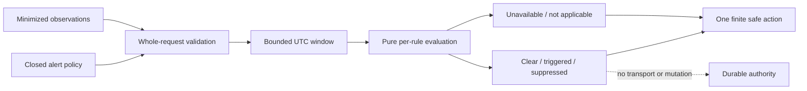

# Session Specification

**Session ID**: `phase03-session03-alerts-and-incident-runbook`
**Phase**: 03 - Operations and Coolify Release
**Source Task**: `06`
**Status**: Complete
**Created**: 2026-08-12
**Base Commit**: a843cb4eb1b009ed7d2408e9c67550312cf26a1d
**Validated**: 2026-08-12
**Completed**: 2026-08-12
**Version**: `0.1.34`

---

## 1. Session Overview

This session turns the closed Session 01 observation vocabulary and Session 02
exact-run report into a deterministic operator alert policy. It also writes the
canonical incident runbook from the recovery behavior that is implemented and
tested today.

Alert evaluation is a pure, local library operation. It neither pages nor sends,
does not read provider content, and cannot mutate run, approval, effect, or eval
authority. The runbook must distinguish an application capability from an
operator-accessible command and must state unavailable operations explicitly.

## 2. Objectives

1. Define closed alert rule, window, suppression, result, severity, evidence,
   action, and failure contracts.
2. Evaluate repeated failures, stuck runs, denied dangerous permission attempts,
   cost spikes, unavailable dependencies, storage pressure, and queue pressure
   from minimized observations with deterministic threshold behavior.
3. Keep missing required measurements visible and queue pressure not applicable
   until the queue exists.
4. Document pause, inspect, retry, resume, compensate, escalate, and stop behavior
   exactly as the repository supports it.
5. Prove bounds, malformed policy refusal, suppression, redaction, and absence of
   new permissions, notification transports, and external effects.

## 3. Prerequisites

- [x] Session 02 provides a bounded, read-only exact-`runId` report command.
- [x] Session 01 provides closed observation and measurement availability contracts.
- [x] Phase 02 recovery actions and effect ambiguity behavior remain covered by tests.

No credential, pager, provider session, network access, or deployment target is
required.

## 4. Scope

### In Scope

- Seven closed alert variants: repeated task failure, stuck run, dangerous
  permission attempt, cost spike, unavailable dependency, storage pressure, and
  queue pressure.
- A maximum of 20 rules and 1,000 observations in one explicit UTC evaluation
  window no longer than 24 hours.
- Finite warning/critical severities, evidence sources, operator actions, result
  statuses, and failure codes.
- Per-rule finite thresholds, comparison semantics, and optional cooldown
  suppression based on caller-supplied last-trigger time.
- `clear`, `triggered`, `suppressed`, `unavailable`, and `not_applicable` results.
- Allowlist-only evidence summaries with counts or tagged numeric measurements;
  no raw observation or provider payload echo.
- Exact no-alert behavior for harmless retries below a repeated-failure threshold.
- Exact no-retry behavior for reservation-only or otherwise indeterminate effects.
- Canonical `docs/runbooks/agent-incident-response.md`, reconciled with the
  existing general incident-response guide.
- Week 4 alert table, runbook link, limitations, tests, and verification evidence.

### Out Of Scope

- Email, chat, webhook, pager, or other alert delivery.
- Live credentials, provider content, external monitoring queries, or background work.
- An HTTP or Pi alert interface, pause endpoint, approval interface, or recovery CLI.
- Running incident drills, mutating durable state, deployment, backup activation,
  restore, rollback, or production on-call commitments.

## 5. Technical Approach

### Architecture

`src/alerts.ts` owns declarative TypeBox contracts, compiled validation, deep
freezing, finite policy definitions, and a pure evaluator. The evaluator accepts
one closed request containing `evaluationAt`, a bounded window, configured rules,
and minimized Session 01 observations. It validates the whole request before
selecting observations, computes one result per rule in stable input order, and
returns only allowlisted evidence.

`tests/alerts.test.ts` exercises threshold edges, unavailable and not-applicable
measurements, suppression, corrupt or hostile values, bounds, redaction, and
immutability. The runbook is documentation-only and names the exact read-only
report command, health check, repository gates, safe process/container stop,
and internal recovery boundary without claiming an operator transport.

### Rule Semantics

| Rule | Evidence | Trigger | Missing behavior | Safe action |
|------|----------|---------|------------------|-------------|
| Repeated task failure | Failed/stopped run observations | Count reaches configured threshold | Empty window is clear | Inspect exact run reports |
| Stuck run | Running/pending run duration | Any duration reaches threshold | Required unavailable duration is unavailable | Stop new requests and inspect run |
| Dangerous permission attempt | Denied tool permission | Count reaches configured threshold | Empty window is clear | Preserve evidence and escalate |
| Cost spike | Available model cost | Sum reaches configured USD threshold | Any required unavailable cost is unavailable | Stop new requests and inspect usage |
| Unavailable dependency | Unavailable dependency samples | Count reaches configured threshold | Missing service sample is unavailable | Inspect dependency |
| Storage pressure | Available used/capacity pair | Any ratio reaches configured percentage | Missing/zero capacity is unavailable | Stop new requests and inspect storage |
| Queue pressure | Available queue depth | Any depth reaches configured threshold | All not-applicable queue samples are not applicable | Inspect queue |

## 6. Deliverables

### Files To Create

| File | Purpose | Est. Lines |
|------|---------|------------|
| `src/alerts.ts` | Closed alert contracts and pure bounded evaluator | ~600 |
| `tests/alerts.test.ts` | Rule, threshold, suppression, missing-value, hostile-input, and boundary tests | ~650 |
| `docs/runbooks/agent-incident-response.md` | Canonical agent-specific incident response guide | ~250 |

### Files To Modify

| File | Changes |
|------|---------|
| `docs/runbooks/incident-response.md` | Link to the canonical agent guide and retire obsolete raw-event tracing advice |
| `docs/build-log-week4.md` | Add the implemented alert table, runbook navigation, and verification evidence |
| `docs/TODO.md` | Record Session 03 progress while keeping Task `06` open |
| `docs/CHANGELOG.md` | Record deterministic alerts and the grounded incident guide |

## 7. Success Criteria

### Functional Requirements

- [x] Every accepted rule has a finite trigger, severity, evidence source,
  suppression policy, and one safe operator action.
- [x] Threshold edges are deterministic and harmless retry counts below the
  repeated-failure threshold remain clear.
- [x] Denied dangerous permission attempts remain visible as triggered or suppressed.
- [x] Missing required measurements cannot silently become clear; queue-only
  absence becomes explicitly not applicable.
- [x] Evaluation returns no raw observation, identifier other than exact run IDs
  where required for inspection, path, URL, provider payload, error, or credential.
- [x] The runbook recommends no manual durable-record edit, retry of an
  indeterminate effect, automatic compensation, or unsupported endpoint.

### Testing Requirements

- [x] All seven variants pass below, at, and above threshold tests as applicable.
- [x] Cooldown boundaries, last-trigger timestamps, stable ordering, closed
  schemas, extra properties, accessors, uncloneable inputs, and limits fail safely.
- [x] Required unavailable values and queue not-applicable values produce their
  exact non-clear result statuses.
- [x] Full tests and production evals remain green.

### Quality Gates

- [x] Strict types, formatter, lint, coverage, dependency audit, ASCII/LF, and
  production-agent verification pass.
- [x] Pi allowlist, HTTP routes, approval/effect/recovery behavior, and the
  lightweight health response are unchanged.
- [x] Documentation makes no production on-call, notification, pause endpoint,
  compensation, recovery transport, or external-send claim.

## 8. Working Assumptions And Boundaries

- The caller supplies already-minimized observations and a canonical evaluation
  time; this session does not collect or schedule alert evaluation.
- A suppression result is still visible evidence. Suppression reduces duplicate
  notification intent only; it does not erase the trigger or grant authority.
- Run IDs may appear only when the configured safe action is exact-run inspection.
- Cost rules fail unavailable when any in-window model cost is unavailable because
  a partial sum cannot prove the threshold was not crossed.
- Storage ratios require both measurements in bytes and a positive capacity.
- There is no queue in the current system; its observation remains not applicable.

### Behavioral Quality Focus

Checklist active: Yes.

- Validate complete requests before rule evaluation or output construction.
- Never spread or stringify raw rules, observations, errors, or boundary objects.
- Accessor-backed, proxy-like, cyclic, and uncloneable data must not execute or leak.
- Alert outcomes explain operator attention but cannot repair or authorize state.

## 9. Testing Strategy

- Unit-test compiled schemas and each evaluator branch with fixed UTC timestamps.
- Test threshold minus one, exact threshold, threshold plus one, exact cooldown
  expiry, and out-of-window exclusion.
- Mix available, unavailable, and not-applicable measurements in stable fixtures.
- Inject protected strings into legal but excluded observation fields and prove
  they never enter serialized outcomes.
- Re-run Pi, HTTP, persistence, recovery, report, and production eval gates.

## 10. Dependencies

- Depends on: `phase03-session02-run-timeline-query-and-redaction`.
- Depended by: Session 04 incident drill alert outcomes and runbook execution.

---

## Next Steps

Run the `updateprd` workflow step.
