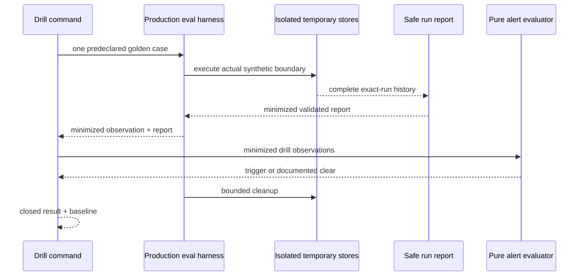

# Session Specification

**Session ID**: `phase03-session04-incident-drills-and-operational-baseline`
**Phase**: 03 - Operations and Coolify Release
**Source Task**: `06`
**Status**: Complete
**Created**: 2026-08-12
**Validated**: 2026-08-12
**Completed**: 2026-08-12
**Version**: `0.1.35`
**Base Commit**: 18126bc767ce9c9b98d8d3d7a5ef6385e1adb78e

---

## 1. Session Overview

This session executes the five required synthetic incidents through the existing
production-eval harness, durable event boundary, safe exact-run report, alert
policy, and recovery decisions. It records one minimized result per drill and a
single-agent operational baseline without exposing or retaining raw temporary
authority files.

The drills reuse the existing golden cases for qualification timeout, invalid
model output, restart after approval, revoked credential, and duplicate fake
request. They do not create a second simulation path or modify production
permissions. All temporary files are isolated and cleaned by the existing
harness after a safe report is constructed.

## 2. Objectives

1. Define a closed five-drill manifest and minimized immutable result contract.
2. Execute every drill against its existing golden production boundary and score
   its predeclared safety expectations.
3. Build the safe exact-`runId` report from the actual temporary event store
   before cleanup and compare its chronology with the manifest.
4. Evaluate the relevant Session 03 alert and record an exact runbook action.
5. Capture truthful success, failure, latency, token, cost, explainability, and
   operational-complexity baseline fields.
6. Complete Task `06` evidence without claiming deployment or Phase 04 entry readiness.

## 3. Prerequisites

- [x] Session 03 provides tested observation, report, alert, and runbook boundaries.
- [x] The production eval suite contains the exact five required synthetic cases.
- [x] Existing harness cleanup is bounded to its own `mkdtemp` directory.

No real credential, customer data, provider call, deployment, or external write
is required.

## 4. Scope

### In Scope

- A closed manifest for exactly five incident IDs and their golden-case IDs.
- Expected report event order, outcome/stop, alert status, recovery/runbook
  action, effect count, and baseline operator-step count per drill.
- A safe production-eval harness export returning only the existing minimized
  observation plus the validated `RunReport`; no raw events or paths escape.
- One bounded command executing all five drills and emitting closed JSON evidence.
- Runtime scoring through `scoreProductionEvalCase` and the current 18-case suite.
- Alert evaluation from valid minimized observations. Revoked credential uses
  two deterministic unavailable dependency samples to exercise the default
  dependency threshold; isolated one-run failures document a clear default
  repeated-failure decision rather than lowering policy.
- Same-run restart recovery proof and duplicate one-effect proof from the
  production observation, report, score, and permission/recovery fields.
- Available measured harness latency and event/step counts; unavailable
  provider-independent token and cost fields retain finite reasons.
- Task `06` Week 4 timelines, report/alert/recovery results, baseline, verification,
  final diff review, TODO, changelog, and runbook drill navigation.

### Out Of Scope

- Live incident response, credential revocation, provider network calls, real data,
  real send, or external notification.
- Manual durable-record changes, retained temporary authority files, recovery
  transport, automatic retry, or compensation.
- Coolify, public routes, secrets, off-server backup, restore, rollback, or Task `07`.
- Phase 04 typed handoff, second agent, router, or orchestration.

## 5. Technical Approach

### Architecture

`executeProductionEvalCaseWithReport` extends the existing harness with one safe
inspection result. It executes the same case state, reads the exact run from the
temporary store, builds a validated `RunReport`, then returns only the current
minimized eval observation and report before the existing `finally` cleanup.

`src/incident-drills.ts` owns the closed manifest, schemas, semantic validation,
observation mapping, alert evaluation, golden scoring, result minimization, and
suite runner. `scripts/incident-drills.ts` prints one JSON suite or a canonical
failure and sets its exit code; it adds no input, secret, or provider boundary.

### Drill Matrix

| Drill | Existing case | Expected safe result | Alert decision | Runbook action |
|-------|---------------|----------------------|----------------|----------------|
| Tool timeout | `eval_qualification_timeout` | `qualification_timeout` / `qualification_failed` | Repeated failure clear at one distinct run | Stop |
| Invalid model response | `eval_invalid_model_output` | `invalid_model_output` / `dependency_failed` | Repeated failure clear at one distinct run | Stop |
| Mid-run restart | `eval_restart_after_approval` | Same-run `approval_pending`, zero effects | Repeated failure clear | Resume |
| Revoked credential | `eval_revoked_provider_credential` | `dependency_failed`, no credential read | Dependency unavailable triggered at two samples | Stop |
| Duplicate request | `eval_duplicate_fake_request` | Stable duplicate, exactly one fake effect | Repeated failure clear | Stop |

## 6. Deliverables

### Files To Create

| File | Purpose | Est. Lines |
|------|---------|------------|
| `src/incident-drills.ts` | Closed drill manifest, runner, scoring, alert mapping, and baseline | ~650 |
| `scripts/incident-drills.ts` | No-input bounded JSON command | ~50 |
| `tests/incident-drills.test.ts` | Five end-to-end drills, contracts, cleanup, redaction, and command tests | ~600 |

### Files To Modify

| File | Changes |
|------|---------|
| `src/production-eval-harness.ts` | Add safe report-bearing execution without raw evidence escape |
| `package.json` | Add the `drill:incidents` command |
| `docs/build-log-week4.md` | Complete Task `06` timeline, alert, recovery, baseline, and verification evidence |
| `docs/runbooks/agent-incident-response.md` | Link exact drill command and clarify synthetic evidence scope |
| `docs/TODO.md` | Close Session 04 and Task `06` only after validation |
| `docs/CHANGELOG.md` | Record the five actual deterministic drills and baseline |

## 7. Success Criteria

### Functional Requirements

- [x] All five predeclared cases execute, score critical-pass, and return exact outcome/stop evidence.
- [x] Every report uses the actual case `runId`, validates complete chronology,
  and contains the exact manifest event sequence.
- [x] Restart preserves one `runId`, pending approval, resume checkpoint, and zero
  effects; duplicate execution reports exactly one effect and no send claim.
- [x] Each drill returns the expected default alert status and one exact runbook action.
- [x] Baseline latency is measured, provider tokens/cost are explicitly
  unavailable, and explainability/operator steps are finite measured counts.
- [x] Command output omits raw events, paths, lead/draft/approval/effect identities,
  credentials, provider payloads, and raw errors.

### Testing Requirements

- [x] Focused end-to-end tests execute all five cases through actual stores/report/alerts.
- [x] Manifest, result, score, report, baseline, hostile input, immutability,
  stable-order, cleanup, stdout/stderr, and exit contracts pass.
- [x] Full repository tests and all 18 production evals remain green.

### Quality Gates

- [x] Strict types, Biome, 95/85/95 coverage, dependency audit, ASCII/LF, and
  production-agent verification pass.
- [x] Pi allowlist, HTTP, approval/effect/recovery contracts, Docker, and workflows are unchanged.
- [x] Task `06` evidence is complete without implying live operations, deployment,
  a real credential test, retained drill state, or Phase 04 entry readiness.

## 8. Working Assumptions And Boundaries

- Existing golden cases are the predeclared drill definitions; their expectations
  remain the authoritative safety oracle rather than copied ad hoc assertions.
- `RunReport` is observed-only. Eval permission/recovery fields supply the
  already-minimized proof for effect count and recovery action.
- Two revoked-credential service samples exercise the default dependency alert;
  they are deterministic observations of the injected unavailable boundary, not
  provider polling or credential content.
- A default repeated-failure threshold of three correctly stays clear for each
  isolated single-run drill. This is a documented no-alert decision, not a gap.
- Cleanup is owned by the existing harness `finally`; drill code never receives a path.

### Behavioral Quality Focus

Checklist active: Yes.

- Raw event arrays or temporary paths must not escape the harness.
- A missing report, failed eval score, timeline mismatch, alert mismatch, or
  baseline inconsistency fails the whole suite with a finite drill identity.
- Command failures contain no caught error text.
- Drill evidence explains behavior but cannot mutate authority or authorize effects.

## 9. Testing Strategy

- Execute each drill independently and as the exact ordered suite.
- Compare report event types, run identity, stop/outcome, permission/effect, and
  recovery values to the manifest and golden score.
- Test default alert threshold semantics for one-run clear and dependency trigger.
- Inspect serialized result/CLI output for protected strings and forbidden fields.
- Instrument temporary directory lifecycle at the harness boundary without
  exposing paths in public results.
- Re-run report, alert, recovery, eval, Pi, HTTP, and full repository gates.

## 10. Dependencies

- Depends on: `phase03-session03-alerts-and-incident-runbook`.
- Completes: Task `06` observability and incident-recovery evidence.
- Enables: Session 05 controlled release security and operator contract.

---

## Next Steps

Session complete. Plan Session 05 from the controlled-release stub.
