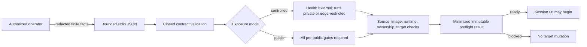

# Session Specification

**Session ID**: `phase03-session05-controlled-release-security-and-operator-contract`
**Phase**: 03 - Operations and Coolify Release
**Source Task**: `07`
**Status**: Complete
**Created**: 2026-08-12
**Validated**: 2026-08-12
**Completed**: 2026-08-12
**Version**: `0.1.36`
**Base Commit**: 9cbd418f0aaa01af935ec5b3b3cbbefaaf1737c5

---

## 1. Session Overview

This session defines the controlled-release security and operator contract
before any Coolify target mutation. It adds a closed preflight evaluator and a
bounded stdin JSON command that accept only finite release facts. The contract
cannot carry a hostname, URL, address, credential, operator name, free-form log,
or private infrastructure identifier.

The preflight separates repository policy validity from target readiness. A
controlled policy may validate while deployment remains blocked until an
authorized operator supplies exact redacted confirmation for source, image,
exposure, storage, secrets, monitoring, backup, recovery, and rollback. This
session records no target claim and does not connect to Coolify.

## 2. Objectives

1. Define a closed controlled-exposure contract with `/health` externally
   checkable over HTTPS and `/runs` private or edge-restricted.
2. Represent every infrastructure decision by a finite category, responsible
   role, validation method, and repository-safe evidence slot.
3. Make public `/runs` readiness impossible without the complete identity,
   authorization, tenant, proxy, shared-rate, lifecycle, edge, and alert gates.
4. Enforce exact source revision, image identity, one replica, port, persistent
   paths, secret-store, monitoring, backup, pause, recovery, and rollback facts.
5. Add a bounded command whose output is closed, minimized, deterministic, and
   contains no submitted values beyond the safe source revision and image digest.
6. Produce the decision record, Mermaid service map, security matrix, operator
   ownership contract, and Week 4 preflight evidence without target mutation.

## 3. Prerequisites

- [x] Session 04 completed Task `06` with 354 tests, 18 green evals, five green drills, and version `0.1.35`.
- [x] Docker, environment, deployment, security, and known-infrastructure records were reconciled.
- [x] The three skipped production infrastructure checks remain explicit and no target evidence is assumed.

No Coolify credential, private target value, browser session, provider call,
deployment permission, or target mutation is required or authorized here.

## 4. Scope

### In Scope

- Closed TypeBox contracts for release evidence, checks, result, and canonical failure.
- Exact finite owner roles, decision IDs, validation methods, evidence slots,
  security gate IDs, and readiness check IDs.
- Controlled and public exposure modes with mode-specific semantic validation.
- Controlled mode permits external HTTPS health only; `/runs` must be private or
  edge-restricted and public-only controls remain visibly not applicable.
- Public mode requires every pre-public gate to be directly confirmed and never
  treats local rate limiting, HTTPS, dashboard access, or health as caller control.
- Exact runtime requirements: port 3000, `/app/data`, event/approval paths,
  16,384-byte application body bound, one replica, bounded run/rate configuration,
  and platform secret storage without values.
- Exact source facts: 40-character revision, clean tree, repository gate pass,
  18/18 critical evals, five/five drills, and an immutable `sha256:` image identity.
- Exact target facts expressed only as booleans or enums; no free-form target data.
- Stdin input bounded to 64 KiB, one JSON object, no arguments, one closed JSON
  result on stdout, canonical stderr failure, and stable exit codes.
- A deliberately incomplete redacted example proving that policy shape does not
  equal deployment readiness.
- Controlled-release decision record, Mermaid map, pre-public matrix, Week 4
  evidence, TODO, changelog, README/deployment/environment navigation, and Apex artifacts.

### Out Of Scope

- Reading `.env`, Pi auth state, provider secrets, Coolify credentials, browser
  state, private URLs, domains, IP addresses, project IDs, or operator names.
- Connecting to, configuring, or mutating Coolify, DNS, firewall, VPS, secret
  store, storage, monitoring, WAF, backup, deployment, or rollback targets.
- Building or publishing an image, external HTTPS checks, `/runs` smoke,
  persistent restart, restore activation, rollback, or operator handoff proof.
- Implementing authentication, authorization, tenant isolation, distributed
  rate state, WAF, approval decisions, real effects, or additional Pi tools.
- Real customer data, production logs, screenshots, or Phase 04 work.

## 5. Technical Approach

### Architecture

`src/release-preflight.ts` owns the exact inventories, schemas, semantic
validation, policy classification, readiness checks, minimized result, deep
immutability, and canonical failures. The evaluator is pure and performs no
filesystem, process, network, provider, or deployment operation.

`scripts/release-preflight.ts` accepts one bounded JSON object from stdin. It
rejects arguments, oversized or malformed input, validates before evaluation,
prints only the closed result, and never echoes the request or caught error.

### Evidence Model

| Group | Safe fields | Forbidden examples |
|-------|-------------|--------------------|
| Source | Full Git revision, fixed gate counts/status | Repository token, remote URL, commit message |
| Image | `sha256:` digest or explicit pending state | Registry URL, credential, private project ID |
| Exposure | Finite route modes and HTTPS requirement | Hostname, domain, IP, proxy address |
| Runtime | Port, replica count, fixed paths, bounded configuration status | Arbitrary mount, command, environment value |
| Secrets | Store kind and value-included boolean | Key name/value, secret reference, auth state |
| Decisions | Fixed ID, role, method, evidence slot, confirmation | Person name, console URL, screenshot path, notes |
| Target | Fixed boolean/enum confirmations | Provider response, logs, infrastructure identifiers |

### Pre-Public Gate Matrix

| Gate | Controlled `/runs` | Public `/runs` |
|------|--------------------|----------------|
| Authentication / authorization | Route not exposed or edge-restricted | Directly confirmed |
| Tenant isolation | Synthetic single-workspace boundary or route not exposed | Directly confirmed |
| Trusted proxy identity | Not trusted by application | Directly confirmed |
| Shared principal-aware rate | Process limiter remains capacity-only | Directly confirmed |
| Body-size control | Application 16,384-byte bound required | Application and edge controls confirmed |
| Human decision access | No public decision endpoint | Authorized durable decision boundary confirmed |
| Data lifecycle | Synthetic-only manual boundary retained | Complete lifecycle confirmed |
| WAF / edge policy | Controlled edge restriction recorded | Public policy directly confirmed |
| Alerts | Local rule/runbook contract recorded | Deployed alert delivery directly confirmed |

## 6. Deliverables

### Files To Create

| File | Purpose | Est. Lines |
|------|---------|------------|
| `src/release-preflight.ts` | Closed policy, evidence contracts, readiness evaluator, and guards | ~650 |
| `scripts/release-preflight.ts` | Bounded stdin JSON command | ~100 |
| `tests/release-preflight.test.ts` | Controlled/public policy, hostile input, command, and redaction proof | ~550 |
| `docs/release/controlled-release-contract.md` | Decision record, Mermaid map, security matrix, and operator ownership | ~250 |
| `docs/fixtures/release-preflight-incomplete.json` | Safe deliberately blocked example with no private values | ~120 |

### Files To Modify

| File | Change |
|------|--------|
| `package.json` | Add `preflight:release` command |
| `docs/build-log-week4.md` | Add repository policy validation and explicit target-readiness block |
| `docs/deployment.md` | Link the preflight and clarify required Session 06 evidence |
| `docs/environments.md` | Align target facts and forbidden evidence with the contract |
| `README.md` | Add controlled-release contract navigation and current status |
| `docs/TODO.md` | Track Session 05 implementation and closeout only after validation |
| `docs/CHANGELOG.md` | Record the closed preflight behavior and non-deployment boundary |

## 7. Success Criteria

### Functional Requirements

- [ ] Every fixed infrastructure decision has an exact role, method, evidence slot, and confirmation state.
- [ ] Controlled exposure passes policy only when `/health` is HTTPS and `/runs`
  is private or edge-restricted; public exposure requires every pre-public gate.
- [ ] Exact source, image, runtime, persistence, secret-store, one-replica,
  backup, monitoring, pause, recovery, and rollback checks are visible.
- [ ] Any unverified revision, missing image, unsafe exposure, missing owner,
  incomplete mandatory configuration, or target evidence produces `blocked`.
- [ ] Result output contains only finite check IDs/statuses and safe digests;
  arbitrary submitted strings are impossible and no request is echoed.
- [ ] Repository policy can validate without claiming the Coolify target is ready.

### Testing Requirements

- [ ] Controlled-ready and public-ready requests pass only their exact gates.
- [ ] Unsafe public, private-route drift, replica/path/port/body-limit drift,
  missing owner, missing decision, secret inclusion, incomplete target, and
  source/image mismatch cases block deterministically.
- [ ] Extra/inherited/accessor/symbol/cyclic/uncloneable input fails before evaluation.
- [ ] Result/failure semantic guards, immutability, stable check order,
  64-KiB stdin bound, malformed JSON, args, stdout/stderr, and redaction pass.
- [ ] Full tests, 18 evals, coverage, audit, and production-agent verification remain green.

### Quality Gates

- [ ] Strict types, Biome, ASCII/LF, docs links, and `git diff --check` pass.
- [ ] Pi/HTTP/approval/effect/recovery/Docker/workflows/dependencies remain unchanged.
- [ ] No target call, secret read, arbitrary path, URL, address, personal data,
  deployment permission, public-ready inference, or unsupported release claim exists.

## 8. Working Assumptions And Boundaries

- Generic roles such as `release_operator`, `security_operator`, and
  `recovery_operator` define responsibility without identifying a person.
- Evidence slots are fixed documentation coordinates, not arbitrary paths or URLs.
- A digest is safe release identity only when recorded from an authorized image
  build; the checked-in incomplete example uses explicit pending state.
- Preflight `ready` is permission to proceed to the separately authorized
  Session 06 operator workflow, not a deployment action.
- Public exposure remains unsupported by current application controls. Tests may
  prove contract logic for a hypothetical complete public request but do not
  claim those controls exist.
- Target confirmation booleans are operator attestations. Session 06 must obtain
  direct external evidence and cannot reuse a synthetic test request.

### Behavioral Quality Focus

Checklist active: Yes.

- Validate the entire own-data tree before reading semantic fields.
- No invalid input may partially produce a ready result.
- Every failed mandatory fact must appear as one finite blocked check without raw context.
- A public request must not inherit controlled-mode exemptions.
- Output must remain detached, deeply immutable, and semantically revalidated.

## 9. Testing Strategy

- Construct exact controlled and hypothetical public ready requests in memory.
- Table-drive every field and gate to its unsafe or missing value and require the
  exact blocked check.
- Mutate nested input and output to prove cloning and deep freezing.
- Inject protected strings into extra/accessor/malformed shapes and verify no output echo.
- Exercise CLI input at empty, malformed, exact-bound, over-bound, multiple-value,
  unexpected-argument, ready, and blocked conditions.
- Scan imports and exact-base diff for network, process execution, filesystem,
  secret, Pi, HTTP, effect, deployment, and target-mutation capabilities.

## 10. Dependencies

- Depends on: `phase03-session04-incident-drills-and-operational-baseline`.
- Starts: Task `07` controlled release without target mutation.
- Enables: Session 06 Coolify deployment health and persistence only after an
  authorized target request directly passes preflight.

---

## Next Step

Session complete. Session 06 requires an authorized target preflight.
