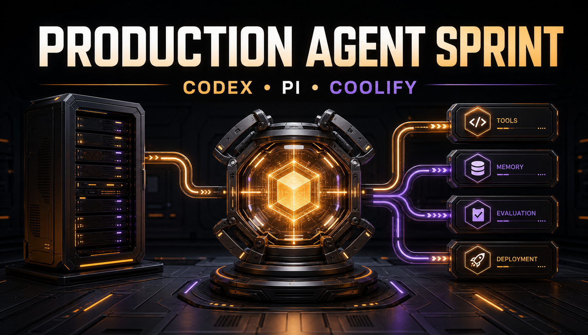
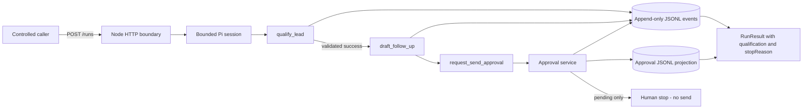

# Production Agent Workshop

Build a bounded Agency Lead Operations Agent with Codex, Pi, and Coolify.



This public repository contains a runnable reference agent, a realistic
[client brief](./docs/todo/client-brief.md), ordered
[workshop tasks](./docs/todo/README_todo.md), deterministic tests and evals,
append-only event evidence, a Docker image, and an explicit human stop.

## Current Bounded Behavior

Given one exact synthetic `leadId`, the current application validates a typed
qualification, permits a deterministic draft only after matching successful
evidence, durably creates the exact pending approval record, derives stop state
from its projection, and stops without sending.

A Pi-independent internal application composes durable approval and one
deterministic in-process fake action with durable idempotency. It is not
composed into the HTTP/Pi runtime, has no public or tool entrypoint, and
performs no network write.



The frozen production allowlist contains exactly:

- `qualify_lead`
- `draft_follow_up`
- `request_send_approval`

Pi has no production shell, filesystem, approval-decision, or send tool. A
pending approval is evidence that a human decision is required; it is not
authorization and it is not a completed external effect.

## Quick Start

Requirements:

- Node.js 24.15 or newer
- npm 12 or newer; the repository pins npm 12.0.2
- Git

Install the locked dependencies, then run the one command that checks
formatting, linting, strict types, all 156 deterministic tests, and all five
evals:

```bash
npm ci
npm run verify
```

The verification path is provider-independent. Running the Pi agent also
requires a provider configured in supported Pi auth state or a supported
provider key exported to the process. To use a ChatGPT Plus or Pro Codex
subscription, follow the
[Pi OpenAI Codex subscription authentication guide](./docs/openai-codex-subscription-auth.md).

Start the HTTP service:

```bash
npm start
```

Check the provider-independent health endpoint:

```bash
curl --fail http://127.0.0.1:3000/health
```

With provider authentication configured, a controlled synthetic run is:

```bash
curl -X POST http://127.0.0.1:3000/runs \
  -H 'content-type: application/json' \
  -d '{"leadId":"lead_ada"}'
```

Available classroom identifiers are `lead_ada`, `lead_grace`, and the
intentional not-found case `lead_unknown`. Do not replace the fixtures with
real customer data.

## Repository Structure

```text
.
|-- .github/workflows/       # Code Quality and Build & Test CI
|-- .spec_system/            # PRD, workflow state, governance, and evidence
|-- docs/                    # Architecture, operations, workshop, and task docs
|-- src/                     # HTTP, Pi orchestration, tools, schemas, and events
|-- tests/                   # Deterministic contract and integration tests
|-- biome.json               # Formatting scope and style
|-- Dockerfile               # Node 24 image, /app/data, and health probe
|-- package.json             # Runtime, scripts, and dependency contract
`-- AGENTS.md                # Repository guidance entry point
```

## Documentation

- [Onboarding](./docs/onboarding.md)
- [Development guide](./docs/development.md)
- [Architecture](./docs/ARCHITECTURE.md)
- [HTTP API](./docs/api/http-api.md)
- [Environments](./docs/environments.md)
- [Deployment](./docs/deployment.md)
- [Incident response](./docs/runbooks/incident-response.md)
- [Contributing](./CONTRIBUTING.md)
- Build Logs: [Week 1](./docs/build-log-week1.md) |
  [Week 2](./docs/build-log-week2.md) |
  [Week 3](./docs/build-log-week3.md) |
  [Week 4](./docs/build-log-week4.md)
- [Workshop path](./docs/todo/README_todo.md)

## Architecture Ownership

- **Codex** changes, tests, reviews, and documents the repository.
- **Pi** owns the bounded model loop and invokes only supplied custom tools.
- **The application** owns validation, permissions, domain truth, event
  evidence, stop reasons, and every future external-effect gate.
- **Coolify** is the intended deployment boundary for secrets, persistence,
  health, and rollback; no production deployment has been validated yet.

See [Architecture](./docs/ARCHITECTURE.md) for the current component and trust
map.

## Project Status And Safety

Phase 00 and all six Phase 01 sessions are complete. Durable approval and the
internal idempotent fake-write composition are validated with consolidated
Task `03` evidence. In particular:

- approval decisions are internal only; there is no public authenticated
  decision endpoint;
- an internal deterministic fake adapter/result store exists for tests and
  later integration, but no Pi/HTTP entrypoint or real external-write adapter exists;
- whole-run recovery, production eval gates, and incident operations remain open;
- `/runs` has a bounded process-wide capacity gate but no caller
  authentication, authorization, tenant isolation, distributed limiter, or
  deployed WAF, so it must remain private or otherwise controlled;
- real customer data remains prohibited until lifecycle and access controls pass.

The cumulative source of truth is the
[Security and Compliance record](./.spec_system/SECURITY-COMPLIANCE.md).

## Docker And Coolify

The Docker image exposes port 3000, stores event and approval files under
`/app/data`, and has a container health probe for `/health`. The image, probe,
and process-wide `/runs` rate gate pass local validation; production Coolify
health, edge security, persistence, restore, and rollback remain unproved.
Use the [deployment guide](./docs/deployment.md) for the verified local boundary
and the remaining external decisions.

## Required Workshop Path

Complete the [ordered workshop tasks](./docs/todo/README_todo.md) across five
phases, one workshop week per phase. Task `08` is a required comparison even
when its evidence says to remove the added handoff.

## Deferred Integrations

These require separate authorization after the ordered workshop path:

1. A read-only production CRM adapter.
2. A separately approved company-research source.
3. A real send provider with exact approval and idempotency guarantees.
4. Postgres behind the existing persistence contracts.
5. Model grading only for qualities deterministic gates cannot measure.

## Versioning

Releases follow [Semantic Versioning 2.0.0](https://semver.org/spec/v2.0.0.html)
and the repository [versioning policy](./docs/VERSIONING.md). The project is
currently version 0.1.22; user-visible changes are recorded in the
[changelog](./docs/CHANGELOG.md).

## Official Pi References

- [Pi repository](https://github.com/earendil-works/pi)
- [Pi SDK guide](https://github.com/earendil-works/pi/blob/main/packages/coding-agent/docs/sdk.md)
- [Pi SDK examples](https://github.com/earendil-works/pi/tree/main/packages/coding-agent/examples/sdk)

Pi is not a general permission sandbox. The production boundary comes from the
frozen tool allowlist, application validation and approvals, deterministic
evidence, and container or platform controls.

### Dependency Note

Pi 0.83.0 currently requires root overrides for `brace-expansion`, `minimatch`,
and `undici`. npm 12 honors the committed overrides; the current audit reports
zero vulnerabilities. Keep npm on the declared version, run `npm audit` before
release, and remove an override only after the upstream dependency tree is
verified.
