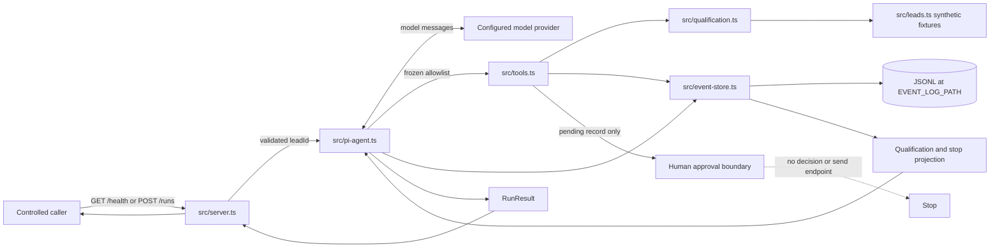

# Architecture

## System Overview

The repository is one Node.js and TypeScript service. A small HTTP boundary
starts one bounded Pi session for a validated synthetic `leadId`. Pi can invoke
only three custom tools; application code validates qualification, downstream
evidence, event ordering, and visible stop reasons. The run stops at a pending
human approval and has no external-write capability.

## Components

| Component | Location | Technology | Purpose |
|-----------|----------|------------|---------|
| HTTP boundary | `src/server.ts` | Node.js HTTP | Health, body limit, `leadId` validation, response mapping |
| Pi orchestration | `src/pi-agent.ts` | Pi Coding Agent SDK | Session lifecycle, prompt, frozen tool allowlist, event-derived run result |
| Qualification domain | `src/qualification.ts` | TypeBox + TypeScript | Closed schemas, runtime validation, deterministic result, canonical failures |
| Custom tools | `src/tools.ts` | Pi tool definitions | Bounded qualification, deterministic draft, pending approval, exact-lead gates |
| Synthetic lead source | `src/leads.ts` | In-memory TypeScript data | Exact lookup for classroom fixtures only |
| Event store | `src/event-store.ts` | Append-only JSONL | Correlated durable evidence by `runId` |
| Deterministic gates | `tests/`, `src/evals.ts` | `node:test` + TSX | Contract, failure, permission, event, and vertical-slice verification |
| Container boundary | `Dockerfile` | Node.js 24 Alpine | Port 3000, `/app/data`, process start, and container health probe |
| Code Quality CI | `.github/workflows/quality.yml` | GitHub Actions | Locked install, formatting check, and strict TypeScript |

## Run And Evidence Flow

1. `POST /runs` accepts JSON under 16,384 bytes and validates the `leadId`
   string pattern before starting Pi.
2. The application creates a `runId`, appends `run.started`, and closes the
   three tools over the exact requested identifier and event store.
3. `qualify_lead` validates input, applies a 1,000 ms application deadline,
   and appends one attempt plus exactly one schema-owned terminal event.
4. `draft_follow_up` and `request_send_approval` deny work unless the latest
   valid qualification is a success for the exact run lead.
5. The application reconstructs qualification from events, derives one finite
   stop reason, appends `run.completed`, and returns `RunResult`.
6. Any uncaught run failure appends `run.failed`; the HTTP boundary maps it to
   a 503 response. Whole-run replay and resume are not implemented.

## Trust And Permission Boundaries

| Boundary | Application rule |
|----------|------------------|
| HTTP input | Validate body size and `leadId` before starting Pi |
| Model/tool input | Treat as untrusted; enforce closed schemas and exact identity |
| Lookup result | Runtime-validate the complete synthetic lead and identity |
| Qualification result | Accept only a schema-valid application-owned outcome |
| Persisted event | Validate type-specific data, identity, freshness, and ordering before projection |
| Draft creation | Require latest matching qualification success |
| Approval request | Create `pending` evidence only; never decide or send |
| External write | Forbidden because no adapter or tool exists |

The production tool names are frozen at runtime. Pi has no shell, filesystem,
credential, deployment, approval-decision, or network-writing tool.

## Data And Persistence

- Synthetic lead fixtures are committed in `src/leads.ts`.
- Pi conversation state is in memory for one run.
- Events append to `EVENT_LOG_PATH`, defaulting to `./data/events.jsonl` and
  set to `/app/data/events.jsonl` in the image.
- Qualification events exclude lead profile text and caught dependency detail.
- Draft and pending approval events currently store a full synthetic draft;
  lifecycle, backup, restore, and erasure rules remain open.
- There is no database, queue, cache, durable decision store, or replay engine.

## Deployment Topology

The locally validated image contains one Node.js process, port 3000, a declared
`/app/data` volume, and a Docker `HEALTHCHECK` for `/health`. Coolify is the
intended hosting boundary, but no production URL, persistence proof, restore,
or rollback has been validated.

## Key Decisions

- Keep one bounded Pi session until measured evidence justifies another stage.
- Keep deterministic schemas, permissions, durable truth, and effect controls
  in application code rather than prompts.
- Use append-only events as evidence and rebuild typed projections from them.
- Keep the required workshop path synthetic and no-send.

Detailed rationale and Mermaid traces are in the [Build Log](./build-log.md).
Living risks and constraints are in
[Considerations](../.spec_system/CONSIDERATIONS.md) and
[Security and Compliance](../.spec_system/SECURITY-COMPLIANCE.md). New decisions
should use the [ADR template](./adr/0000-template.md).
