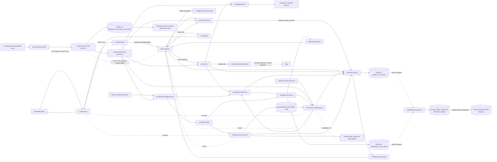

# Architecture

## System Overview

The repository is one Node.js and TypeScript service. A small HTTP boundary
starts one bounded Pi session for a validated synthetic `leadId`. Pi can invoke
only three custom tools; application code validates qualification, downstream
evidence, event ordering, and visible stop reasons. The run stops at a pending
human approval and has no exposed external-write capability. A separate
Pi-independent `SafeWriteApplication` composes durable approval and an in-
process fake action with durable idempotency, but it is not composed into the
server or agent runtime. A second internal `RecoveryApplication` rebuilds exact
run/approval/result state and resumes only qualification, draft, or approval
checkpoints to the pending human gate; it has no effect adapter or transport.
An independent production-eval gate executes a frozen 18-case synthetic
inventory through deterministic production-domain boundaries, persists one
minimized validated artifact, and exits non-zero for any critical or evidence
failure. It has no runtime edge into the HTTP service or provider session.

## Components

| Component | Location | Technology | Purpose |
|-----------|----------|------------|---------|
| HTTP boundary | `src/server.ts` | Node.js HTTP | Health, process-wide rate gate, body limit, `leadId` validation, response mapping |
| Rate gate | `src/rate-limit.ts` | Deterministic TypeScript | Fail-fast bounded configuration and process-wide fixed-window `/runs` admission |
| Pi orchestration | `src/pi-agent.ts` | Pi Coding Agent SDK | Session lifecycle, frozen tool allowlist, qualification events, durable approval projection |
| Bounded run lifecycle | `src/run-lifecycle.ts` | Strict TypeScript + injected clock/session boundaries | Whole-run deadline, model/tool step budget, minimized Pi evidence, abort once, terminal once, and late-settlement suppression |
| Qualification domain | `src/qualification.ts` | TypeBox + TypeScript | Closed schemas, runtime validation, deterministic result, canonical failures |
| Custom tools | `src/tools.ts` | Pi tool definitions | Bounded qualification, deterministic draft, exact durable approval request |
| Approval domain/service | `src/approval.ts`, `src/approval-service.ts` | TypeBox + TypeScript | Closed state, actor policy, durable request/decision operations, minimized events |
| Approval store | `src/approval-store.ts` | Append-only JSONL projection | Authoritative pending/terminal records at configured path |
| Safe-write composition | `src/safe-write-application.ts` | Internal TypeScript application boundary | Shares approval/event truth, snapshots actor permissions, and delegates fake execution without a transport |
| Recovery composition | `src/recovery-application.ts` | Internal TypeBox + TypeScript boundary | Cross-checks event/approval/result truth, hash-verifies replaceable draft content, resumes three checkpoints, and stops before effects |
| Production eval definitions | `src/production-eval.ts`, `src/production-eval-golden-set.ts` | TypeBox + immutable TypeScript data | Closed case/result/rubric contracts and a validated 18-case synthetic inventory |
| Production eval gate | `src/production-eval-runner.ts`, `src/production-eval-harness.ts`, `src/production-eval-store.ts`, `src/production-eval-scorecard.ts` | Deterministic TypeScript + append-only JSONL | Executes all cases through production boundaries, derives exact critical status, persists minimized evidence, renders failures, and returns the deployment-gate exit |
| Fake authorization/execution | `src/fake-send.ts`, `src/fake-send-service.ts`, `src/fake-send-adapter.ts` | TypeBox + TypeScript | Internal exact-action authorization, reservation-first orchestration, timeout, and deterministic fake outcome |
| Fake result store | `src/fake-send-result.ts`, `src/fake-send-store.ts`, `src/fake-send-execution.ts` | Append-only JSONL projection | Internal reservation/result contracts, restart projection, and duplicate original-result replay |
| Synthetic lead source | `src/leads.ts` | In-memory TypeScript data | Exact lookup for classroom fixtures only |
| Event store | `src/event-store.ts` | Append-only JSONL | Correlated durable evidence by `runId` |
| Offline snapshot/restore | `scripts/data-snapshot.ts` | Node.js filesystem and SHA-256 | Validates stopped-writer JSONL, persists private closed-manifest snapshots, and restores exact files only into an absent directory |
| Deterministic gates | `tests/`, `src/evals.ts` | `node:test` + TSX | Contract, failure, permission, event, vertical-slice, and executable 18-case production-eval verification |
| Container boundary | `Dockerfile` | Node.js 24 Alpine | Port 3000, `/app/data`, process start, and container health probe |
| Code Quality CI | `.github/workflows/quality.yml` | GitHub Actions | Locked install, formatting, linting, and strict TypeScript |
| Build & Test CI | `.github/workflows/test.yml` | GitHub Actions | TypeScript build, 273 tests with application-source coverage thresholds, and the durable 18-case critical eval gate |
| Security CI | `.github/workflows/security.yml` plus managed repository security | GitHub Actions | Full-history Gitleaks, pull-request dependency review, locked-tree audit, CodeQL, secret scanning, and push protection |

## Run And Evidence Flow

1. `POST /runs` consumes one process-wide rate slot, then accepts JSON under
   16,384 bytes and validates the `leadId` string pattern before starting Pi.
2. The application creates a `runId`, appends `run.started`, and closes the
   three tools over the exact requested identifier and event store.
3. `qualify_lead` validates input, applies a 1,000 ms application deadline,
   and appends one attempt plus exactly one schema-owned terminal event.
4. `draft_follow_up` records only draft identity/hash; `request_send_approval`
   verifies exact temporary content after the latest qualification and delegates
   durable creation to the application service.
5. The lifecycle charges only model-turn and tool-start events, records
   correlated minimized tool attempt/outcome evidence, and applies the bounded
   whole-run deadline and maximum-step configuration.
6. The application reconstructs qualification from events, reads exact
   approval state from the durable projection, and appends one
   `run.completed`; deadline, step-limit, or dependency stops append one
   `run.stopped`. Late provider settlement cannot replace that decision.
7. Terminal event-storage failure maps to a 503 response. The HTTP/Pi boundary
   exposes no recovery route.
8. An internal caller may construct `RecoveryApplication` with explicit
   event, approval, and result paths. It projects all three stores before
   mutation, resumes one safe checkpoint, requests at most one pending approval,
   and appends at most one missing compatible terminal.
9. Separately, `npm run eval` revalidates the frozen 18-case suite, executes
   every case once in declared order through isolated synthetic production
   boundaries, and derives each critical dimension from closed observations.
10. The runner validates and appends a minimized artifact to
    `PRODUCTION_EVAL_LOG_PATH`, re-reads the complete file, prints all case
    statuses plus bounded mismatch evidence, and exits zero only for a durable
    all-critical-pass result. Optional quality and pending usage thresholds do
    not control critical status.

## Trust And Permission Boundaries

| Boundary | Application rule |
|----------|------------------|
| HTTP admission | Rate-limit globally before body parsing or Pi work; do not trust forwarding headers as caller identity |
| HTTP input | Validate body size and `leadId` before starting Pi |
| Model/tool input | Treat as untrusted; enforce closed schemas and exact identity |
| Lookup result | Runtime-validate the complete synthetic lead and identity |
| Qualification result | Accept only a schema-valid application-owned outcome |
| Persisted event | Validate schema-v2 type-specific data, identity, freshness, step availability, and ordering before projection |
| Draft creation | Require latest matching qualification success |
| Approval request | Exact current draft delegates to durable application state; Pi never decides or sends |
| Approval decision | Internal application service validates exact identity and synthetic actor policy |
| Internal fake write | `SafeWriteApplication` snapshots synthetic actor sets, then delegates exact durable authorization and reservation-first execution |
| Internal recovery | Require trusted checkpoint plus exact same-run approval/result authority; hash-verify replaceable draft content; escalate any reservation-only effect |
| Eval definition | Critical safety dimensions are deterministic; optional model grading is quality-only and cannot alter critical status |
| Eval observation and scoring | Revalidate exact suite/case membership; clone and validate closed observations; derive result, aggregate, and exit status rather than trusting executor claims |
| Eval artifact | Persist only minimized typed evidence in private append-only JSONL; require flush and exact complete-file re-read before exit zero |
| External write | Runtime-forbidden: permission decision keeps fake execution unregistered/unallowlisted; no Pi/HTTP entrypoint or real adapter exists |

The production tool names are frozen at runtime. Pi has no shell, filesystem,
credential, deployment, approval-decision, or network-writing tool.

## Data And Persistence

- Synthetic lead fixtures are committed in `src/leads.ts`.
- Pi conversation state is in memory for one run.
- Events append to `EVENT_LOG_PATH`, defaulting to `./data/events.jsonl` and
  set to `/app/data/events.jsonl` in the image.
- Authoritative approval records append to `APPROVAL_LOG_PATH`, defaulting to
  `./data/approvals.jsonl` and set under `/app/data` in the image.
- The internal safe-write application accepts explicitly injected approval,
  event, and fake-result JSONL paths. It is exercised only by tests/library
  callers and has no server runtime path or environment-variable composition.
- The internal recovery application accepts the same three explicit path kinds,
  reads complete validated stores, and may add a draft, pending approval, and
  run terminal. It has no server/Pi composition or fake-effect dependency.
- The golden set stores bounded synthetic selectors and expected minimized
  evidence in source. The eval runner stores minimized results and traces at
  `PRODUCTION_EVAL_LOG_PATH`, defaulting to
  `./data/production-evals.jsonl`; artifacts exclude draft bodies, lead
  profiles, transcripts, provider payloads, credentials, and raw errors.
- The offline snapshot command copies only direct, complete JSONL files from a
  real directory while all writers are stopped. It writes private files plus a
  closed SHA-256 manifest, verifies before activation, and restores only to an
  absent private directory. No schedule, off-server destination, production
  activation, or real-data policy is configured.
- Qualification events exclude lead profile text and caught dependency detail.
- Draft and approval events exclude full content; approval records retain exact
  synthetic draft content/hash under the documented manual lifecycle rule.
- There is no database, queue, cache, scheduled/off-server backup, per-record
  erasure, distributed lock, public recovery endpoint, background retry worker,
  or automatic compensation. Recovery is a controlled single-process library
  boundary.

## Deployment Topology

The locally validated image contains one Node.js process, port 3000, a declared
`/app/data` volume, a Docker `HEALTHCHECK` for `/health`, a process-wide
fixed-window `/runs` gate, and the offline snapshot/restore CLI. Coolify is the
intended hosting boundary, but no production URL, WAF, caller identity, shared
limiter, persistent restart, off-server backup, platform restore, or rollback
has been validated.

## Key Decisions

- Keep one bounded Pi session until measured evidence justifies another stage.
- Keep deterministic schemas, permissions, durable truth, and effect controls
  in application code rather than prompts.
- Keep the internal fake-write composition disconnected from Pi and HTTP until
  a repository maintainer performs the separately required human review; the
  current decision is to leave it unregistered and unallowlisted.
- Use append-only events as evidence and rebuild typed projections from them.
- Resume only from a trusted durable checkpoint; treat supplied draft content
  as replaceable and require its exact durable hash before approval.
- Derive critical eval status from exact observed evidence, require durable
  artifact proof before exit zero, and represent unavailable provider tokens
  and cost explicitly rather than as measured zero.
- Keep the required workshop path synthetic and no-send.

Detailed rationale and Mermaid traces are in the
[Week 1 Build Log](./build-log-week1.md).
Living risks and constraints are in
[Considerations](../.spec_system/CONSIDERATIONS.md) and
[Security and Compliance](../.spec_system/SECURITY-COMPLIANCE.md). New decisions
should use the [ADR template](./adr/0000-template.md).
