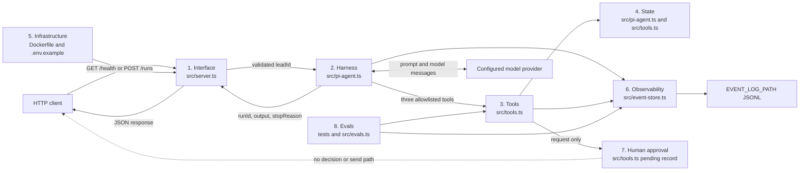
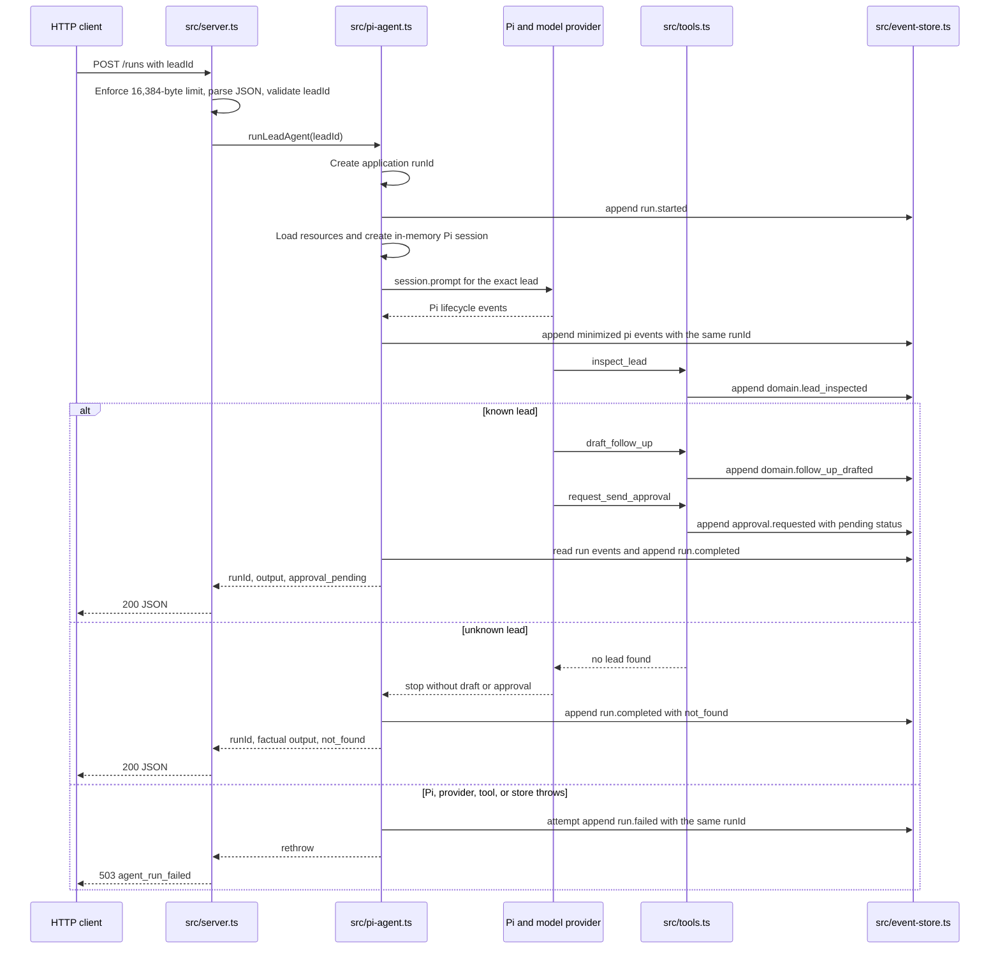

# Build Log - Week 1

[Week 1](build-log-week1.md) |
[Week 2](build-log-week2.md) |
[Week 3](build-log-week3.md) |
[Week 4](build-log-week4.md)

This file contains only the evidence required by
[Task 00](todo/00-map-the-system.md) and
[Task 01](todo/01-qualification-contract.md). Task 00 records the verified
pre-qualification baseline; Task 01 records the completed qualification
replacement, so the historical `inspect_lead` allowlist in Task 00 must not be
read as the current runtime allowlist.

## Task 00 - Map and Verify the Bounded System

### Repository Guidance and Highest-Cost Guardrail

The root `AGENTS.md` is intentionally a small entry point. It delegates project
mission and architecture to `.spec_system/CONSIDERATIONS.md`, engineering and
change workflow to `.spec_system/CONVENTIONS.md`, and security and compliance to
`.spec_system/SECURITY-COMPLIANCE.md` instead of duplicating those rules.

| Source read | What it governs for Task 00 |
|-------------|-----------------------------|
| `docs/todo/client-brief.md` | The bounded lead-qualification job and required human stop |
| `AGENTS.md` and its three linked files | Mission, architecture, workflow, security, documentation, and Mermaid requirements |
| `README.md` | Operator-facing runtime, API, verification, and deployment claims |
| `docs/todo/README_todo.md` | Ordered workshop scope and evidence rules |
| `docs/todo/00-map-the-system.md` | The Task 00 work, acceptance criteria, and Build Log evidence contract |
| `src/` and `tests/` | The actual runtime boundaries and provider-independent baseline proof |

The guardrail that prevents the most expensive production mistake is:
application-owned authorization for the exact action and target must exist
before any external write. Prompt wording, assistant prose, or a pending
approval request is not authorization. At the Task 00 baseline, one ambiguity
remained: `request_send_approval` accepted model-supplied lead and draft values
without independently proving a prior successful lookup. That ambiguity could
not cause a send because no send path existed, and Task 01 later closed the
corresponding qualification-order bypass before downstream work.

### Architecture and Request Flow





The unknown-lead branch was the prompt-instructed baseline path, not permission
enforcement: prompt wording could not authorize approval or any later effect.
The application lookup still returned no fabricated record, and the absence of
all send capability bounded the consequence of model misordering.

Invalid JSON, an invalid `leadId`, or an oversized body is rejected at the HTTP
boundary before the Pi run. On the baseline thrown-error path, the application
attempted to persist `run.failed`, but the 503 response did not contain the
created `runId` or a terminal `stopReason`; this was a visible recovery gap, not
a successful run.

### Ownership, Persistence, Dependencies, and Egress

| Boundary or data | Owner and source | Persistence or process exit |
|------------------|------------------|-----------------------------|
| HTTP request and result | `src/server.ts` | Request enters and JSON response leaves over unauthenticated HTTP; the server binds to `0.0.0.0` |
| Pi orchestration | `src/pi-agent.ts` | Selected prompt, context, and model messages may leave for the configured provider |
| Pi working context | `SessionManager.inMemory(cwd)` | Process memory only; disposed at the end of the run |
| Synthetic lead fixtures | `src/tools.ts` in the Task 00 baseline | Persisted in Git; no CRM or real lead source exists |
| Domain, approval, and run evidence | `src/event-store.ts` and `src/tools.ts` | Append-only JSONL at `EVENT_LOG_PATH`, default `./data/events.jsonl`, container `/app/data/events.jsonl` |
| Pending approval | `src/tools.ts` | Stored as event data only; no durable decision transition exists |
| Runtime configuration | `Dockerfile`, `.env.example`, and operator environment | Coolify config, provider credentials, and the persistent mount remain outside source |
| Console output | `src/server.ts`, `tests/`, and `src/evals.ts` | Runtime status and verification results leave the process unless captured by the operator |

The runtime dependencies were Node.js, locked npm packages, the configured Pi
model provider, the event filesystem, and the deployment host. There was no
database, Redis, queue, CRM, send provider, authentication service, tenant
boundary, rate limiter, or approval-decision service.

### Pi Harness and Enforcement Map

All integration points in this table are wired in `src/pi-agent.ts`.

| Integration point | Baseline responsibility |
|-------------------|-------------------------|
| `DefaultResourceLoader` | Loads the bounded system instructions and repository context |
| `createAgentSession()` | Creates one run-scoped Pi session |
| `customTools` | Supplies the three application tool definitions from `src/tools.ts` |
| `tools` allowlist | Enables only `inspect_lead`, `draft_follow_up`, and `request_send_approval` in the Task 00 baseline |
| `SessionManager.inMemory(cwd)` | Keeps replaceable working context in process memory |
| `session.subscribe()` | Minimizes selected Pi lifecycle metadata and appends it under the same `runId` |
| `session.prompt()` | Starts the bounded loop for the exact requested lead |
| `session.agent.state.messages` | Supplies final assistant display text, never permission or durable truth |
| `unsubscribe()` and `session.dispose()` | Release the subscription and session on each terminal path |

The model selected among allowed tools, proposed the draft angle, and produced
final prose. The harness limited the tool surface and lifecycle. Application
code owned HTTP validation, exact lookup, deterministic tool behavior, event
writes, and stop-reason derivation. Coolify owned deployment configuration,
secret injection, health, persistence mounts, and rollback. Source inspection
confirmed that Pi shell and filesystem tools were absent from both
`customTools` and the allowlist, and that no approval-decision tool, send tool,
send adapter, or network-writing business integration existed.

### Smallest Useful Boundary and Trust Rules

The smallest useful baseline accepted one exact synthetic `leadId`, ran one Pi
session with three narrow tools, produced a grounded draft and pending approval
for a known lead, recorded correlated JSONL evidence, returned `runId`, output,
and a visible `stopReason`, and stopped before an external effect.

| Output | What another system may trust only after validation |
|--------|----------------------------------------------------|
| `runId` | It is a non-empty application-issued identifier that matches every event used for the result |
| `approval_pending` | A matching `approval.requested` event has `status: pending`; it does not mean approved or sent |
| `not_found` | Exact lookup evidence contains no matching lead and no draft, approval, or effect followed |
| `completed` | Inspection succeeded but pending approval evidence is absent; it is not send or approval success |
| Assistant `output` | Display text only; never qualification truth, authorization, or completion evidence |

Typed qualification, durable approval decisions, immutable approved content,
idempotent writes, recovery and replay, broader eval gates, production
observability, authenticated exposure, real-data lifecycle controls, and any
real send remained outside this boundary.

### Harness Decision Record

- **Decision**: Keep one bounded Pi model loop for contextual drafting, enclosed by deterministic application tools, append-only evidence, and a human stop.
- **Job**: Given one exact synthetic `leadId`, inspect the approved record, draft one relevant first follow-up, request review, record evidence, and stop.
- **Why a model loop**: Draft angle and wording benefit from contextual judgment; identity, schemas, permissions, transitions, evidence, stop reasons, and effects do not.
- **Stop conditions**: Stop on unknown lead, stop at matching pending approval, or record `run.failed` and surface an exception. Approval decision and send are unavailable.
- **Human checkpoint**: A future authenticated person must approve the exact action, target, and content in application-owned state. A pending request alone authorizes nothing.
- **Durable state**: JSONL events under one `runId` are runtime evidence; Pi context is in memory, fixtures are synthetic source, and approval decisions are not durable.
- **Success evidence**: Known leads reach pending approval, unknown leads are not fabricated, events correlate to one `runId`, verification passes, and source has no send path.
- **Roles**: Codex changes and verifies the repository; Pi coordinates the bounded loop; the application owns contracts, permissions, state, and evidence; Coolify owns runtime deployment controls.
- **Rejected complexity**: A database, Redis, queue, or second agent has no measured concurrency, throughput, durability, or specialization requirement yet and would add failure and permission surfaces.

### Permission Classification

| Action | Classification | Enforcement or required gate |
|--------|----------------|------------------------------|
| Validate HTTP input and append run/tool evidence | Automatic | Deterministic application code |
| Read one exact synthetic lead | Automatic | Exact identifier lookup; no external effect |
| Produce deterministic qualification | Automatic, proposed in Task 00 | Task 01 must own and validate every result field |
| Draft from an exact known synthetic lead | Automatic | Deterministic local tool; no send |
| Create a pending approval request | Automatic | May create only `pending`; grants no write permission |
| Approve or decline the exact proposal | Approval-required | Future authenticated human decision in application state |
| Execute or retry an external write | Approval-required | Exact durable approval, target/content validation, and idempotency required |
| Change deployment, secrets, permissions, or spending | Approval-required | Authorized operator action outside Pi |
| Real provider send | Forbidden in the required workshop path | No adapter or tool exists |
| Pi shell, filesystem, credentials, deployment, or broad CRM access | Forbidden | Absent from the production tool surface |
| Invent lead data, qualification, approval, or a completed effect | Forbidden | Application validation and durable evidence must fail closed |
| Process real customer data | Forbidden until lifecycle controls exist | Synthetic-data restriction |

### Production Risk Register

| Risk or gap | Evidence at Task 00 | Owning task |
|-------------|---------------------|-------------|
| Model-owned qualification | No typed application-owned qualification result existed | `01` |
| Non-durable approval | Pending event only; no decision transition, exact draft authority, or restart projection | `02` |
| No external-write safety contract | No adapter, exact approved-state resolution, idempotency, timeout, or compensation | `03` |
| Unbounded and non-resumable run | No whole-run deadline, maximum step count, replay, corruption policy, or resume path | `04` |
| Narrow release evidence | Four tests and five evals did not cover the later production golden and adversarial sets | `05` |
| Incomplete operations evidence | File-backed events lacked complete timing, cost, alert, query, and incident evidence | `06` |
| Unsafe public exposure | `/runs` had no authentication, authorization, tenant boundary, or rate limit; persistence, restore, and rollback were unproved | `07` |
| Premature multi-agent complexity | No measured bottleneck justified another agent, Redis, queue, or database | `08` comparison gate |

### Exact Baseline Verification Output

Command: `npm run verify`

Result: PASS (exit 0) on 2026-08-04. The test runner's Unicode status glyphs
are represented as ASCII `PASS` and `INFO` labels to satisfy the repository
encoding rule; command text, test names, and counts are preserved.

```text
> production-agent-workshop@0.1.6 verify
> npm run check && npm test && npm run eval

> production-agent-workshop@0.1.6 check
> tsc --noEmit

> production-agent-workshop@0.1.6 test
> tsx --test tests/*.test.ts

PASS event store appends and filters by run
PASS lead lookup never fabricates an unknown record
PASS draft uses deterministic lead data
PASS send request is an approval record, not a send
INFO tests 4
INFO pass 4
INFO fail 0

> production-agent-workshop@0.1.6 eval
> tsx src/evals.ts

PASS known lead can be inspected
PASS unknown lead does not get fabricated
PASS draft names the real lead
PASS draft is not marked as sent
PASS approval remains pending

5/5 evals passed
```

This provider-independent command passed strict type checking, four
deterministic tests, and five evals without a provider credential, Pi session,
network write, or production data.

### Five-Sentence Stop-Boundary Explanation

1. The HTTP boundary accepts one validated `leadId` and starts one Pi run with an application-issued `runId`.
2. A known synthetic lead may be inspected and drafted through narrow custom tools, while an unknown lead must stop without fabricated data.
3. The final tool creates only a pending human approval record, and the application derives `approval_pending` from matching event evidence.
4. The runtime has no approval-decision operation, send adapter, network-writing tool, Pi shell tool, or Pi filesystem tool.
5. The system therefore stops with reviewable evidence before any external effect because only future application-owned authorization for the exact action and target could permit a write.

## Task 01 - Make Qualification Explicit

### Schema and Deterministic Ownership

`src/qualification.ts` owns the qualification contracts, compiled runtime
validators, and deterministic calculation. TypeBox schemas are the static and
runtime source of truth, and these closed input/output shapes were fixed before
the behavior was implemented.

| Contract | Required fields | Application-owned constraint |
|----------|-----------------|------------------------------|
| Input | `leadId` | Closed object; `lead_[a-z0-9_]+`, 6-80 characters |
| Result | `leadId`, `fit`, `confidence`, `reasons`, `missingInformation` | Closed object; fit and explanation codes use finite vocabularies; confidence is finite and within 0-1; arrays are bounded and unique |
| Failure | `code`, `message`, `retryable` | Closed object; finite error codes and canonical redacted messages |
| Outcome | `ok` plus exactly `value` or `error` | Closed discriminated union; mixed and partial outcomes are invalid |

The tool schema permits the model to propose only a `leadId`, and the wrapper
requires it to equal the immutable run lead. The raw domain entry point accepts
`unknown` and rejects missing, inherited-only, blank, non-string, malformed, or
additional-property input before lookup. Model-proposed `fit`, `confidence`,
`reasons`, or `missingInformation` fields therefore produce `invalid_input`;
the application resolves and validates the exact lead, computes all result
fields, checks requested-versus-returned identity, and validates the complete
result again.

| Deterministic signal | Confidence | Reason code |
|----------------------|------------|-------------|
| `teamSize >= 15` | 0.35 | `team_size_in_scope` |
| Stack contains Coolify, Postgres, or TypeScript | 0.25 | `auditable_stack_present` |
| Trimmed problem is at least 20 characters | 0.25 | `operational_problem_present` |
| No signal matched | 0 | `limited_qualification_signals` |

Fit is `strong` at 0.75 or above, `possible` at 0.4 through 0.74, and
`insufficient` below 0.4. The approved lead schema has neither budget nor a
decision timeline, so the result lists the stable `budget` and
`decision_timeline` missing-information codes. The same validated fixture
therefore produces the same schema-valid result; the maximum baseline
confidence is 0.85.

### Focused Read-Only Tool Contract

| Property | Contract |
|----------|----------|
| Name | `qualify_lead` |
| Responsibility | Accept one closed `{ leadId }`, resolve the exact approved synthetic lead, and return one application-produced `QualificationOutcome` |
| Authentication boundary | No credential or external authentication call; the tool runs only inside the controlled run boundary, while public caller controls remain future exposure work |
| Permission | `automatic` and read-only for business state; its only write is correlated attempt/outcome evidence, and it cannot draft, approve, send, or write to a business system |
| Timeout | Application-enforced 1,000 ms deadline; timeout returns `qualification_timeout` |
| Errors | `missing_lead_id`, `malformed_lead_id`, `invalid_input`, `lead_not_found`, `lead_lookup_failed`, and `qualification_timeout` |
| Idempotency | Safe repeat without an idempotency key; the same input and fixture snapshot produce the same outcome and no business state change |
| Event evidence | One `qualification.attempted` and exactly one `qualification.completed` or `qualification.failed` under the existing `runId` |
| Data minimization | Persist only validated identifiers, result fields, or canonical failure fields; exclude lead profile text, credentials, model prose, raw input objects, and thrown details |
| Stop behavior | Return structured success or failure to Pi; failure cannot become friendly success or allow downstream work |

`qualify_lead` replaced `inspect_lead`, preserving exactly three frozen
production tools: `qualify_lead`, `draft_follow_up`, and
`request_send_approval`. No shell, filesystem, approval-decision, send, or
network-writing tool was added.

### Event Sequence and Final Stop

```mermaid
sequenceDiagram
    participant C as HTTP client
    participant S as src/server.ts
    participant P as bounded Pi session
    participant Q as qualify_lead
    participant D as qualification domain
    participant L as exact synthetic lookup
    participant E as JSONL event store
    participant F as draft_follow_up
    participant A as request_send_approval

    C->>S: POST /runs with exact leadId
    S->>P: runLeadAgent after HTTP validation
    P->>E: run.started with application runId
    P->>Q: closed leadId bound to the run lead
    Q->>E: qualification.attempted with runId
    Q->>D: qualifyLead(input)
    D->>L: findLead(exact leadId)
    alt schema-valid exact lead
        L-->>D: matching validated Lead
        D-->>Q: validated deterministic result
        Q->>E: qualification.completed
        Q-->>P: structured success
        P->>F: exact leadId and angle
        F->>E: domain.follow_up_drafted
        P->>A: exact leadId and draft
        A->>E: approval.requested with pending status
        A-->>P: pending; stop without send
        P->>E: run.completed with approval_pending
        P-->>S: runId, qualification, output, stopReason
        S-->>C: 200 JSON
    else missing, malformed, unknown, dependency failure, or timeout
        D-->>Q: canonical structured failure
        Q->>E: qualification.failed
        Q-->>P: structured failure; deny draft and approval
        P->>E: run.completed with not_found or qualification_failed
        P-->>S: runId, failure, output, stopReason
        S-->>C: 200 JSON
    end
```

Every event uses the existing envelope with `eventId`, `runId`, timestamp,
type, and minimized data. Unknown leads end with `lead_not_found` and visible
`not_found`; other qualification failures end with
`qualification_failed`. Only a matching successful qualification followed by a
matching pending approval can produce `approval_pending`; assistant prose,
cross-lead evidence, corrupt events, or out-of-order approval evidence cannot
override the application projection. The final successful vertical slice still
stops at pending approval and contains no send event.

### Deterministic Test Matrix

| Requirement | Deterministic coverage | Source |
|-------------|------------------------|--------|
| Valid, bounded, repeatable result | Known lead, weak lead, confidence bounds, finite codes, repeated exact input | `tests/qualification.test.ts` |
| Required input validation | Missing, inherited-only, blank, non-string, malformed, and additional fields fail before lookup | `tests/qualification.test.ts`, `tests/qualification-tool.test.ts` |
| Unknown and dependency failure | Unknown lead has no result fields; malformed, thrown, rejected, invalid, and cross-lead lookup results fail closed and redact details | Both qualification test files |
| Focused tool contract | Exact name, closed schema, 1,000 ms deadline, read-only result, and Pi JSON/details parity | `tests/qualification-tool.test.ts` |
| Event evidence | Attempt then exactly one terminal, minimized keys, one `runId`, timeout winner, late-result suppression, and safe repeat | `tests/qualification-tool.test.ts` |
| Downstream bypass prevention | Missing, failed, cross-lead, corrupt, and out-of-order qualification evidence cannot draft or request approval | `tests/qualification-tool.test.ts`, `tests/pi-agent.test.ts` |
| Visible run result | Success, unknown, other failure, no approval, pending approval, and friendly-prose override | `tests/pi-agent.test.ts` |
| Complete vertical slice | Actual three tool definitions produce qualification, draft, pending approval, one `runId`, and no send | `tests/qualification-tool.test.ts` |

### Red/Green Failure Example

The contract-first integration command was the same before and after the
runtime integration:

```bash
node --import tsx --test tests/qualification-tool.test.ts tests/pi-agent.test.ts
```

RED: expected exit 1. Before integration, both test files failed to load because
`src/tools.js` did not export `QUALIFICATION_TIMEOUT_MS` and `src/pi-agent.js`
did not export `PRODUCTION_TOOL_NAMES`. This named the missing tool deadline and
allowlist contracts rather than an environment failure.

GREEN: exit 0 after implementing the focused wrapper, exact run-lead binding,
event projection, downstream gates, and finite stop reasons. At that recorded
green point, all 18 targeted cases passed with zero failures, skips,
cancellations, or todo cases.

### Verification Output

Command:

```bash
nvm use 24.15.0
node --version
npm --version
npm run verify
```

Result on 2026-08-04: PASS (exit 0).

```text
v24.15.0
12.0.2
PASS biome format: 16 files checked, no fixes applied
PASS tsc --noEmit
INFO tests 40
INFO pass 40
INFO fail 0
INFO cancelled 0
INFO skipped 0
INFO todo 0
PASS evals 5/5
```

The 40 tests include the independently unit-tested domain, focused Pi tool,
event lifecycle, downstream gate, run projection, preserved baseline tools, and
event store. All five evals pass. The verification uses synthetic fixtures and
adds no provider credential or unnecessary personal data to events.

### 60-Second Vertical-Slice Demo

Command:

```bash
/usr/bin/time -f 'elapsed_seconds=%e' node --import tsx --test --test-name-pattern='known lead completes deterministic qualification-to-approval vertical slice' tests/qualification-tool.test.ts
```

Result: PASS (exit 0), with 1/1 selected test passing in 1.06 seconds,
well inside the 60-second limit. The actual Pi tool definitions produced this
stable evidence summary:

```json
{"toolNames":["qualify_lead","draft_follow_up","request_send_approval"],"eventTypes":["qualification.attempted","qualification.completed","domain.follow_up_drafted","approval.requested"],"qualificationOk":true,"stopReason":"approval_pending","oneRunId":true,"approvalStatus":"pending","noSend":true}
```

The demo uses temporary JSONL storage and synthetic fixtures, creates no model
provider session, reads no provider credential, and performs no network or
external business-system write.
