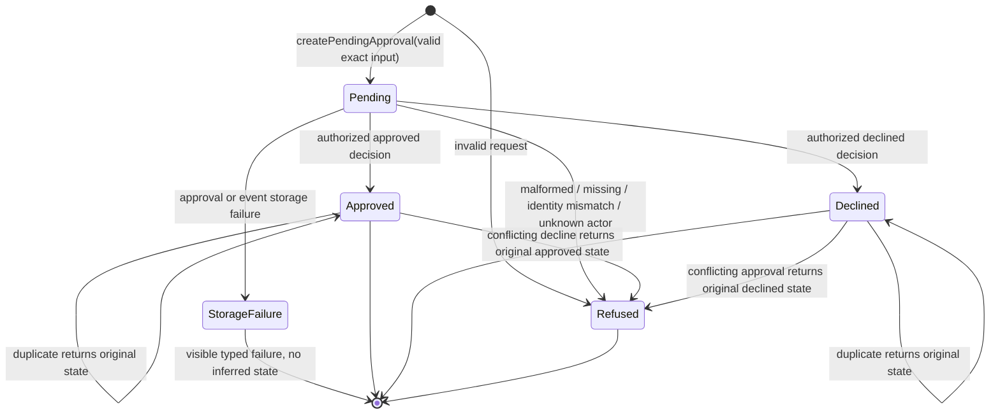
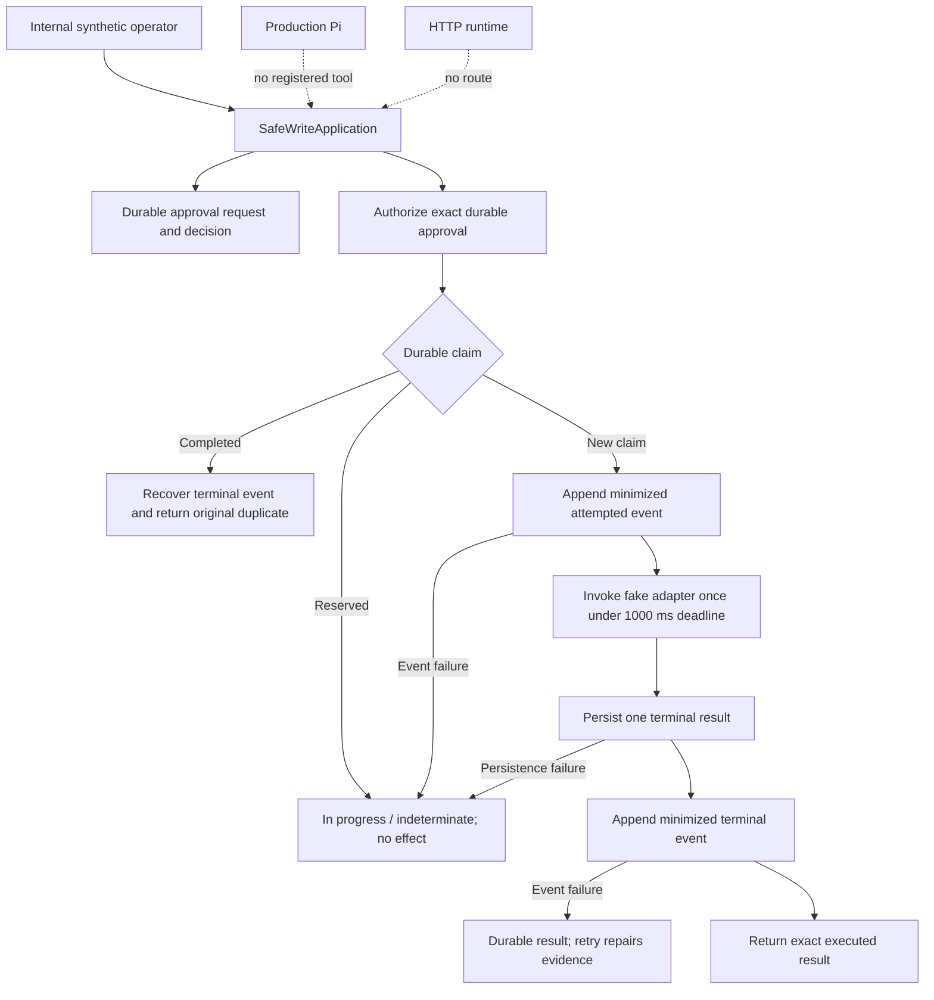

# Build Log - Week 2

[Week 1](build-log-week1.md) |
[Week 2](build-log-week2.md) |
[Week 3](build-log-week3.md) |
[Week 4](build-log-week4.md)

> This log contains only observed evidence from Tasks 02 and 03. Sections that
> remain outside the current implementation say so explicitly; planned behavior
> is never presented as an implemented control.

## Task 02 - Make Approvals Durable

Task contract: [02 - Make Approvals Durable](todo/02-durable-approvals.md)

### Goal and Boundary

`src/approval.ts` owns the closed, Pi-independent approval record and pure
decision transition boundary. One pending record binds a stable `approvalId` to
the original `runId`, exact `send_follow_up` action, exact lead target, immutable
synthetic draft ID/content/SHA-256, request time, and null decision. Approved and
declined are mutually exclusive terminal variants with minimized actor ID and
decision time.

`src/approval-service.ts` now integrates this domain with the replaceable file
store and minimized operational events. Pi can request the exact current draft
but has no approve/decline operation; decisions remain internal application
calls. There is still no public decision endpoint or external effect.

### Approval State Diagram



Source: `ApprovalRecordSchema`, `createPendingApproval`, and
`transitionApproval` in `src/approval.ts`; `FileApprovalStore`; and
`ApprovalService`, exercised by approval domain/store/service and tool tests.

### Storage Contract

The schema separates three closed variants: pending, approved, and declined.
Each record retains only synthetic approval/run/action/target/draft linkage,
request time, status, and minimized decision metadata. Draft identity is linked
to content with an application-owned SHA-256 and revalidated at every untrusted
record crossing.

The replaceable `ApprovalStore` contract exposes `appendRequest`,
`appendDecision`, `get`, and `listRun`, each returning a discriminated typed
outcome. `ApprovalStorageRecordSchema` permits only one pending request record
or one matching approved/declined decision record.

`FileApprovalStore` in `src/approval-store.ts` stores one closed record per LF-
terminated JSONL line at its injected path. A request line retains the exact
pending record; a decision line retains only record identity, recording time,
approval/run identity, and minimized decision metadata. The adapter opens in
append mode, writes one complete line, calls `fsync`, closes in `finally`, and
rebuilds from disk before returning success. It holds no authoritative current-
state cache. Runtime composition selects `APPROVAL_LOG_PATH`, defaulting to
`./data/approvals.jsonl` locally and `/app/data/approvals.jsonl` in the image.

### Transition Event Examples

The closed `ApprovalEventDataSchema` permits minimized synthetic data such as:

```json
{"eventType":"approval.requested","approvalId":"approval_test_001","action":"send_follow_up","targetKind":"lead","leadId":"lead_ada","draftId":"draft_test_001","status":"pending"}
{"eventType":"approval.approved","approvalId":"approval_test_001","actorId":"actor_reviewer","status":"approved"}
{"eventType":"approval.decision_duplicate","approvalId":"approval_test_001","actorId":"actor_reviewer","requestedDecision":"approved","status":"approved"}
{"eventType":"approval.invalid","approvalId":"approval_test_001","operation":"decision","code":"unknown_actor"}
{"eventType":"approval.storage_failed","approvalId":"approval_test_001","operation":"decision","code":"storage_failure"}
```

The surrounding `AgentEvent` supplies the original `runId`; full draft content,
credentials, raw exceptions, and unrelated lead data are rejected as extra
event properties. `ApprovalService` emits these events after authoritative state
mutation and recovers a missing request/terminal event from durable state on a
retry without appending another transition.

### Restart Proof

Command:

```bash
node --import tsx --test tests/approval-store.test.ts
```

Observed result: 13/13 adapter tests pass. A first store appends pending then
terminal records; separately constructed instances read the same file and rebuild exact
pending, approved, and declined objects. The tests also inspect durable line
counts: one request plus one terminal decision remains exactly two lines after
an identical retry. The 11-test service suite and cross-layer tool test construct
new service/store instances for pending and terminal views and preserve the same
two-line result. No raw conversation or in-memory cache grants state.

### Data-Lifecycle Decision

Current scope is synthetic only. A request line retains storage record ID/time,
approval/run/action, target kind/lead ID, draft ID/SHA-256/full content, pending
status, request time, and null decision. A terminal line retains storage record
ID/time, approval/run identity, actor ID, decision, and decision time.
Operational qualification/draft/approval events contain only the identifiers,
hashes, finite states, and canonical error codes defined by their schemas.

- **Retention**: keep synthetic approval/event files for at most 30 days or
  until environment teardown, whichever occurs first. This is a manual rule;
  no expiry scheduler exists.
- **Redaction**: never edit append-only lines in place. Share minimized event
  evidence by default; the approval file remains restricted because it contains
  the exact synthetic draft.
- **Export**: only an authorized operator may make a controlled offline copy of
  the exact configured files while the service is stopped. There is no public
  export API.
- **Deletion**: stop the service and delete the whole exact synthetic data file
  during reset/expiry, then verify it is absent. Individual-record erasure is
  unsupported because it would break append-only evidence.

There is no backup/restore drill, per-record erasure, consent, tenant, or real-
data governance. Real personal/customer data remains prohibited until those
controls are designed and validated.

### Exercised Failure and Recovery

| Case | Deterministic Outcome | State Effect |
|------|-----------------------|--------------|
| Missing approval | `approval_not_found` | None |
| Malformed decision | `invalid_decision` | None |
| Unknown actor | `unknown_actor` | None |
| Duplicate request | `duplicate_request` | No second request line |
| Run or approval mismatch | `approval_identity_mismatch` | None |
| Same terminal decision | `duplicate` + original terminal record | None |
| Opposite terminal decision | `conflict` + original terminal record | None |
| Invalid current record | `invalid_approval_record` | None |
| Storage failure | `storage_failure` plus minimized correlated event when writable | No success may be inferred |
| Event outage after state append | `storage_failure`; retry repairs missing minimized event | No second state line |

The pure transition tests exercise domain refusals without editing state. The
file-store suite additionally writes invalid JSON, malformed schema data, and a
truncated non-LF record. Reads return `corrupt_record` or `interrupted_write`
with no projection. Injected writer failure returns redacted `storage_failure`;
a new store lookup proves no in-memory approval was created. Recovery is to
repair the storage source through a later operator workflow, never to skip or
silently truncate damaged evidence.

The application-service suite additionally injects approval/event read/write,
ID, and clock failures. A durable state append followed by an event outage
returns visible failure; retry restores the missing minimized event from the
record and preserves the one-request/one-decision line count. Unknown actors,
malformed inputs, missing approvals, duplicates, and conflicts append no state.

### Verification Output

Session 01 contract and Session 02 storage verification under Node.js 24.15.0
and npm 12.0.2:

- `node --import tsx --test tests/approval.test.ts` - 17/17 focused tests pass.
- `npm run verify` - formatting and strict types pass, 57/57 deterministic
  tests pass, and 5/5 deterministic evals pass.
- `npm audit --audit-level=low` - 0 vulnerabilities.
- Targeted permission, credential, ASCII/LF, and `git diff --check` scans pass.
- `npx tsx --test tests/approval-store.test.ts` - 13/13 focused adapter and
  restart tests pass.
- Session 02 `npm run verify` - formatting and strict types pass, 70/70
  deterministic tests pass, and 5/5 deterministic evals pass.
- `npx tsx --test tests/approval-service.test.ts` - 11/11 service tests pass.
- Selected service/tool/Pi integration gate - 39/39 tests and strict types pass.
- Session 03 `npm run verify` - formatting and strict types pass, 86/86
  deterministic tests pass, and 5/5 deterministic evals pass.
- Session 03 `npm audit --audit-level=low` - 0 vulnerabilities; targeted
  credential, network/process, data, Pi/HTTP permission, and whitespace scans pass.
- Post-review Session 03 gate - 93/93 deterministic tests and 5/5 evals pass
  after runtime adapter validation, failure canonicalization, and ordering repairs.

### Final Diff Review and Remaining Risk

Sessions 01-03 add no Pi allowlist entry, HTTP decision route, provider
credential, network access, or external effect. Session 03 selects the
configured approval path, delegates exact requests to application state, keeps
decisions internal, minimizes events, and derives stop truth from projection.
Synthetic full draft content is confined to the approval record.

Remaining Task `02` risks are explicit: the adapter is single-process; audit and
state files do not share an atomic transaction; damaged-file repair is manual;
the 30-day retention rule is manual; and no per-record erasure, backup/restore,
public actor authentication, or tenant boundary exists. These restrictions keep
real data and public decision operations prohibited.

## Task 03 - Add an Idempotent Send Boundary

Task contract: [03 - Add an Idempotent Send Boundary](todo/03-idempotent-send.md)

### Goal and Boundary

Sessions 04 and 05 define and implement the internal fake-write service.
Session 06 composes it with durable approval behind one internal application
boundary without exposing it to Pi or HTTP. Responsibilities are split as:

- `src/fake-send.ts` - exact approved-action authorization and stable key;
- `src/fake-send-result.ts` - event, reservation, result, record, and store
  contracts;
- `src/fake-send-store.ts` - append-only JSONL projection and durable claim/
  completion adapter;
- `src/fake-send-service.ts` - state/event/effect ordering, deadline, duplicate
  replay, and evidence recovery;
- `src/fake-send-adapter.ts` - deterministic in-process fake adapter only;
- `src/fake-send-execution.ts` - closed application outcome contract.
- `src/safe-write-application.ts` - shared approval/event/result composition,
  snapshotted actor permissions, and the explicit production exclusion decision.

The service receives a previously validated exact approved action. It invokes no
provider and performs no socket, DNS, HTTP, subprocess, or real message write.
The production Pi allowlist remains exactly three request/read tools.



### Write Contract

The identity-only request and immutable command rules from Session 04 remain
unchanged. The application owns the full execution order:

1. validate authorization and exact approval/run/action/target/draft identity;
2. synchronously append and flush one durable reservation before asynchronous
   work;
3. append `fake_send.attempted` before calling the adapter;
4. invoke the injected fake adapter once with an `AbortSignal` and 1,000 ms
   deadline;
5. append and flush one terminal accepted, rejected, timed-out, or downstream-
   failure result and re-read its projection;
6. append the matching minimized terminal event;
7. on a completed duplicate, repair any missing terminal event and return the
   exact original result without another adapter call.

`FileFakeSendResultStore` writes one closed LF-terminated JSON value per line,
opens new files with mode `0600`, calls `fsync`, closes in `finally`, and
rebuilds from disk before success. It keeps no authoritative cache. Projection
rejects invalid JSON/schema, missing final LF, blank lines, duplicate record IDs,
decreasing time, duplicate reservations, result-before-reservation, duplicate
terminal records, and reservation/result identity conflicts.

The fake adapter returns a deterministic receipt derived from the stable key.
It has no external dependency. Results continue to declare automatic
compensation unsupported and `manual_review_required`.

### Permission And Outcome Table

| Case | Implemented result | Adapter effects |
|------|--------------------|-----------------|
| Exact approved first request | Durable reservation, one fake invocation, exact terminal result | 1 |
| Completed duplicate/restart | Exact original result with `duplicate` kind | 0 additional |
| Existing reservation only | `execution_in_progress`; indeterminate/manual review | 0 additional |
| Invalid/extra request | `invalid_request` | 0 |
| Unauthorized actor | `permission_denied` before approval lookup + minimized event | 0 |
| Missing approval | `approval_not_found` | 0 |
| Pending approval | `approval_pending` | 0 |
| Declined approval | `approval_declined` | 0 |
| Run/action/target/draft mismatch | `approval_identity_mismatch` | 0 |
| Corrupt/interrupted/out-of-order result file | Typed store refusal; no partial projection | 0 |
| Attempt-event failure | Durable reservation, visible storage failure | 0 |
| Adapter rejection | Durable `rejected` result and event | 1 |
| Adapter throw/reject/malformed result | Durable redacted `downstream_failure` | 1 |
| Adapter deadline | Abort signal + durable `timed_out`; late settlement ignored | 1 |
| Completion-store failure after effect | Reservation remains indeterminate; storage failure | 1, never retried automatically |
| Terminal-event failure | Durable result + storage-failure evidence; duplicate retry repairs terminal event | 1 |

### Idempotency Proof

The stable `v1` key remains the SHA-256 of length-delimited domain, approval,
run, action, target, draft ID, and approved draft SHA-256 fields. Actor identity
and caller content remain excluded.

Observed deterministic proof:

- a first accepted execution writes exactly two result-file lines: reservation
  then terminal result;
- a new store/service instance returns a deep-equal original result, leaves the
  file at two lines, and calls a fresh adapter spy zero times;
- two concurrent calls in one Node process synchronously serialize at the file
  claim, producing one adapter call and one `execution_in_progress` response;
- repeated exact completion is idempotent and adds no line; a different terminal
  result is a typed conflict;
- timeout, rejected, and downstream failures are terminal for the same key and
  are returned exactly on later duplicates;
- a reservation without a result never expires or retries automatically because
  the effect may already have happened.

This is an at-most-once guarantee only for the documented single process. No
distributed or multi-process locking claim is made.

### Test Matrix

| Suite | Tests | Covered behavior |
|-------|------:|------------------|
| `tests/fake-send.test.ts` | 16 | Closed authorization/adapter/result/execution contracts, semantic identity, stable key, permission order, zero-effect denials |
| `tests/fake-send-store.test.ts` | 16 | Projection, restart, line counts, private mode, duplicate/in-progress, exact completion, corruption, interruption, I/O and metadata failures |
| `tests/fake-send-service.test.ts` | 15 | First/duplicate/concurrent execution, all authorization denials, rejection/downstream/timeout/late paths, store/event outages, immutable replaceable boundaries, duplicate terminal evidence, and recovery |
| `tests/safe-write-application.test.ts` | 9 | File-backed valid/missing/mismatch/pending/declined/timeout/duplicate/permission/rejected/downstream paths, actor snapshots, shared event domains, and production exclusion |

The combined Task `03` gate passes 56/56 tests. The complete repository passes
149/149 deterministic tests plus five evals.

### File-Backed Vertical Slice Proof

The internal application constructs one event store and one approval store, then
shares them between the approval service and exact fake-send authorizer. It
constructs the result store and fake-send service once per application instance.
Approval and execution actor sets are copied at construction, so later caller
mutation cannot grant permission.

Observed proof through actual temporary JSONL files:

- request plus authorized approval decision produces exactly two approval lines;
- exact execution produces exactly two result lines and one adapter effect;
- the same shared run log contains approval and fake-send domains, and duplicate
  recovery ignores valid other-domain events while rejecting any malformed
  event that claims `fake_send.*`;
- a new application instance on the same three paths returns the deep-equal
  original with zero calls to its injected adapter and no third result line;
- missing input, target mismatch, pending/declined state, and permission denial
  create no result file and invoke no adapter;
- timeout, rejection, throws, and malformed adapter output create one exact
  canonical terminal result and matching minimized fake-send event.

### Redacted Event Examples

The surrounding `AgentEvent` supplies the exact original `runId`. Implemented
data examples are:

```json
{"eventType":"fake_send.attempted","approvalId":"approval_test_001","idempotencyKey":"aaaaaaaaaaaaaaaaaaaaaaaaaaaaaaaaaaaaaaaaaaaaaaaaaaaaaaaaaaaaaaaa"}
{"eventType":"fake_send.accepted","approvalId":"approval_test_001","idempotencyKey":"aaaaaaaaaaaaaaaaaaaaaaaaaaaaaaaaaaaaaaaaaaaaaaaaaaaaaaaaaaaaaaaa","durationMs":25,"outcome":"accepted"}
{"eventType":"fake_send.duplicate","approvalId":"approval_test_001","idempotencyKey":"aaaaaaaaaaaaaaaaaaaaaaaaaaaaaaaaaaaaaaaaaaaaaaaaaaaaaaaaaaaaaaaa","durationMs":1,"outcome":"duplicate","originalStatus":"accepted"}
{"eventType":"fake_send.storage_failed","approvalId":"approval_test_001","idempotencyKey":"aaaaaaaaaaaaaaaaaaaaaaaaaaaaaaaaaaaaaaaaaaaaaaaaaaaaaaaaaaaaaaaa","code":"storage_failure"}
```

Closed schemas reject draft content, target address, raw errors, provider
response, credentials, and unrelated lead data. Tests inspect serialized events
and prove neither the synthetic draft nor lead target appears.

### Human Review Result

**Human review status: not performed and not claimed. Production decision: keep
fake/write capability unregistered and unallowlisted.** The frozen decision in
`src/safe-write-application.ts` records both false values, names the repository
maintainer as the required reviewer, and requires that review before either may
change. The production allowlist remains exactly `qualify_lead`,
`draft_follow_up`, and `request_send_approval`; there is no Pi fake-send tool or
HTTP write route.

This satisfies the safety condition by making no write-capable allowlist change.
AI implementation/review evidence is not represented as human approval. A future
proposal must provide the exact tool contract and diff to a repository
maintainer, record approval, and separately authorize any scope expansion.

### Exercised Failure, Recovery, And Escalation

| Failure | Safe behavior | Retry / human action |
|---------|---------------|----------------------|
| Authorization denial | No claim, attempt, or effect | Correct approval/identity/permission; do not bypass |
| Claim/read corruption or outage | No effect | Stop; inspect/repair exact result file offline |
| Attempt-event outage | Reservation only, no effect | Do not retry automatically; inspect event/result evidence |
| Timeout | Abort + durable timed-out result; late settlement ignored | Duplicate returns timeout; human decides any future new approved action |
| Rejected/downstream | Durable terminal failure | Duplicate returns original; investigate before a new approval |
| Completion failure after invocation | Reservation only; effect indeterminate | Mandatory human inspection; no automatic retry or compensation |
| Terminal-event outage | Durable terminal result remains truth | Duplicate safely reconstructs missing terminal event, then returns original |
| Existing reservation after restart | `execution_in_progress` | Treat as indeterminate; manual escalation only |

Automatic rollback, lease expiry, reservation deletion, and retry of an
indeterminate key are intentionally absent.

### Verification Output

- Contract/store RED: focused test failed with `ERR_MODULE_NOT_FOUND` for
  `src/fake-send-store.js`.
- Service RED: focused test failed with `ERR_MODULE_NOT_FOUND` for
  `src/fake-send-service.js`.
- Composition RED: the nine-path integration suite failed with
  `ERR_MODULE_NOT_FOUND` for `src/safe-write-application.js`.
- Initial composition GREEN exposed shared-log duplicate recovery rejecting
  valid approval events; the corrected domain-aware reader passes the direct
  regression and fails closed on malformed fake-send namespace claims.
- Focused GREEN: 56/56 Task `03` contract/store/service/application tests pass.
- Code-review RED/GREEN: mutable reservation/result/event values, repeated exact
  terminal evidence, and terminal-only generic failures were reproduced and
  repaired with direct regressions.
- `npm run verify`: formatting and strict types pass, 149/149 tests pass, and
  5/5 evals pass.
- `npm audit --audit-level=low`: 0 vulnerabilities.
- Final review additionally checks persistence, events, permission order,
  credentials, process/network capabilities, ASCII/LF, and the complete diff.

### Final Diff Review And Remaining Risk

Sessions 05-06 add local JSONL result capability, an in-process fake adapter,
and an internal application composition behind the exact durable approval
boundary. They add no package, provider, credential, public route, Pi tool,
allowlist entry, subprocess, network call, real message, real data, or automatic
compensation. Source scans confirm neither `src/pi-agent.ts` nor `src/server.ts`
imports the internal application.

Values generated by the service are frozen before replaceable result/event
adapters receive them. Duplicate replay also requires exactly one matching
terminal event; multiple matching terminal records are treated as corrupt
evidence and fail closed.

Known constraints remain explicit: the claim is single-process only; approval,
event, and result files are not one transaction; a crash or completion failure
can leave an indeterminate reservation; repair and retention are manual; no
lease expiry, distributed lock, backup/restore, tenant boundary, public actor
authentication, or real-data lifecycle exists. Whole-run recovery and
production eval gates remain later-phase work and are not started here.
