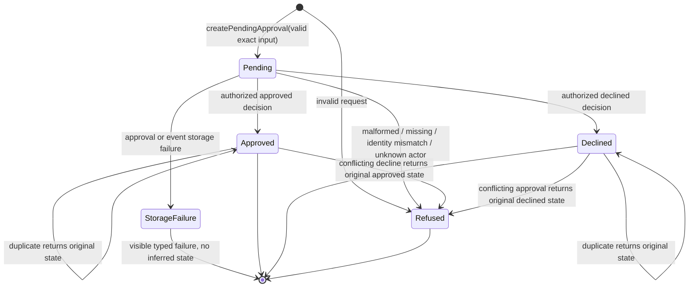

# Build Log - Week 2

[Week 1](build-log-week1.md) |
[Week 2](build-log-week2.md) |
[Week 3](build-log-week3.md) |
[Week 4](build-log-week4.md)

> This log contains only observed evidence from Tasks 02 and 03. Sections that
> remain outside the current implementation say so explicitly; planned behavior
> is never presented as an implemented control.

## Task 02 - Make Approvals Durable

Task contract: [02 - Make Approvals Durable](todo/02-durable-approvals.md)

### Goal and Boundary

`src/approval.ts` owns the closed, Pi-independent approval record and pure
decision transition boundary. One pending record binds a stable `approvalId` to
the original `runId`, exact `send_follow_up` action, exact lead target, immutable
synthetic draft ID/content/SHA-256, request time, and null decision. Approved and
declined are mutually exclusive terminal variants with minimized actor ID and
decision time.

`src/approval-service.ts` now integrates this domain with the replaceable file
store and minimized operational events. Pi can request the exact current draft
but has no approve/decline operation; decisions remain internal application
calls. There is still no public decision endpoint or external effect.

### Approval State Diagram



Source: `ApprovalRecordSchema`, `createPendingApproval`, and
`transitionApproval` in `src/approval.ts`; `FileApprovalStore`; and
`ApprovalService`, exercised by approval domain/store/service and tool tests.

### Storage Contract

The schema separates three closed variants: pending, approved, and declined.
Each record retains only synthetic approval/run/action/target/draft linkage,
request time, status, and minimized decision metadata. Draft identity is linked
to content with an application-owned SHA-256 and revalidated at every untrusted
record crossing.

The replaceable `ApprovalStore` contract exposes `appendRequest`,
`appendDecision`, `get`, and `listRun`, each returning a discriminated typed
outcome. `ApprovalStorageRecordSchema` permits only one pending request record
or one matching approved/declined decision record.

`FileApprovalStore` in `src/approval-store.ts` stores one closed record per LF-
terminated JSONL line at its injected path. A request line retains the exact
pending record; a decision line retains only record identity, recording time,
approval/run identity, and minimized decision metadata. The adapter opens in
append mode, writes one complete line, calls `fsync`, closes in `finally`, and
rebuilds from disk before returning success. It holds no authoritative current-
state cache. Runtime composition selects `APPROVAL_LOG_PATH`, defaulting to
`./data/approvals.jsonl` locally and `/app/data/approvals.jsonl` in the image.

### Transition Event Examples

The closed `ApprovalEventDataSchema` permits minimized synthetic data such as:

```json
{"eventType":"approval.requested","approvalId":"approval_test_001","action":"send_follow_up","targetKind":"lead","leadId":"lead_ada","draftId":"draft_test_001","status":"pending"}
{"eventType":"approval.approved","approvalId":"approval_test_001","actorId":"actor_reviewer","status":"approved"}
{"eventType":"approval.decision_duplicate","approvalId":"approval_test_001","actorId":"actor_reviewer","requestedDecision":"approved","status":"approved"}
{"eventType":"approval.invalid","approvalId":"approval_test_001","operation":"decision","code":"unknown_actor"}
{"eventType":"approval.storage_failed","approvalId":"approval_test_001","operation":"decision","code":"storage_failure"}
```

The surrounding `AgentEvent` supplies the original `runId`; full draft content,
credentials, raw exceptions, and unrelated lead data are rejected as extra
event properties. `ApprovalService` emits these events after authoritative state
mutation and recovers a missing request/terminal event from durable state on a
retry without appending another transition.

### Restart Proof

Command:

```bash
node --import tsx --test tests/approval-store.test.ts
```

Observed result: 13/13 adapter tests pass. A first store appends pending then
terminal records; separately constructed instances read the same file and rebuild exact
pending, approved, and declined objects. The tests also inspect durable line
counts: one request plus one terminal decision remains exactly two lines after
an identical retry. The 11-test service suite and cross-layer tool test construct
new service/store instances for pending and terminal views and preserve the same
two-line result. No raw conversation or in-memory cache grants state.

### Data-Lifecycle Decision

Current scope is synthetic only. A request line retains storage record ID/time,
approval/run/action, target kind/lead ID, draft ID/SHA-256/full content, pending
status, request time, and null decision. A terminal line retains storage record
ID/time, approval/run identity, actor ID, decision, and decision time.
Operational qualification/draft/approval events contain only the identifiers,
hashes, finite states, and canonical error codes defined by their schemas.

- **Retention**: keep synthetic approval/event files for at most 30 days or
  until environment teardown, whichever occurs first. This is a manual rule;
  no expiry scheduler exists.
- **Redaction**: never edit append-only lines in place. Share minimized event
  evidence by default; the approval file remains restricted because it contains
  the exact synthetic draft.
- **Export**: only an authorized operator may make a controlled offline copy of
  the exact configured files while the service is stopped. There is no public
  export API.
- **Deletion**: stop the service and delete the whole exact synthetic data file
  during reset/expiry, then verify it is absent. Individual-record erasure is
  unsupported because it would break append-only evidence.

There is no backup/restore drill, per-record erasure, consent, tenant, or real-
data governance. Real personal/customer data remains prohibited until those
controls are designed and validated.

### Exercised Failure and Recovery

| Case | Deterministic Outcome | State Effect |
|------|-----------------------|--------------|
| Missing approval | `approval_not_found` | None |
| Malformed decision | `invalid_decision` | None |
| Unknown actor | `unknown_actor` | None |
| Duplicate request | `duplicate_request` | No second request line |
| Run or approval mismatch | `approval_identity_mismatch` | None |
| Same terminal decision | `duplicate` + original terminal record | None |
| Opposite terminal decision | `conflict` + original terminal record | None |
| Invalid current record | `invalid_approval_record` | None |
| Storage failure | `storage_failure` plus minimized correlated event when writable | No success may be inferred |
| Event outage after state append | `storage_failure`; retry repairs missing minimized event | No second state line |

The pure transition tests exercise domain refusals without editing state. The
file-store suite additionally writes invalid JSON, malformed schema data, and a
truncated non-LF record. Reads return `corrupt_record` or `interrupted_write`
with no projection. Injected writer failure returns redacted `storage_failure`;
a new store lookup proves no in-memory approval was created. Recovery is to
repair the storage source through a later operator workflow, never to skip or
silently truncate damaged evidence.

The application-service suite additionally injects approval/event read/write,
ID, and clock failures. A durable state append followed by an event outage
returns visible failure; retry restores the missing minimized event from the
record and preserves the one-request/one-decision line count. Unknown actors,
malformed inputs, missing approvals, duplicates, and conflicts append no state.

### Verification Output

Session 01 contract and Session 02 storage verification under Node.js 24.15.0
and npm 12.0.2:

- `node --import tsx --test tests/approval.test.ts` - 17/17 focused tests pass.
- `npm run verify` - formatting and strict types pass, 57/57 deterministic
  tests pass, and 5/5 deterministic evals pass.
- `npm audit --audit-level=low` - 0 vulnerabilities.
- Targeted permission, credential, ASCII/LF, and `git diff --check` scans pass.
- `npx tsx --test tests/approval-store.test.ts` - 13/13 focused adapter and
  restart tests pass.
- Session 02 `npm run verify` - formatting and strict types pass, 70/70
  deterministic tests pass, and 5/5 deterministic evals pass.
- `npx tsx --test tests/approval-service.test.ts` - 11/11 service tests pass.
- Selected service/tool/Pi integration gate - 39/39 tests and strict types pass.
- Session 03 `npm run verify` - formatting and strict types pass, 86/86
  deterministic tests pass, and 5/5 deterministic evals pass.
- Session 03 `npm audit --audit-level=low` - 0 vulnerabilities; targeted
  credential, network/process, data, Pi/HTTP permission, and whitespace scans pass.
- Post-review Session 03 gate - 93/93 deterministic tests and 5/5 evals pass
  after runtime adapter validation, failure canonicalization, and ordering repairs.

### Final Diff Review and Remaining Risk

Sessions 01-03 add no Pi allowlist entry, HTTP decision route, provider
credential, network access, or external effect. Session 03 selects the
configured approval path, delegates exact requests to application state, keeps
decisions internal, minimizes events, and derives stop truth from projection.
Synthetic full draft content is confined to the approval record.

Remaining Task `02` risks are explicit: the adapter is single-process; audit and
state files do not share an atomic transaction; damaged-file repair is manual;
the 30-day retention rule is manual; and no per-record erasure, backup/restore,
public actor authentication, or tenant boundary exists. These restrictions keep
real data and public decision operations prohibited.

## Task 03 - Add an Idempotent Send Boundary

Task contract: [03 - Add an Idempotent Send Boundary](todo/03-idempotent-send.md)

### Goal and Boundary

_State the implemented fake-write boundary and confirm that no real provider
credential or network send was added._

### Write Contract

_Record the typed input/output, timeout, error codes, approval rule, immutable
target/content resolution, structured evidence, and compensation decision._

### Permission Table

_Classify approved, pending, declined, missing, malformed, mismatched,
duplicate, timed-out, permission-denied, and downstream-failure actions._

### Idempotency Proof

_Record the stable key derivation, first persisted result, duplicate command,
and evidence that a repeat produces no second effect._

### Test Matrix

_Map every required success and failure case to deterministic tests and source._

### Redacted Event Examples

_Add minimized attempt and result examples containing `runId`, `approvalId`,
idempotency key, duration, and outcome without a full draft or personal data._

### Human Review Result

_Record the reviewer role, reviewed boundary, decision, follow-up findings, and
proof that allowlisting happened only after review._

### Exercised Failure and Recovery

_Record at least one denied or failed write, its actionable output, and the safe
retry, compensation, escalation, or stop behavior._

### Verification Output

_Record the exact verification commands and results, including
`npm run verify`._

### Final Diff Review and Remaining Risk

_Record the permissions, credentials, personal-data, side-effect, idempotency,
and documentation diff review plus unresolved write risks._
