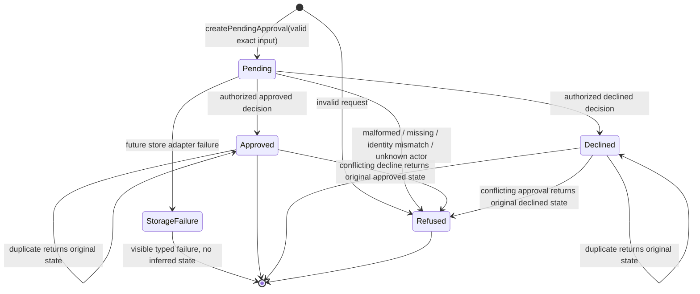

# Build Log - Week 2

[Week 1](build-log-week1.md) |
[Week 2](build-log-week2.md) |
[Week 3](build-log-week3.md) |
[Week 4](build-log-week4.md)

> This log contains only observed evidence from Tasks 02 and 03. Sections that
> remain outside the current implementation say so explicitly; planned behavior
> is never presented as an implemented control.

## Task 02 - Make Approvals Durable

Task contract: [02 - Make Approvals Durable](todo/02-durable-approvals.md)

### Goal and Boundary

`src/approval.ts` owns the closed, Pi-independent approval record and pure
decision transition boundary. One pending record binds a stable `approvalId` to
the original `runId`, exact `send_follow_up` action, exact lead target, immutable
synthetic draft ID/content/SHA-256, request time, and null decision. Approved and
declined are mutually exclusive terminal variants with minimized actor ID and
decision time.

This first slice performs no file I/O, Pi/HTTP integration, or external effect.
The replaceable store contract exists, but its file-backed implementation and
restart evidence belong to the next Phase 01 session.

### Approval State Diagram



Source: `ApprovalRecordSchema`, `createPendingApproval`, and
`transitionApproval` in `src/approval.ts`, exercised by
`tests/approval.test.ts`.

### Storage Contract

The schema separates three closed variants: pending, approved, and declined.
Each record retains only synthetic approval/run/action/target/draft linkage,
request time, status, and minimized decision metadata. Draft identity is linked
to content with an application-owned SHA-256 and revalidated at every untrusted
record crossing.

The replaceable `ApprovalStore` contract exposes `appendRequest`,
`appendDecision`, `get`, and `listRun`, each returning a discriminated typed
outcome. `ApprovalStorageRecordSchema` permits only one pending request record
or one matching approved/declined decision record. The Phase 01 Session 01
boundary deliberately defines no file adapter and makes no restart claim.

### Transition Event Examples

The closed `ApprovalEventDataSchema` permits minimized synthetic data such as:

```json
{"eventType":"approval.requested","approvalId":"approval_test_001","action":"send_follow_up","targetKind":"lead","leadId":"lead_ada","draftId":"draft_test_001","status":"pending"}
{"eventType":"approval.approved","approvalId":"approval_test_001","actorId":"actor_reviewer","status":"approved"}
{"eventType":"approval.decision_duplicate","approvalId":"approval_test_001","actorId":"actor_reviewer","requestedDecision":"approved","status":"approved"}
{"eventType":"approval.invalid","approvalId":"approval_test_001","operation":"decision","code":"unknown_actor"}
{"eventType":"approval.storage_failed","approvalId":"approval_test_001","operation":"decision","code":"storage_failure"}
```

The surrounding `AgentEvent` supplies the original `runId`; full draft content,
credentials, raw exceptions, and unrelated lead data are rejected as extra
event properties. Event emission is not integrated in this session.

### Restart Proof

Not implemented in the contract-only slice. Session 02 must provide the
file-backed adapter and exact process-restart projection proof before this
section can claim durability.

### Data-Lifecycle Decision

Current scope is synthetic only. The closed record identifies exactly which
approval, actor, target, and draft fields a later adapter may persist; the
operational event schema excludes full drafts. Retention, export, and deletion
operations remain unimplemented until Session 03 records the complete Task 02
data-lifecycle decision. Real personal data remains prohibited.

### Exercised Failure and Recovery

| Case | Deterministic Outcome | State Effect |
|------|-----------------------|--------------|
| Missing approval | `approval_not_found` | None |
| Malformed decision | `invalid_decision` | None |
| Unknown actor | `unknown_actor` | None |
| Run or approval mismatch | `approval_identity_mismatch` | None |
| Same terminal decision | `duplicate` + original terminal record | None |
| Opposite terminal decision | `conflict` + original terminal record | None |
| Invalid current record | `invalid_approval_record` | None |
| Storage failure | Closed `storage_failure` contract for Session 02 | No success may be inferred |

The pure transition tests exercise refusals without editing state. Durable
failure and recovery evidence is added only after the file store exists.

### Verification Output

Session 01 contract verification under Node.js 24.15.0 and npm 12.0.2:

- `node --import tsx --test tests/approval.test.ts` - 17/17 focused tests pass.
- `npm run verify` - formatting and strict types pass, 57/57 deterministic
  tests pass, and 5/5 deterministic evals pass.
- `npm audit --audit-level=low` - 0 vulnerabilities.
- Targeted permission, credential, ASCII/LF, and `git diff --check` scans pass.

### Final Diff Review and Remaining Risk

Session 01 adds no Pi tool, allowlist change, HTTP route, filesystem adapter,
provider credential, or external effect. The new domain module is independent
from Pi and I/O. It permits synthetic full draft content only inside the
approval record contract and rejects it from operational event data.

Remaining Task `02` risk is explicit: the store interface has no file-backed
implementation, projection, restart proof, interruption handling, or integrated
event lifecycle yet. Sessions 02 and 03 must close those items before durable
approval is claimed complete.

## Task 03 - Add an Idempotent Send Boundary

Task contract: [03 - Add an Idempotent Send Boundary](todo/03-idempotent-send.md)

### Goal and Boundary

_State the implemented fake-write boundary and confirm that no real provider
credential or network send was added._

### Write Contract

_Record the typed input/output, timeout, error codes, approval rule, immutable
target/content resolution, structured evidence, and compensation decision._

### Permission Table

_Classify approved, pending, declined, missing, malformed, mismatched,
duplicate, timed-out, permission-denied, and downstream-failure actions._

### Idempotency Proof

_Record the stable key derivation, first persisted result, duplicate command,
and evidence that a repeat produces no second effect._

### Test Matrix

_Map every required success and failure case to deterministic tests and source._

### Redacted Event Examples

_Add minimized attempt and result examples containing `runId`, `approvalId`,
idempotency key, duration, and outcome without a full draft or personal data._

### Human Review Result

_Record the reviewer role, reviewed boundary, decision, follow-up findings, and
proof that allowlisting happened only after review._

### Exercised Failure and Recovery

_Record at least one denied or failed write, its actionable output, and the safe
retry, compensation, escalation, or stop behavior._

### Verification Output

_Record the exact verification commands and results, including
`npm run verify`._

### Final Diff Review and Remaining Risk

_Record the permissions, credentials, personal-data, side-effect, idempotency,
and documentation diff review plus unresolved write risks._
