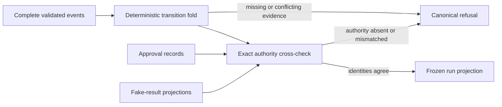
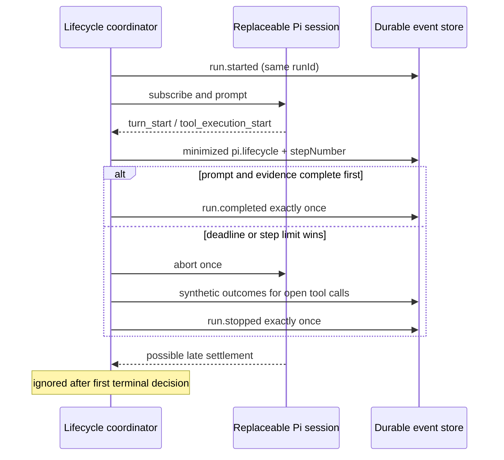
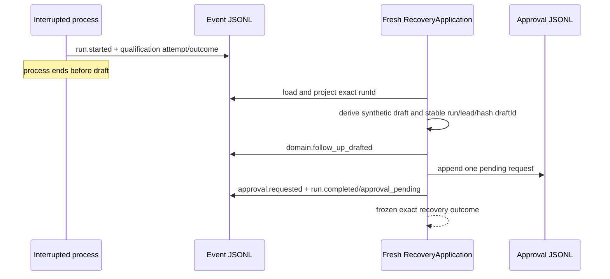
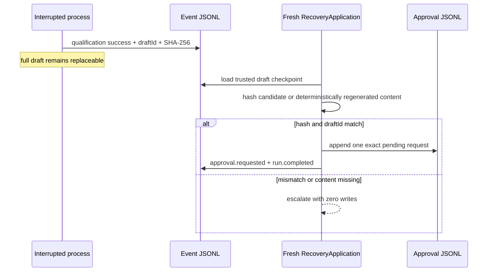
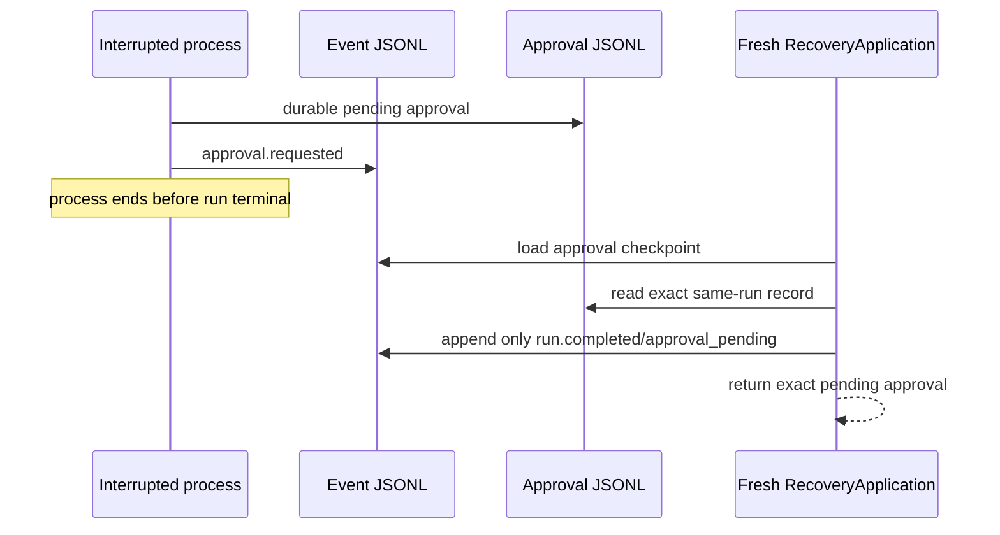

# Build Log - Week 3

[Week 1](build-log-week1.md) |
[Week 2](build-log-week2.md) |
[Week 3](build-log-week3.md) |
[Week 4](build-log-week4.md)

> Template only. This log is reserved for observable evidence from Tasks 04
> and 05. Replace each italic instruction after running the named work; never
> present planned behavior as an implemented control.

## Task 04 - Recover and Replay

Task contract: [04 - Recover and Replay](todo/04-recovery-and-replay.md)

### Goal and Boundary

Sessions 01-04 establish trusted durable run history, deterministic projection,
application-owned whole-run bounds, and an internal recovery application for
the three required checkpoints. Recovery is provider-independent and has no Pi
tool, HTTP route, approval-decision authority, fake-effect adapter, or real
network capability.

Operational events own recorded run history. They do not authorize an approval
or prove a fake effect: the dedicated approval and fake-result stores remain
the exact permission and idempotency authorities.

### Event Schema

`src/run-event.ts` owns the version 2 envelope:

| Field | Contract |
|-------|----------|
| `schemaVersion` | Exact literal `2` |
| `eventId` | Prefixed bounded `event_*` identity |
| `runId` | Existing bounded `run_*` or UUID identity |
| `at` | Canonical millisecond UTC ISO timestamp |
| `type` | Bounded code exactly matching `data.eventType` |
| `data` | One closed minimized owned payload variant |
| `metadata` | Closed actor, action, tool, argument, result, error, approval, stop, version, duration, step, retry, token, and cost fields |

Metadata uses `null` for unavailable values, so measured zero duration, retry,
tokens, or cost is not confused with missing provider evidence. Token totals
must equal input plus output. Validated arguments permit at most 20 bounded
scalar fields and reject nested arbitrary content.

Current payload variants cover `run.started`, `run.completed`, `run.stopped`,
`run.failed`, qualification attempt/completion/failure,
`domain.follow_up_drafted`, normalized `pi.lifecycle`, all closed approval
events, and all closed fake-send events.
Pi SDK objects are reduced to bounded source type, tool name and call identity,
error flag, message identity, and stop reason; raw SDK payloads are rejected.

Example minimized record:

```json
{"schemaVersion":2,"eventId":"event_example_001","runId":"run_example_001","at":"2026-08-11T16:00:00.000Z","type":"run.started","data":{"eventType":"run.started","leadId":"lead_ada"},"metadata":{"actor":{"kind":"application","id":null},"action":"run_start","tool":null,"validatedArguments":null,"result":"attempted","errorCode":null,"approvalState":null,"stopReason":null,"applicationVersion":"0.1.25","modelVersion":null,"promptVersion":null,"durationMs":null,"stepNumber":null,"retryCount":0,"tokens":null,"costUsd":null}}
```

#### Storage Contract

`JsonlEventStore` validates configuration and generated metadata before
filesystem construction. Append then validates the complete existing log,
denies duplicate identity or decreasing per-run time, opens with private mode,
writes one LF-terminated record, calls `fsync`, closes, re-reads the entire
file, and compares exact before/after state before reporting success.

Reads validate every line, event, namespace, identity, and timestamp before
filtering by `runId`. A missing file is an exact empty history; blank,
truncated, malformed, duplicate, or out-of-order evidence returns canonical
`corrupt_record`, `interrupted_write`, `duplicate_event`, or
`out_of_order_record` failure. Pre-write I/O and replaceable-boundary failures
use canonical `storage_failure`; indeterminate write, flush, close, or re-read
failures use canonical `interrupted_write`.

Compatibility decision: the existing `at` field remains the timestamp name and
file order remains the structural order for the current single-process store.
Session 02 owns domain-semantic event order and recovery checkpoints. Existing
legacy unversioned or version 1 event files fail closed rather than being
silently upgraded; the workshop uses synthetic data and must reset or
explicitly migrate such a file before startup.

Focused evidence: strict file checks pass and 19/19 event contract/store tests
cover closed variants, restart, private mode, corruption, truncation, duplicate
identity, decreasing time, no-op writes, and injected write/sync/close/read
failures.

### Projection Rules

`src/run-projection.ts` is a pure, read-only projector over one complete
validated run history. It clones external input before validation, folds legal
transitions in file order, and returns either one deeply frozen projection or a
canonical redacted failure. It performs no store write, tool call, approval
transition, fake effect, model invocation, or network operation.



The legal core order is one `run.started`, one qualification attempt and
optional outcome, one successful-qualification-dependent draft, one
draft-dependent approval request, and one compatible run terminal. Normalized
Pi events may occur before the run terminal but cannot create a checkpoint.
After the run terminal, only approval decision/failure observations and
fake-send observations may extend the history; a second terminal or new run,
qualification, draft, approval-request, or Pi event fails closed.

| Durable milestone | Latest safe checkpoint | Required exact facts |
|-------------------|------------------------|----------------------|
| Run start | `run_started` | Event, run, and lead identity |
| Qualification success | `qualification_completed` | Attempt plus result for the started lead |
| Draft creation | `draft_created` | Qualified lead, draft identity, and SHA-256 |
| Approval request | `approval_requested` | Run, lead, draft, action, and approval identity |

An open qualification attempt remains visible while the checkpoint stays at
run start. An attempted fake effect remains `effect_indeterminate`; the
projector does not infer whether a side effect occurred. Run status is closed
to `running`, `waiting_for_approval`, `approved`, `effect_indeterminate`,
`completed`, `stopped`, or `failed`, while the agent terminal outcome remains a
separate durable fact.

Operational approval and fake-send events expose only observed status. When
dedicated evidence is omitted, the projection reports `not_supplied`. When it
is supplied, the projector validates every record and checks exact run, lead,
draft, hash, approval, idempotency, result status, and result duration. Missing,
extra, invalid, or mismatched dedicated evidence returns `authority_mismatch`
or `invalid_input`; no event grants approval or proves an effect. An observed
approval or accepted fake result cannot elevate the trusted lifecycle to
`approved` or effect-complete without matching dedicated truth; it remains
waiting or indeterminate.

Replaceable working context contains only qualification result or failure,
draft identity and hash, approval identity and observed state, fake-send
identity and observed state, checkpoint, terminal, and event identities. It
contains no transcript, full draft, lead profile, credential, raw Pi payload,
or arbitrary dependency message. Rebuilding context never deletes or mutates
the source events.

Canonical refusal codes cover invalid input, missing start, cross-run identity,
out-of-order events, missing prerequisites, duplicate evidence, conflicting
evidence, incompatible terminals, authority mismatch, structurally corrupt or
interrupted durable history, and storage failure. Failures expose only a stable
message plus a safe event index and identity when available; partial
projections are never returned.

Focused evidence: 22/22 projection cases pass. They cover every checkpoint,
open attempts, qualification refusal, run failure, legal post-run approval and
fake evidence, replay duplicates, exact authority checks, missing and malformed
evidence, lead-bound not-found refusal, cross-run and ordering refusal, repeated
milestones, terminal compatibility, mutation resistance, malformed or throwing
adapters, structural store-failure mapping, and deep equality across fresh
`JsonlEventStore` instances. Projection exists; retry, replay execution, and
resume remain assigned to Session 04.

### Bounded Run Lifecycle

`src/run-lifecycle.ts` owns the run deadline, step budget, Pi lifecycle
normalization, open-tool correlation, cancellation, and terminal race. Bounds
are resolved before event paths, stores, sessions, timers, or listeners:

| Variable | Default | Accepted range | Invalid behavior |
|----------|---------|----------------|------------------|
| `RUN_DEADLINE_MS` | `30000` | Integer `1` through `300000` | Startup/run construction fails before runtime files |
| `RUN_MAX_STEPS` | `24` | Integer `1` through `100` | Startup/run construction fails before runtime files |

Exactly two Pi event types consume budget: `turn_start` charges one model step
and `tool_execution_start` charges one tool step. Bounded agent, turn, message
boundary, tool outcome, retry, compaction, and model-selection evidence is
persisted without another charge. High-volume `message_update`,
`tool_execution_update`, queue, entry, and bash updates are neither charged nor
persisted, so provider verbosity cannot force one fsync/full-log re-read per
token. The event that reaches `RUN_MAX_STEPS` is minimized and recorded, then
the application stops the run; no event above the configured maximum is
accepted.



Tool-start evidence retains only bounded tool name/call identity and the
originating run/step. A matching tool outcome records success or the canonical
application error code found in validated tool details, including validation,
permission, storage, timeout, or dependency refusal. Raw arguments, tool
results, assistant prose, and arbitrary errors are discarded. If a deadline
or step limit closes an open call, the application records one synthetic
`tool_execution_end` with the bounded stop reason before the run terminal.

Normal application evidence creates `run.completed`. Deadline,
`step_limit_exceeded`, and dependency failures create one `run.stopped` event
with matching result, error code, stop reason, duration, and last step.
Terminal append failure never becomes a manufactured stopped success; the HTTP
composition returns the existing availability failure. The projector accepts
one compatible bounded terminal from any trusted prefix and rejects all late
core evidence or duplicate terminals.

Focused evidence: 21/21 lifecycle cases cover closed defaults and bounds,
exact step classification, minimized application-level tool refusal and usage,
normal correlated completion, deadline, late settlement, open-tool step stop,
dependency failure, lifecycle and terminal storage failure, rejected abort,
open-call completion refusal, deadline before session creation, and
invalid-input no-construction behavior. Event and projection
contract tests additionally cover all three stopped reasons, step metadata,
schema version refusal, terminal compatibility, and late-core refusal.

### Recovery Decision Table

`src/recovery-application.ts` owns a frozen five-action policy. Calling the
internal entrypoint is explicit; there is no background retry worker.

| Action | Required evidence | Automatic in invoked recovery | Current behavior |
|--------|-------------------|-------------------------------|------------------|
| `retry` | Canonical transient storage failure or `run.started` with no qualification attempt; no known effect | No | Return a retryable refusal; the bounded qualification path or caller decides whether to invoke again |
| `resume` | Trusted qualification, draft, or approval checkpoint; exact run/lead identity; matching approval/result authority; no terminal or effect ambiguity | Yes | Generate or hash-verify one draft, request at most one approval, append at most one missing run terminal, and return the exact durable approval |
| `compensate` | Verified completed effect plus an explicit operator-owned compensation plan | No | Unsupported. The fake result records `manual_review_required`; recovery never compensates automatically |
| `escalate` | Open qualification attempt, damaged/ambiguous evidence, authority mismatch, missing draft content, or any reservation-only effect | Yes, as a refusal | Preserve all three files, return a canonical redacted category, and perform no mutation |
| `stop` | Failed or incompatible terminal, failed qualification, invalid/cross-lead request, or verified completed effect | Yes | Return without reopening the run, requesting approval, or retrying an effect |

Every successful resume projects before mutation, reprojects after approval,
appends only a compatible missing terminal, and projects once more before
return. A storage failure returns no partial projection or approval.

### Three Restart Timelines

#### Interruption After Qualification



Observed result: the completed qualification is not repeated. The first
recovery produces six run events, one approval record, zero result records, and
one `approval_pending` terminal under the original `runId`.

#### Interruption After Draft



Observed result: exact content resumes with the original durable draft ID and
hash. Substituted content returns `draft_mismatch`; event and approval line
counts do not change.

#### Interruption After Approval Request



Observed result: approval lines remain unchanged, exactly one terminal is
added, and later approved or declined authority is replayed exactly without
changing the original agent stop reason.

### Replay-Idempotency Proof

Focused command:

```bash
npx tsx --test tests/recovery-application.test.ts
```

The 17-case recovery matrix creates every checkpoint through event, tool, and
approval APIs, then constructs fresh store/service instances. Repeating the
same qualification recovery request returns a deeply equal frozen outcome with
the original terminal event and approval. Counts remain six events, one
approval record, and zero fake-result records. Draft recovery retains one draft
event; approval recovery retains one approval request. A simulated first
terminal append failure is repaired by the same generate request without a
second qualification, draft, approval, or terminal.

Recovery imports no fake-send service or adapter, so its effect-call count is
structurally zero. Existing fake execution duplicate tests remain green. A
same-run hidden or observed reservation returns `effect_indeterminate`; a
completed fake result returns `effect_completed`. Repeating either refusal
changes no event, approval, or result line.

### Retention Decision

- **Scope**: only synthetic event, approval, and injected fake-result JSONL
  files. Real customer data remains prohibited.
- **Retention**: retain the coordinated three-file environment for at most 30
  days or until teardown, whichever comes first. An active incident hold pauses
  deletion until the preserved copy is handed to the responsible operator.
- **Redaction**: operational events retain bounded identities, hashes, codes,
  steps, timing, version, and optional usage/cost only. Full synthetic draft
  content exists only in the exact approval record or transient hash-verified
  recovery input. Raw transcript, provider payload, arguments/results, stack,
  credential, and dependency prose are excluded.
- **Export**: stop all service and internal harness writers, then make a
  controlled offline copy of the exact coordinated files. There is no public
  export endpoint or per-run export guarantee.
- **Deletion**: after stopping all writers and resolving any incident hold,
  delete the whole coordinated synthetic environment and verify all selected
  files are absent. Never edit or remove individual append-only records because
  that destroys ordering, authority, and recovery evidence.
- **Compaction**: compact only replaceable in-memory working context. Durable
  source events and dedicated authority records are never compacted away.
- **Real-data gate**: automated retention, scoped export/erasure, access,
  purpose/lawful basis, backup/restore, tenant, subprocessor, and data-location
  controls must pass before any real personal data is introduced.

### Exercised Failure and Recovery

The deterministic deadline case advances injected time to exactly the bound,
observes one abort request, one `deadline_exceeded` terminal, listener/timer
cleanup, and an immutable non-success result. Resolving the prompt and emitting
an agent event afterward produces no event or result change. The maximum-step
case starts one model turn under a limit of two, then observes a tool start at
step two; it records the attempt, a synthetic stopped outcome for that exact
call ID, and one `step_limit_exceeded` terminal.

The recovery failure exercise writes a valid pending approval and terminal,
then records a same-run fake reservation and attempted event through their
application stores. Fresh recovery returns frozen `effect_indeterminate` with
action `escalate`. Repeating it preserves identical event, approval, and result
counts. A completed accepted fake result instead returns `effect_completed`
with action `stop`. No recovery path constructs or calls an effect adapter.

### Verification Output

Task `04` implementation verification:

| Command | Result |
|---------|--------|
| `npm run verify` | PASS - format, lint, strict types, 238/238 tests, and 5/5 evals |
| `npm run test:coverage` | PASS - 97.17% lines, 85.87% branches, and 97.41% functions against 95/85/95 gates |
| `npm run build` | PASS |
| `npm audit --omit=dev` | PASS - zero vulnerabilities |

The production-boundary check confirms exactly `qualify_lead`,
`draft_follow_up`, and `request_send_approval`. The lifecycle adds no shell,
filesystem, network client, approval-decision, fake-send, or safe-write
capability to Pi or HTTP.

### Final Diff Review and Remaining Risk

The Session 04 implementation surface adds one internal file-backed recovery
module and deterministic tests. It adds no credential, real customer data, raw
Pi payload, runtime environment variable, dependency, HTTP route, Pi tool,
approval decision, fake service/adapter import, network client, shell/process,
or deployed behavior. Event schema version 2 remains intentionally
incompatible with earlier synthetic files; an operator must reset or explicitly
migrate them rather than accepting mixed history. Public/distributed recovery,
automatic scheduling, real-data lifecycle, backup/restore, and deployment
evidence remain open release gates.

## Task 05 - Add Production Eval Gates

Task contract: [05 - Add Production Eval Gates](todo/05-production-evals.md)

### Goal and Boundary

_State which client-brief behaviors now block deployment and which quality
measures remain non-blocking._

### Golden-Set Inventory

_List the synthetic happy, ambiguous, failure, adversarial, duplicate, restart,
and human-escalation cases with expected outcomes and event sequences._

### Rubric

_Record critical pass/fail dimensions, separate quality metrics, thresholds,
version fields, and explicit pending latency or cost thresholds._

### Scorecard

_Record the compact reproducible result by case, expected versus observed
evidence, tool sequence, stop reason, latency, cost, and version._

### Critical Red/Fix/Green Traces

_Record one controlled red/fix/green trace for every critical boundary,
including lead fabrication, false-send wording, and approval bypass, and prove
each deliberate break was reverted._

### Exercised Failure and Refusal

_Record a critical failure exiting non-zero and blocking the documented
deployment path regardless of aggregate quality._

### Verification Output

_Record the exact final verification commands and results, including
`npm run verify`._

### Final Diff Review and Remaining Risk

_Record the eval, permission, privacy, side-effect, deliberate-break, and
documentation diff review plus uncovered cases or pending thresholds._
