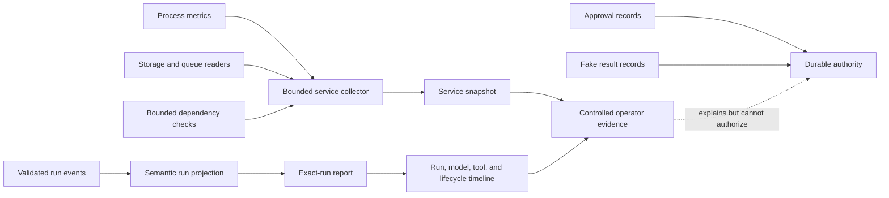
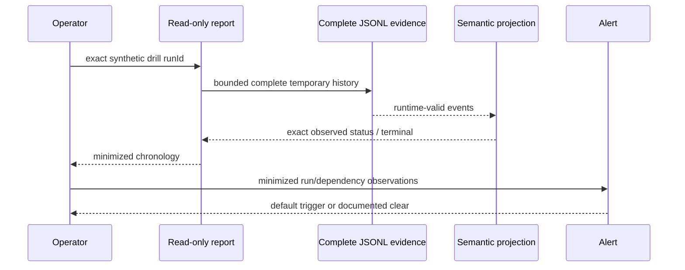
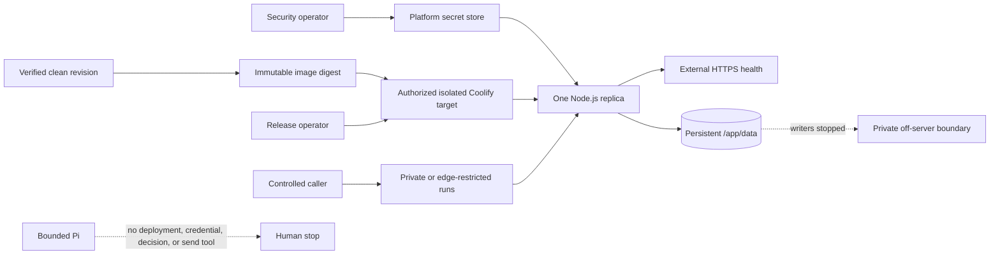

# Build Log - Week 4

[Week 1](build-log-week1.md) |
[Week 2](build-log-week2.md) |
[Week 3](build-log-week3.md) |
[Week 4](build-log-week4.md)

Tasks `06` and `07` are complete for the controlled synthetic workshop boundary.
Phase 03 Sessions 01-04 produced the Task `06` observability and incident
evidence; Sessions 05-08 produced the Task `07` Coolify release evidence. This
log omits private target values, credentials, live run identifiers, and full
drafts, and it does not claim public-production or real-data readiness.

## Task 06 - Observe Failures and Practice Recovery

Task contract:
[06 - Observe Failures and Practice Recovery](todo/06-observability-and-incidents.md)

### Goal and Boundary

Session 01 implemented a closed, read-only observability contract for four
layers and a controlled service snapshot collector. The library-only collector
is not registered as a Pi tool and is not reachable through HTTP. `GET /health`
remains exactly `{"status":"ok"}`. Approval records and fake-result records
remain the only approval and effect authority.

Sessions 01 through 04 provide the observation, exact-run report, alert,
runbook, and five synthetic drill evidence required by Task `06`. The final
validation and closeout record is attached to Session 04.



The exact-run command reads durable run events only. It does not ingest or
invent a historical service snapshot, because service observations carry no
`runId`. Operators inspect the bounded service snapshot separately and use the
report for every run-scoped layer present in the validated event history.

### Acceptance-to-Evidence Map

| Task `06` acceptance check | Direct evidence in this log | Recorded result |
|----------------------------|-----------------------------|-----------------|
| Reconstruct one failed run | Complete Incident Timeline and Run Query Output | Pass for all durable run-scoped evidence; service health remains a separate uncorrelated snapshot |
| Terminal stop reasons and actionable failures | Run Query Output and Recovery Proof | Pass with closed stop reasons and finite error categories |
| Per-run cost and latency without invented values | Run Query Output and Operational Baseline | Pass; measured values and explicit unavailability remain distinct |
| Actionable, retry-aware alerts | Alert Table | Pass with finite thresholds, cooldowns, evidence, and operator actions |
| Restart and duplicate recovery without duplicate effects | Recovery Proof | Pass; restart creates zero effects and duplicate application preserves one total fake effect |
| Runbook matches implemented commands and capabilities | Incident Runbook | Pass; unsupported pause, compensation, and transport capabilities are stated |
| No credentials or unnecessary personal data | Redacted Observability View and final review | Pass for synthetic minimized evidence |
| Repository verification | Verification Output | Pass at Task `06` closeout: 354 tests, 18 evals, and 5 drills |

### Complete Incident Timeline

Session 04 executes the five predeclared production-eval cases through isolated
temporary stores and constructs each safe report before bounded cleanup. The
actual report chronologies are:

| Drill / `runId` | Exact event sequence |
|-----------------|----------------------|
| Tool timeout / `run_qualification_timeout` | `run.started` -> `qualification.attempted` -> `qualification.failed` -> `run.completed` |
| Invalid model / `run_invalid_model_output` | `run.started` -> `run.stopped` |
| Restart / `run_restart_after_approval` | `run.started` -> `qualification.attempted` -> `qualification.completed` -> `domain.follow_up_drafted` -> `approval.requested` -> `run.completed` |
| Credential unavailable / `run_revoked_provider_credential` | `run.started` -> `run.stopped` |
| Duplicate / `run_duplicate_fake_request` | Restart sequence -> `approval.approved` -> `fake_send.attempted` -> `fake_send.accepted` -> `fake_send.duplicate` |



### Run Query Output

Command contract:

```text
npm run report:run -- --run-id <exact-run-id> --event-log <operator-path> --format text|json
```

The command validates the run ID before filesystem access, accepts only a
resolved non-root regular file, rejects symlinks and evidence above 64 MiB,
validates the complete JSONL and semantic run projection, caps one report at
1,000 events, and never opens a write path. The event-log path is never emitted.

Preserved synthetic example:

```text
$ npm run report:run -- --run-id run_report_fixture --event-log tests/fixtures/run-report-failed.jsonl --format text
run=run_report_fixture status=stopped events=4 checkpoint=run_started authority=observed_only terminal=completed:qualification_failed
metrics elapsed=3000:milliseconds max_retry=1 tokens=0/0/0 cost=0:usd
001 at=2026-08-12T00:00:00.000Z layer=run event=run.started app=0.1.32 step=- retry=0 duration=unavailable:not_reported outcome=attempted permission=not_applicable effect=none error=- stop=- model=- prompt=- tool=- tokens=unavailable:not_reported cost=unavailable:not_reported
002 at=2026-08-12T00:00:01.000Z layer=domain event=qualification.attempted app=0.1.32 step=1 retry=0 duration=0:milliseconds outcome=attempted permission=not_applicable effect=none error=- stop=- model=synthetic-model-v1 prompt=synthetic-prompt-v1 tool=- tokens=0/0/0 cost=0:usd
003 at=2026-08-12T00:00:02.000Z layer=domain event=qualification.failed app=0.1.32 step=1 retry=1 duration=25:milliseconds outcome=failed permission=not_applicable effect=none error=qualification_timeout stop=- model=- prompt=- tool=- tokens=unavailable:not_reported cost=unavailable:not_reported
004 at=2026-08-12T00:00:03.000Z layer=terminal event=run.completed app=0.1.32 step=- retry=1 duration=30:milliseconds outcome=stopped permission=not_applicable effect=none error=qualification_timeout stop=qualification_failed model=- prompt=- tool=- tokens=unavailable:not_reported cost=unavailable:not_reported
```

JSON mode returns the same timeline and summary facts under a closed schema.
The report intentionally omits event IDs, actors, lead and draft identifiers,
arguments, hashes, receipts, idempotency keys, raw errors, payloads, paths,
URLs, and infrastructure details. `authority=observed_only` prevents an
approval or effect observation from being presented as durable authority.

### Alert Table

Session 03 adds a pure bounded evaluator over minimized observations. It has no
scheduler, notification transport, webhook, pager, HTTP route, Pi tool, or
durable mutation. `suppressed` retains the trigger evidence during cooldown;
required missing values are `unavailable`, never clear.

| Rule | Default trigger | Severity | Evidence | Cooldown | Safe operator action |
|------|-----------------|----------|----------|----------|----------------------|
| Repeated task failure | 3 failed/stopped runs | Warning | Run outcome count | 5 minutes | Inspect exact run reports |
| Stuck run | Running/pending at least 5 minutes | Critical | Maximum run duration | 5 minutes | Stop new requests and inspect run |
| Dangerous permission attempt | 1 forbidden/denied decision | Critical | Permission-decision count | 15 minutes | Preserve evidence and escalate |
| Cost spike | Available model cost sum at least USD 5 | Warning | Model cost | 15 minutes | Stop new requests and inspect usage |
| Unavailable dependency | 2 unavailable dependency samples | Critical | Dependency state | 5 minutes | Inspect dependency |
| Storage pressure | Utilization at least 85% | Critical | Used/capacity ratio | 15 minutes | Stop new requests and inspect storage |
| Queue pressure | Depth at least 100 | Warning | Queue depth | 5 minutes | Inspect queue |

The application has no queue, so its queue observation and alert result are
explicitly `not_applicable`. Successful retries below the failure threshold do
not alert. A dangerous permission denial remains visible as `triggered` or
`suppressed`.

### Redacted Observability View

| Layer | Correlation | Bounded fields | Explicit absence |
|-------|-------------|----------------|------------------|
| Service | Application version, environment, canonical time | Uptime, RSS, heap, CPU, storage, queue, dependency ID/state/duration/error | `unavailable` or `not_applicable` with finite reason |
| Run | Exact `runId` | Outcome, stop reason, duration, step count, retry count, error category | Tagged measurements and nullable finite error/stop fields |
| Model | Exact `runId` and step | Model/prompt version, outcome, duration, retry, tokens, cost, error | Tagged token/cost/duration availability |
| Tool | Exact `runId` and step | Tool/call identity, outcome, permission, side-effect category, duration, retry, error | Tagged duration and nullable finite error |

Fields intentionally absent from every observation include credentials,
provider payloads, raw errors, filesystem paths, private URLs, lead attributes,
draft bodies, full approval records, and fake-result receipts. Collector labels
are bounded identifiers, dependencies are limited to 20, and timeout cleanup is
mandatory for every dependency check.

Measured zero is represented as `{"status":"available","value":0,"unit":"..."}`.
Missing values never reuse zero: they are either
`{"status":"unavailable","reason":"..."}` or
`{"status":"not_applicable","reason":"..."}`.

### Incident Runbook

The canonical [Agent Incident Response](runbooks/agent-incident-response.md)
guide grounds every action in the current implementation:

- pause is external access/process/container control because no pause endpoint exists;
- inspect uses the exact read-only `report:run` command;
- retry is caller-controlled only for canonical transient storage/event storage
  refusal or an unstarted qualification with no known effect;
- resume exists only through the internal recovery library at a trusted exact checkpoint;
- compensation is unsupported and always operator-owned;
- corrupt authority, open attempts, and reservation-only effects preserve and escalate;
- terminal or already-completed effects stop without reopening or re-executing.

Session 04 exercises these paths with:

```text
npm run drill:incidents
```

The no-input command runs only the five fixed synthetic cases, prints one closed
JSON suite, returns nonzero on any score/report/alert mismatch, and retains no
temporary authority file or path.

### Recovery Proof

| Drill | Report status / events | Outcome | Default alert | Recovery/runbook | Effects |
|-------|------------------------|---------|---------------|------------------|---------|
| Tool timeout | `stopped` / 4 | `qualification_timeout`, `qualification_failed` | Repeated failure `clear` at 1/3 | `stop` | 0 |
| Invalid model response | `stopped` / 2 | `invalid_model_output`, `dependency_failed` | Repeated failure `clear` at 1/3 | `stop` | 0 |
| Mid-run restart | `waiting_for_approval` / 6 | `approval_pending` | Repeated failure `clear` at 0/3 | `resume` at `approval_requested` | 0 |
| Revoked credential injection | `stopped` / 2 | `dependency_failed` | Dependency unavailable `triggered` at 2/2 | `stop` | 0 |
| Duplicate request | `effect_indeterminate` / 10 | Stable `duplicate` | Repeated failure `clear` at 0/3 | `stop`; return existing result | 1 total |

The restart creates one pending approval event and the fresh recovery instance
returns the same `runId` and checkpoint with no effect. The duplicate drill
records one attempted/accepted fake effect and one duplicate observation; its
dedicated minimized permission evidence reports exactly one total effect.

The duplicate report deliberately remains `authority=observed_only` and
`effect_indeterminate`: the report reads events, not the dedicated fake-result
store, so it cannot promote an observed acceptance into authority. The eval
permission evidence supplies the separate one-effect proof. No drill manually
edits an event, approval, result, or eval record.

### Operational Baseline

One recorded `npm run drill:incidents` sample on 2026-08-12 produced:

| Drill | Harness latency | Explainability | Exercised steps | Tokens | Cost |
|-------|-----------------|----------------|-----------------|--------|------|
| Tool timeout | 13.804 ms | 4 report events | 4 | Unavailable: provider independent | Unavailable: provider independent |
| Invalid model response | 5.793 ms | 2 report events | 4 | Unavailable: provider independent | Unavailable: provider independent |
| Mid-run restart | 27.154 ms | 6 report events | 5 | Unavailable: provider independent | Unavailable: provider independent |
| Revoked credential injection | 4.417 ms | 2 report events | 5 | Unavailable: provider independent | Unavailable: provider independent |
| Duplicate request | 37.293 ms | 10 report events | 4 | Unavailable: provider independent | Unavailable: provider independent |

Latency is a measured local harness value and will vary by run. Explainability
is the validated safe-report event count. Exercised steps count the completed
case, score, report, alert, and applicable recovery/dependency stages; it is not
a production operator-time measurement. No provider-independent token or cost
value is invented.

### Verification Output

Session 01 focused evidence:

- `npx tsc --noEmit`: pass.
- `npx tsx --test tests/observability.test.ts`: 20/20 pass.
- Local `GET /health`: exact `{"status":"ok"}` response.
- Exact production Pi allowlist regression: 1/1 pass.
- `npm run verify`: 293/293 tests and 18/18 production eval cases pass.
- `npm run test:coverage`: 97.72% lines, 85.60% branches, and 98.04% functions.
- `npm audit`: zero known vulnerabilities.

Session 02 focused evidence:

- `npx tsc --noEmit`: pass.
- `npx tsx --test tests/run-report.test.ts`: 23/23 pass.
- Preserved fixture text and JSON commands: pass with byte-identical input.
- Malformed, truncated, duplicate, out-of-order, missing-run, symlink, and
  invalid-input subprocess cases: fail visibly with no partial stdout.
- `npm run verify`: 316/316 tests and 18/18 production eval cases pass.
- `npm run test:coverage`: 97.65% lines, 85.74% branches, and 98.17% functions.
- `npm audit`: zero known vulnerabilities.

Session 03 focused evidence:

- `npx tsc --noEmit`: pass.
- `npx tsx --test tests/alerts.test.ts`: 22/22 pass.
- Exact thresholds, below-threshold retries, distinct-run counting, cooldown
  edges, unavailable values, absent queue, and protected-output cases: pass.
- `npm run verify`: 338/338 tests and 18/18 production eval cases pass.
- `npm run test:coverage`: 97.73% lines, 85.80% branches, and 98.29% functions.
- `npm audit`: zero known vulnerabilities.

Session 04 focused evidence:

- `npx tsc --noEmit`: pass.
- `npx tsx --test tests/incident-drills.test.ts`: 16/16 pass.
- `npm run drill:incidents`: five exact results, suite `pass`, exit 0.
- Store/report chronology, golden scoring, alert decisions, restart, duplicate,
  protected output, cleanup, and invalid-command cases: pass.
- `npm run verify`: 354/354 tests and 18/18 production eval cases pass.
- `npm run test:coverage`: 97.82% lines, 86.14% branches, and 98.37% functions.
- `npm audit`: zero known vulnerabilities.

### Final Diff Review and Remaining Risk

The Task `06` diff adds no HTTP route, Pi tool, notification, provider call,
credential read, real effect, deployment, or retained drill file. Drill output
omits lead/draft/approval/effect identities, event IDs, validated arguments,
actors, receipts, idempotency keys, raw errors, filesystem paths, and provider
payloads. Temporary paths remain inside the existing harness and are removed in
`finally`; tests compare the matching temp-directory inventory before/after.

At Task `06` closeout, deployment proof was intentionally deferred to Task
`07`; the sections below now record that controlled release. Task `06` itself
still adds no scheduler or alert delivery, in-application pause,
approval-decision or recovery transport, production on-call/SLA, or live
provider token/cost measurement.

## Task 07 - Release Through Coolify

Task contract: [07 - Release Through Coolify](todo/07-coolify-release.md)

### Goal and Boundary

Session 05 implemented a repository-owned preflight before target mutation. The
default exposure permits external HTTPS health but keeps `/runs` private or
edge-restricted, one replica owns `/app/data`, and only synthetic data is
allowed. The preflight accepts no URL, address, credential, operator name,
private identifier, arbitrary evidence string, or deployment instruction.

Policy validation is implemented. During the release, the authorized controlled
target passed all 15 preflight checks. The workshop owner accepted every
operator role, provider and rotation ownership, workstation backup ownership,
incident ownership, and rollback ownership. The preflight remains redacted and
`targetMutationAllowed` remains false; readiness never grants mutation by
itself. A ready result only admits the separately authorized Session 06
workflow.

The final repository closeout is version `0.1.39`. The deployed runtime evidence
is for exact source revision `52df37a96a76afc1d82656ef04e0922aa42e9b16`
with package version `0.1.36`; later commits completed recovery records,
handoff, Integration CI, and Phase 03 documentation and are not presented as a
new deployed image.

### Acceptance-to-Evidence Map

| Task `07` acceptance check | Direct evidence in this log | Recorded result |
|----------------------------|-----------------------------|-----------------|
| Local verification and critical eval gates | Verification and Image Identity | Pass: 374 tests, 18 evals, 5 drills, and zero dependency vulnerabilities |
| Image build from a fresh commit | Verification and Image Identity | Pass for the clean-checkout source-build contract and recorded source/digest binding; no byte-identical rebuild claim |
| Live HTTPS health | Live Health and Run Timeline | Pass during the controlled release: authenticated 200 and anonymous 401 |
| Observable approval-pending run with no send claim | Live Health and Run Timeline | Pass with six redacted business events, one durable pending approval, and canonical no-send output |
| Exposure-appropriate security boundaries | Security-Gate Checklist | Pass for controlled access; public production remains blocked |
| Restart persistence and backup restore | Restart and Restore Proof | Pass with byte-identical live files and exact absent-directory local restore |
| Reversible failure diagnosis and rollback | Rollback Timeline | Pass for a pre-replacement deployment failure and source-pinned recovery; post-recovery digest reinspection is unavailable |
| Operator handoff | Operator Guide and Five-Minute Demo | Pass for the single-owner workshop; a second human did not replay every platform action |
| Redacted release evidence | All Task `07` sections and final review | Pass; no credential, private target value, run ID, full draft, or raw log is included |

### Infrastructure Decision Record

The complete decision record is in the
[Controlled Release Contract](release/controlled-release-contract.md). Its 13
fixed entries cover capacity, location, administration, SSH/firewall, DNS/HTTPS,
Coolify access, environment isolation, secrets, lifecycle, off-server backup,
monitoring, incident ownership, and update/rollback. Each entry has exactly one
generic role, finite validation method, and Week 4 evidence slot. Missing,
reordered, remapped, or unconfirmed entries block readiness.

The original incomplete example marks no target decision confirmed. The
current-target snapshot confirms all decisions after the workshop owner
explicitly accepted each generic role and the directly exercised procedures.

### Deployment and Service Map



The map is the redacted topology exercised during Sessions 06-08. It records a
real controlled deployment without exposing its URL, region, registry, project,
volume, backup, or operator identifiers.

### Security-Gate Checklist

| Gate group | Controlled result | Public requirement |
|------------|-------------------|--------------------|
| Authentication, authorization, tenant | Route not exposed beyond controlled boundary | All directly confirmed |
| Proxy identity and shared rate | Not trusted; process gate is capacity-only | Both directly confirmed |
| Body size | Exact 16,384-byte application bound | Application and edge confirmed |
| Human decisions | No public decision endpoint | Authorized durable boundary confirmed |
| Data lifecycle | Synthetic-only manual lifecycle | Full lifecycle confirmed |
| Edge/WAF | Private route or confirmed restriction | Directly confirmed |
| Alerts | Local rules and runbook only | Deployed delivery confirmed |

Controlled `/runs=public`, public mode with any exemption, unverified HTTPS,
secret values, path/replica drift, or incomplete ownership returns `blocked`.
The local process rate limiter never satisfies a public caller-control gate.

### Verification and Image Identity

At Task `07` closeout:

- Focused preflight tests: 20/20 pass.
- Strict TypeScript: pass.
- Controlled-ready and hypothetical public-ready contract requests: pass only
  with their exact finite gate states.
- Checked-in incomplete example: valid request, status `blocked`, 13 exact
  blocked checks.
- Command: one JSON object on stdin, 64 KiB maximum, no arguments; ready exits
  0, blocked exits 1, invalid exits 2.
- Full repository verification: 374/374 tests and 18/18 production evals pass.
- Incident drills: 5/5 pass.
- Coverage: 97.88% lines, 86.29% branches, and 98.43% functions; the Session 05
  release-preflight module measured 99.11/90.71/100.
- Dependency audit: zero vulnerabilities.
- Integration CI performs a fresh repository checkout, locked install,
  production Dockerfile build, container health check, and request-boundary
  check. This proves rebuildability from source; no byte-for-byte image rebuild
  comparison was performed.

During Session 06, Coolify ran revision
`52df37a96a76afc1d82656ef04e0922aa42e9b16` at package version `0.1.36`.
The recorded immutable image digest is
`sha256:f97d51eb0f7dfdc832f74b3700af1003a7fd6bd33fbfdd0a39d1aed111e599d1`.
It also appears in the checked-in redacted current-target fixture and session
validation records; private target identifiers remain omitted. That exact
revision passed `npm run verify`, 5/5 incident drills, and `npm audit` with zero
vulnerabilities. It includes the regression for provider tool-call identifiers
that contain the observed opaque separator. The original Session 05 incomplete
fixture remains `pending` because it is a policy-shape example, not target
evidence.

### Live Health and Run Timeline

During Session 06, the controlled HTTPS boundary denied anonymous `/health` and
`/runs` requests with 401, while the configured operator credential received
the exact healthy 200 response from `/health`. The live container and
Dockerfile health check were healthy, Sentinel was healthy, the Coolify API
accepted read, write, deploy, stop, and start operations, and OpenAI accepted
the injected runtime-only secret without its value being read or logged. A
workstation probe was reset during TLS before packets reached the VPS while the
public hostname continued to return the expected controlled response from the
VPS; that path remains a recorded access limitation, not evidence against the
target-side health check.

The controlled synthetic smoke used a committed known lead, produced grounded
qualification, created exactly one durable pending approval, returned
`approval_pending`, and returned the canonical no-send output. The run ID is
kept in the private operator environment rather than this log.

Redacted live business-event timeline:

```text
run.started -> qualification.attempted -> qualification.completed -> domain.follow_up_drafted -> approval.requested -> run.completed
```

The terminal event records `approval_pending`. There is no approval decision,
send attempt, or effect event in the live smoke timeline.

### Restart and Restore Proof

During Session 06, the named read-write `/app/data` volume survived a full
container replacement.
Before and after replacement, the exact smoke run event file and approval file
had identical SHA-256 values; the replacement projected the same completed
`approval_pending` run and exactly one pending approval without manual edits.
This proves event and approval behavior, not only mount continuity.

The workshop owner selected a private `0700` directory on the local workstation
as the off-server destination. The stopped-writer snapshot was copied out of
the server boundary, validated locally, and its temporary server copy was
removed. Manual backups run before and after demonstrations and are kept for 30
days or until workshop teardown. Paid remote storage, automation, and geographic
redundancy are deliberately not required for this synthetic workshop.

A fresh absent-directory restore validated 2 files, 64 JSONL records, 44,018
bytes, the complete manifest, every checksum, `0700` directory mode, and `0600`
file modes in 227 ms. A local service then started against the restored paths,
returned health 200 after 1,259 ms, rebuilt the saved run as
`waiting_for_approval`, and rebuilt exactly one pending approval. Restore plus
start-to-health measured 1,486 ms; the snapshot recovery point was 1,962 seconds
old when restore began. Post-activation checksums remained unchanged. The source
snapshot and restored copy remain preserved; no destructive live-volume swap
was needed or claimed.

### Rollback Timeline

Automatic branch-head deployment was found enabled after the Session 06 push,
so the workshop owner disabled it before the drill. The exact verified revision
was re-established with a temporary container-side check that proved the saved
run, saved pending approval, provider-backed smoke, and canonical no-send output.
That baseline completed in 51,531 ms.

The historical pre-fix revision no longer reproduced its provider identifier
failure and passed after 103,413 ms. The deterministic fallback then requested
a well-formed nonexistent revision. Coolify failed that deployment in 3,422 ms
before replacing the healthy container or touching the volume. The diagnosis
was `deployment_failed`; no raw build log was retained.

Coolify restored the exact verified revision with a non-force cached deployment
in 67,550 ms. The internal check again proved the saved run and approval plus a
new grounded pending-approval provider run. A separate container-side probe
proved package version `0.1.36`, binding the running image to revision
`52df37a96a76afc1d82656ef04e0922aa42e9b16`; at recovery closeout, Coolify
reported `running:healthy`. Storage, secrets, one-replica ownership, and
controlled access did not change. The temporary hook was removed and automatic
deployment was off at closeout.

Coolify 4.0.0-beta.463 does not expose the newer read-only rollback-image API.
The previously inspected immutable digest and its commit tag remain reserved,
and the recovery requested the same configured commit without forcing a rebuild,
but a second digest inspection is unavailable through the current least-
privilege token. This limit is explicit rather than inferred away.

### Operator Guide

The [plain-English Coolify workshop guide](./runbooks/coolify-workshop-operator.md)
covers normal health, local gates, manual deploy, pause, restart, exact-run
reporting, recovery selection, stopped-writer backup, absent-directory restore,
source-pinned rollback, secret rotation, and mandatory human takeover.

The workshop owner is the authorized operator and is separate from the
repository implementation author. They filled the private `.env`, confirmed
that they perform the workshop actions, chose the private local workstation for
backup, and rejected the phrase "operator ownership" as unclear. The guide now
uses direct wording such as "you are responsible" and names each action.
Repository commands were checked against their implemented CLI contracts;
Coolify deploy, stop/start, restart/replacement, secret, health, and recovery
actions were directly exercised in Sessions 06-08. A second human did not
repeat every button click. That staffing redundancy is not claimed or required
for this single-owner synthetic workshop.

### Five-Minute Demo

The [five-minute controlled-release demo](./demos/week4-controlled-release.md)
covers the problem and user, bounded Mermaid architecture, exact safe happy
path, local/deployed parity, deterministic failed deployment and recovery,
restore timing, critical eval gate, measured provider baseline, current limits,
and the Phase 04 experiment as the next improvement.

### Local And Deployed Parity

Both sides used the exact committed `lead_ada` fixture and runtime-only OpenAI
configuration. The local service used fresh private temporary stores; the
deployed check ran inside the controlled container and left `/runs` private.
They matched on HTTP 200, strong/0.85 qualification, three reasons, two missing
fields, one draft, one pending approval, the six ordered business events,
`approval_pending`, canonical no-send output, and an observed-only report in
`waiting_for_approval` state. Any mismatch would have failed deployment.
Draft parity means one application-validated exact-lead draft was bound to the
pending approval on each side. Full model-selected text and its hash were not
retained or compared; byte-identical prose is neither proved nor required for
the safety contract.

Local request time was 24,831 ms with 6,038 input tokens, 486 output tokens,
and USD 0.04477. Deployed request time was 10,768 ms and its safe report marked
token and cost data available; numeric deployed values were not extracted.
Coolify finished the exact-revision deployment in 63,364 ms. The temporary
check was removed, the app remained `running:healthy`, the configured revision
still matched, automatic deployment remained disabled, and no private run ID or
target value entered this log.

### Final Diff Review and Remaining Risk

The final review retains controlled exposure, the exact three-tool allowlist,
operator-only platform actions, synthetic-only data, private secrets and target
values, one JSONL-owning replica, stopped-writer recovery, and the no-send
boundary. No screenshot was needed. The open limits remain public identity and
tenant controls, real-data governance, public human decisions, real effects,
multi-replica persistence, automated/geographic backup, destructive live-volume
activation, external on-call delivery, stable access from every workstation
network, and current-platform digest reinspection after rollback.
