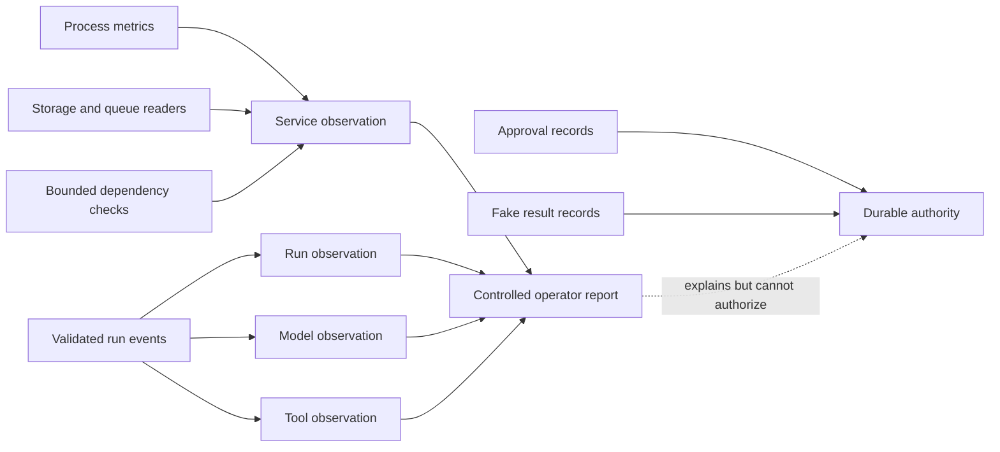

# Build Log - Week 4

[Week 1](build-log-week1.md) |
[Week 2](build-log-week2.md) |
[Week 3](build-log-week3.md) |
[Week 4](build-log-week4.md)

> Template only. This log is reserved for observable evidence from Tasks 06
> and 07. Replace each italic instruction after running the named work; never
> present planned behavior as an implemented control.

## Task 06 - Observe Failures and Practice Recovery

Task contract:
[06 - Observe Failures and Practice Recovery](todo/06-observability-and-incidents.md)

### Goal and Boundary

Session 01 adds a closed, read-only observability contract for four layers and
a controlled service snapshot collector. The collector is library-only: it is
not registered as a Pi tool and is not reachable through HTTP. `GET /health`
remains exactly `{"status":"ok"}`. Approval records and fake-result records
remain the only approval and effect authority.

Task `06` remains in progress until the run query, alerts, runbook, and five
incident drills in Sessions 02 through 04 have direct evidence.

### Complete Incident Timeline

_Add a Mermaid timeline following one synthetic `runId` across the request,
model, tool, approval, failure, recovery, and terminal evidence._

### Run Query Output

_Record the safe operator command and redacted chronological output for one
`runId`._

### Alert Table

_Record thresholds, severity, evidence, and operator action for task failures,
stuck runs, dangerous permission attempts, cost spikes, storage pressure, and
unavailable dependencies._

### Redacted Observability View

| Layer | Correlation | Bounded fields | Explicit absence |
|-------|-------------|----------------|------------------|
| Service | Application version, environment, canonical time | Uptime, RSS, heap, CPU, storage, queue, dependency ID/state/duration/error | `unavailable` or `not_applicable` with finite reason |
| Run | Exact `runId` | Outcome, stop reason, duration, step count, retry count, error category | Tagged measurements and nullable finite error/stop fields |
| Model | Exact `runId` and step | Model/prompt version, outcome, duration, retry, tokens, cost, error | Tagged token/cost/duration availability |
| Tool | Exact `runId` and step | Tool/call identity, outcome, permission, side-effect category, duration, retry, error | Tagged duration and nullable finite error |

Fields intentionally absent from every observation include credentials,
provider payloads, raw errors, filesystem paths, private URLs, lead attributes,
draft bodies, full approval records, and fake-result receipts. Collector labels
are bounded identifiers, dependencies are limited to 20, and timeout cleanup is
mandatory for every dependency check.

Measured zero is represented as `{"status":"available","value":0,"unit":"..."}`.
Missing values never reuse zero: they are either
`{"status":"unavailable","reason":"..."}` or
`{"status":"not_applicable","reason":"..."}`.

### Incident Runbook

_Link `docs/runbooks/agent-incident-response.md` and record the exact pause,
inspect, retry, resume, compensate, escalate, and stop commands exercised._

### Recovery Proof

_Record the timeout, invalid-model-response, restart, revoked-credential, and
duplicate-request drills, including observed recovery without state editing or
duplicate effects._

### Verification Output

Session 01 focused evidence:

- `npx tsc --noEmit`: pass.
- `npx tsx --test tests/observability.test.ts`: 20/20 pass.
- Local `GET /health`: exact `{"status":"ok"}` response.
- Exact production Pi allowlist regression: 1/1 pass.
- `npm run verify`: 293/293 tests and 18/18 production eval cases pass.
- `npm run test:coverage`: 97.72% lines, 85.60% branches, and 98.04% functions.
- `npm audit`: zero known vulnerabilities.

The final Task `06` verification result will be recorded after Sessions 02
through 04 complete the query, alert, runbook, and drill evidence.

### Final Diff Review and Remaining Risk

_Record the logging, credentials, personal-data, alert, recovery, side-effect,
and documentation diff review plus remaining operational blind spots._

## Task 07 - Release Through Coolify

Task contract: [07 - Release Through Coolify](todo/07-coolify-release.md)

### Goal and Boundary

_State the authorized deployment scope, controlled exposure, operator-owned
decisions, and capabilities that remain unavailable._

### Infrastructure Decision Record

_Record the redacted compute, region, access, network, environment, secret,
backup, update, monitoring, pause, recovery, and rollback decisions._

### Deployment and Service Map

_Add a redacted Mermaid map of repository, image, Coolify, service, health,
persistent storage, provider, operator, and controlled client boundaries._

### Security-Gate Checklist

_Record authentication, authorization, tenant isolation, rate/body limits,
human approval operations, data lifecycle, alerting, and redaction results._

### Verification and Image Identity

_Record the clean revision, exact local verification result, reproducible image
command, and immutable image identifier without private registry details._

### Live Health and Run Timeline

_Record the redacted HTTPS health result and one controlled known-lead timeline
ending at `approval_pending` without a send claim._

### Restart and Restore Proof

_Record container restart persistence, backup restore commands, observed state,
recovery time, and missing steps without exposing private infrastructure._

### Rollback Timeline

_Record one intentional reversible failure, diagnosis, rollback command,
restored image identity, health result, and elapsed recovery time._

### Operator Guide

_Link the one-page operator handoff and record another operator's evidence that
the documented deploy, pause, restart, query, recovery, and stop paths work._

### Five-Minute Demo

_Record the problem and user, bounded architecture, happy path, one failure and
recovery, eval gate, cost or latency evidence, and next improvement._

### Final Diff Review and Remaining Risk

_Record the exposure, permissions, secrets, personal-data, persistence,
recovery, side-effect, screenshot, and documentation review plus open release
risks._
