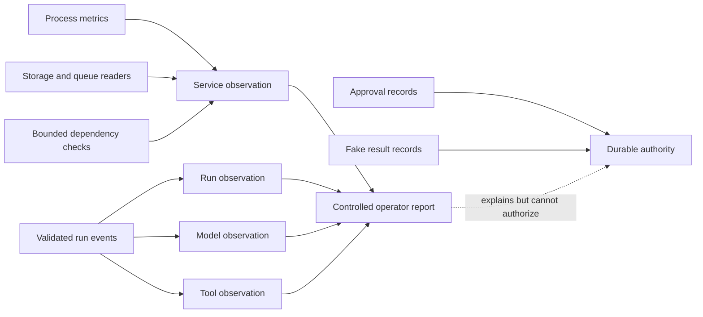
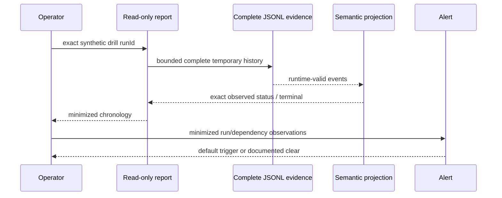
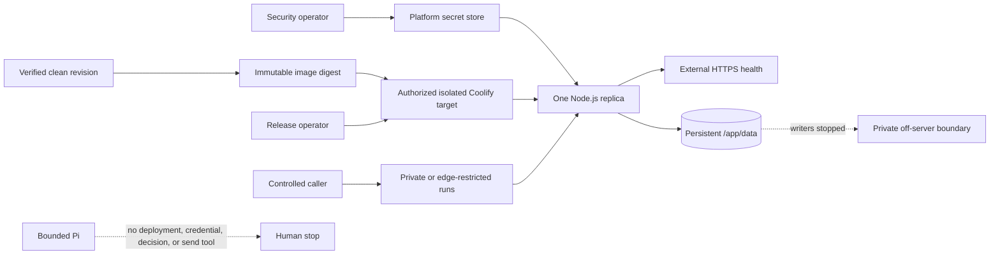

# Build Log - Week 4

[Week 1](build-log-week1.md) |
[Week 2](build-log-week2.md) |
[Week 3](build-log-week3.md) |
[Week 4](build-log-week4.md)

Task `06` now contains direct observable evidence. Task `07` sections remain
templates until the controlled release sessions execute; no placeholder below
is an implemented deployment claim.

## Task 06 - Observe Failures and Practice Recovery

Task contract:
[06 - Observe Failures and Practice Recovery](todo/06-observability-and-incidents.md)

### Goal and Boundary

Session 01 adds a closed, read-only observability contract for four layers and
a controlled service snapshot collector. The collector is library-only: it is
not registered as a Pi tool and is not reachable through HTTP. `GET /health`
remains exactly `{"status":"ok"}`. Approval records and fake-result records
remain the only approval and effect authority.

Sessions 01 through 04 provide the observation, exact-run report, alert,
runbook, and five synthetic drill evidence required by Task `06`. The final
validation and closeout record is attached to Session 04.



### Complete Incident Timeline

Session 04 executes the five predeclared production-eval cases through isolated
temporary stores and constructs each safe report before bounded cleanup. The
actual report chronologies are:

| Drill / `runId` | Exact event sequence |
|-----------------|----------------------|
| Tool timeout / `run_qualification_timeout` | `run.started` -> `qualification.attempted` -> `qualification.failed` -> `run.completed` |
| Invalid model / `run_invalid_model_output` | `run.started` -> `run.stopped` |
| Restart / `run_restart_after_approval` | `run.started` -> `qualification.attempted` -> `qualification.completed` -> `domain.follow_up_drafted` -> `approval.requested` -> `run.completed` |
| Credential unavailable / `run_revoked_provider_credential` | `run.started` -> `run.stopped` |
| Duplicate / `run_duplicate_fake_request` | Restart sequence -> `approval.approved` -> `fake_send.attempted` -> `fake_send.accepted` -> `fake_send.duplicate` |



### Run Query Output

Command contract:

```text
npm run report:run -- --run-id <exact-run-id> --event-log <operator-path> --format text|json
```

The command validates the run ID before filesystem access, accepts only a
resolved non-root regular file, rejects symlinks and evidence above 64 MiB,
validates the complete JSONL and semantic run projection, caps one report at
1,000 events, and never opens a write path. The event-log path is never emitted.

Preserved synthetic example:

```text
$ npm run report:run -- --run-id run_report_fixture --event-log tests/fixtures/run-report-failed.jsonl --format text
run=run_report_fixture status=stopped events=4 checkpoint=run_started authority=observed_only terminal=completed:qualification_failed
metrics elapsed=3000:milliseconds max_retry=1 tokens=0/0/0 cost=0:usd
001 at=2026-08-12T00:00:00.000Z layer=run event=run.started app=0.1.32 step=- retry=0 duration=unavailable:not_reported outcome=attempted permission=not_applicable effect=none error=- stop=- model=- prompt=- tool=- tokens=unavailable:not_reported cost=unavailable:not_reported
002 at=2026-08-12T00:00:01.000Z layer=domain event=qualification.attempted app=0.1.32 step=1 retry=0 duration=0:milliseconds outcome=attempted permission=not_applicable effect=none error=- stop=- model=synthetic-model-v1 prompt=synthetic-prompt-v1 tool=- tokens=0/0/0 cost=0:usd
003 at=2026-08-12T00:00:02.000Z layer=domain event=qualification.failed app=0.1.32 step=1 retry=1 duration=25:milliseconds outcome=failed permission=not_applicable effect=none error=qualification_timeout stop=- model=- prompt=- tool=- tokens=unavailable:not_reported cost=unavailable:not_reported
004 at=2026-08-12T00:00:03.000Z layer=terminal event=run.completed app=0.1.32 step=- retry=1 duration=30:milliseconds outcome=stopped permission=not_applicable effect=none error=qualification_timeout stop=qualification_failed model=- prompt=- tool=- tokens=unavailable:not_reported cost=unavailable:not_reported
```

JSON mode returns the same timeline and summary facts under a closed schema.
The report intentionally omits event IDs, actors, lead and draft identifiers,
arguments, hashes, receipts, idempotency keys, raw errors, payloads, paths,
URLs, and infrastructure details. `authority=observed_only` prevents an
approval or effect observation from being presented as durable authority.

### Alert Table

Session 03 adds a pure bounded evaluator over minimized observations. It has no
scheduler, notification transport, webhook, pager, HTTP route, Pi tool, or
durable mutation. `suppressed` retains the trigger evidence during cooldown;
required missing values are `unavailable`, never clear.

| Rule | Default trigger | Severity | Evidence | Cooldown | Safe operator action |
|------|-----------------|----------|----------|----------|----------------------|
| Repeated task failure | 3 failed/stopped runs | Warning | Run outcome count | 5 minutes | Inspect exact run reports |
| Stuck run | Running/pending at least 5 minutes | Critical | Maximum run duration | 5 minutes | Stop new requests and inspect run |
| Dangerous permission attempt | 1 forbidden/denied decision | Critical | Permission-decision count | 15 minutes | Preserve evidence and escalate |
| Cost spike | Available model cost sum at least USD 5 | Warning | Model cost | 15 minutes | Stop new requests and inspect usage |
| Unavailable dependency | 2 unavailable dependency samples | Critical | Dependency state | 5 minutes | Inspect dependency |
| Storage pressure | Utilization at least 85% | Critical | Used/capacity ratio | 15 minutes | Stop new requests and inspect storage |
| Queue pressure | Depth at least 100 | Warning | Queue depth | 5 minutes | Inspect queue |

The application has no queue, so its queue observation and alert result are
explicitly `not_applicable`. Successful retries below the failure threshold do
not alert. A dangerous permission denial remains visible as `triggered` or
`suppressed`.

### Redacted Observability View

| Layer | Correlation | Bounded fields | Explicit absence |
|-------|-------------|----------------|------------------|
| Service | Application version, environment, canonical time | Uptime, RSS, heap, CPU, storage, queue, dependency ID/state/duration/error | `unavailable` or `not_applicable` with finite reason |
| Run | Exact `runId` | Outcome, stop reason, duration, step count, retry count, error category | Tagged measurements and nullable finite error/stop fields |
| Model | Exact `runId` and step | Model/prompt version, outcome, duration, retry, tokens, cost, error | Tagged token/cost/duration availability |
| Tool | Exact `runId` and step | Tool/call identity, outcome, permission, side-effect category, duration, retry, error | Tagged duration and nullable finite error |

Fields intentionally absent from every observation include credentials,
provider payloads, raw errors, filesystem paths, private URLs, lead attributes,
draft bodies, full approval records, and fake-result receipts. Collector labels
are bounded identifiers, dependencies are limited to 20, and timeout cleanup is
mandatory for every dependency check.

Measured zero is represented as `{"status":"available","value":0,"unit":"..."}`.
Missing values never reuse zero: they are either
`{"status":"unavailable","reason":"..."}` or
`{"status":"not_applicable","reason":"..."}`.

### Incident Runbook

The canonical [Agent Incident Response](runbooks/agent-incident-response.md)
guide grounds every action in the current implementation:

- pause is external access/process/container control because no pause endpoint exists;
- inspect uses the exact read-only `report:run` command;
- retry is caller-controlled only for canonical transient storage/event storage
  refusal or an unstarted qualification with no known effect;
- resume exists only through the internal recovery library at a trusted exact checkpoint;
- compensation is unsupported and always operator-owned;
- corrupt authority, open attempts, and reservation-only effects preserve and escalate;
- terminal or already-completed effects stop without reopening or re-executing.

Session 04 exercises these paths with:

```text
npm run drill:incidents
```

The no-input command runs only the five fixed synthetic cases, prints one closed
JSON suite, returns nonzero on any score/report/alert mismatch, and retains no
temporary authority file or path.

### Recovery Proof

| Drill | Report status / events | Outcome | Default alert | Recovery/runbook | Effects |
|-------|------------------------|---------|---------------|------------------|---------|
| Tool timeout | `stopped` / 4 | `qualification_timeout`, `qualification_failed` | Repeated failure `clear` at 1/3 | `stop` | 0 |
| Invalid model response | `stopped` / 2 | `invalid_model_output`, `dependency_failed` | Repeated failure `clear` at 1/3 | `stop` | 0 |
| Mid-run restart | `waiting_for_approval` / 6 | `approval_pending` | Repeated failure `clear` at 0/3 | `resume` at `approval_requested` | 0 |
| Revoked credential injection | `stopped` / 2 | `dependency_failed` | Dependency unavailable `triggered` at 2/2 | `stop` | 0 |
| Duplicate request | `effect_indeterminate` / 10 | Stable `duplicate` | Repeated failure `clear` at 0/3 | `stop`; return existing result | 1 total |

The restart creates one pending approval event and the fresh recovery instance
returns the same `runId` and checkpoint with no effect. The duplicate drill
records one attempted/accepted fake effect and one duplicate observation; its
dedicated minimized permission evidence reports exactly one total effect.

The duplicate report deliberately remains `authority=observed_only` and
`effect_indeterminate`: the report reads events, not the dedicated fake-result
store, so it cannot promote an observed acceptance into authority. The eval
permission evidence supplies the separate one-effect proof. No drill manually
edits an event, approval, result, or eval record.

### Operational Baseline

One recorded `npm run drill:incidents` sample on 2026-08-12 produced:

| Drill | Harness latency | Explainability | Exercised steps | Tokens | Cost |
|-------|-----------------|----------------|-----------------|--------|------|
| Tool timeout | 13.804 ms | 4 report events | 4 | Unavailable: provider independent | Unavailable: provider independent |
| Invalid model response | 5.793 ms | 2 report events | 4 | Unavailable: provider independent | Unavailable: provider independent |
| Mid-run restart | 27.154 ms | 6 report events | 5 | Unavailable: provider independent | Unavailable: provider independent |
| Revoked credential injection | 4.417 ms | 2 report events | 5 | Unavailable: provider independent | Unavailable: provider independent |
| Duplicate request | 37.293 ms | 10 report events | 4 | Unavailable: provider independent | Unavailable: provider independent |

Latency is a measured local harness value and will vary by run. Explainability
is the validated safe-report event count. Exercised steps count the completed
case, score, report, alert, and applicable recovery/dependency stages; it is not
a production operator-time measurement. No provider-independent token or cost
value is invented.

### Verification Output

Session 01 focused evidence:

- `npx tsc --noEmit`: pass.
- `npx tsx --test tests/observability.test.ts`: 20/20 pass.
- Local `GET /health`: exact `{"status":"ok"}` response.
- Exact production Pi allowlist regression: 1/1 pass.
- `npm run verify`: 293/293 tests and 18/18 production eval cases pass.
- `npm run test:coverage`: 97.72% lines, 85.60% branches, and 98.04% functions.
- `npm audit`: zero known vulnerabilities.

Session 02 focused evidence:

- `npx tsc --noEmit`: pass.
- `npx tsx --test tests/run-report.test.ts`: 23/23 pass.
- Preserved fixture text and JSON commands: pass with byte-identical input.
- Malformed, truncated, duplicate, out-of-order, missing-run, symlink, and
  invalid-input subprocess cases: fail visibly with no partial stdout.
- `npm run verify`: 316/316 tests and 18/18 production eval cases pass.
- `npm run test:coverage`: 97.65% lines, 85.74% branches, and 98.17% functions.
- `npm audit`: zero known vulnerabilities.

Session 03 focused evidence:

- `npx tsc --noEmit`: pass.
- `npx tsx --test tests/alerts.test.ts`: 22/22 pass.
- Exact thresholds, below-threshold retries, distinct-run counting, cooldown
  edges, unavailable values, absent queue, and protected-output cases: pass.
- `npm run verify`: 338/338 tests and 18/18 production eval cases pass.
- `npm run test:coverage`: 97.73% lines, 85.80% branches, and 98.29% functions.
- `npm audit`: zero known vulnerabilities.

Session 04 focused evidence:

- `npx tsc --noEmit`: pass.
- `npx tsx --test tests/incident-drills.test.ts`: 16/16 pass.
- `npm run drill:incidents`: five exact results, suite `pass`, exit 0.
- Store/report chronology, golden scoring, alert decisions, restart, duplicate,
  protected output, cleanup, and invalid-command cases: pass.
- `npm run verify`: 354/354 tests and 18/18 production eval cases pass.
- `npm run test:coverage`: 97.82% lines, 86.14% branches, and 98.37% functions.
- `npm audit`: zero known vulnerabilities.

### Final Diff Review and Remaining Risk

The Task `06` diff adds no HTTP route, Pi tool, notification, provider call,
credential read, real effect, deployment, or retained drill file. Drill output
omits lead/draft/approval/effect identities, event IDs, validated arguments,
actors, receipts, idempotency keys, raw errors, filesystem paths, and provider
payloads. Temporary paths remain inside the existing harness and are removed in
`finally`; tests compare the matching temp-directory inventory before/after.

Remaining operational blind spots are explicit: no scheduler or alert delivery,
no in-application pause, approval-decision, or recovery transport, no production
on-call/SLA, no real provider token/cost measurement, and no deployment proof.
Task `07` Sessions 05 through 08 own the controlled release boundary.

## Task 07 - Release Through Coolify

Task contract: [07 - Release Through Coolify](todo/07-coolify-release.md)

### Goal and Boundary

Session 05 defines a repository-owned preflight before target mutation. The
default exposure permits external HTTPS health but keeps `/runs` private or
edge-restricted, one replica owns `/app/data`, and only synthetic data is
allowed. The preflight accepts no URL, address, credential, operator name,
private identifier, arbitrary evidence string, or deployment instruction.

Policy validation is implemented. Coolify target readiness remains **BLOCKED**
until an authorized target supplies every direct confirmation. The preflight
always returns `targetMutationAllowed: false`; a ready result only admits the
separately authorized Session 06 workflow.

### Infrastructure Decision Record

The complete decision record is in the
[Controlled Release Contract](release/controlled-release-contract.md). Its 13
fixed entries cover capacity, location, administration, SSH/firewall, DNS/HTTPS,
Coolify access, environment isolation, secrets, lifecycle, off-server backup,
monitoring, incident ownership, and update/rollback. Each entry has exactly one
generic role, finite validation method, and Week 4 evidence slot. Missing,
reordered, remapped, or unconfirmed entries block readiness.

No target decision is marked confirmed in the checked-in example. This is an
intentional truthful stop, not missing repository policy.

### Deployment and Service Map



The map is a required target contract, not a deployment claim. No URL, region,
registry, project, volume, backup, or operator identifier is recorded.

### Security-Gate Checklist

| Gate group | Controlled result | Public requirement |
|------------|-------------------|--------------------|
| Authentication, authorization, tenant | Route not exposed beyond controlled boundary | All directly confirmed |
| Proxy identity and shared rate | Not trusted; process gate is capacity-only | Both directly confirmed |
| Body size | Exact 16,384-byte application bound | Application and edge confirmed |
| Human decisions | No public decision endpoint | Authorized durable boundary confirmed |
| Data lifecycle | Synthetic-only manual lifecycle | Full lifecycle confirmed |
| Edge/WAF | Private route or confirmed restriction | Directly confirmed |
| Alerts | Local rules and runbook only | Deployed delivery confirmed |

Controlled `/runs=public`, public mode with any exemption, unverified HTTPS,
secret values, path/replica drift, or incomplete ownership returns `blocked`.
The local process rate limiter never satisfies a public caller-control gate.

### Verification and Image Identity

Session base: `9cbd418f0aaa01af935ec5b3b3cbbefaaf1737c5` at version `0.1.35`.

- Focused preflight tests: 20/20 pass.
- Strict TypeScript: pass.
- Controlled-ready and hypothetical public-ready contract requests: pass only
  with their exact finite gate states.
- Checked-in redacted example: valid request, status `blocked`, 13 exact blocked checks.
- Command: one JSON object on stdin, 64 KiB maximum, no arguments; ready exits
  0, blocked exits 1, invalid exits 2.
- Full repository verification: 374/374 tests and 18/18 production evals pass.
- Coverage: 97.88% lines, 86.31% branches, and 98.43% functions; release
  preflight is 99.11/90.71/100.
- Dependency audit: zero vulnerabilities.

No release image was built and no digest is claimed in Session 05. The fixture
uses explicit `pending`; Session 06 must record a direct immutable digest.

### Live Health and Run Timeline

_Record the redacted HTTPS health result and one controlled known-lead timeline
ending at `approval_pending` without a send claim._

### Restart and Restore Proof

_Record container restart persistence, backup restore commands, observed state,
recovery time, and missing steps without exposing private infrastructure._

### Rollback Timeline

_Record one intentional reversible failure, diagnosis, rollback command,
restored image identity, health result, and elapsed recovery time._

### Operator Guide

_Link the one-page operator handoff and record another operator's evidence that
the documented deploy, pause, restart, query, recovery, and stop paths work._

### Five-Minute Demo

_Record the problem and user, bounded architecture, happy path, one failure and
recovery, eval gate, cost or latency evidence, and next improvement._

### Final Diff Review and Remaining Risk

_Record the exposure, permissions, secrets, personal-data, persistence,
recovery, side-effect, screenshot, and documentation review plus open release
risks._
