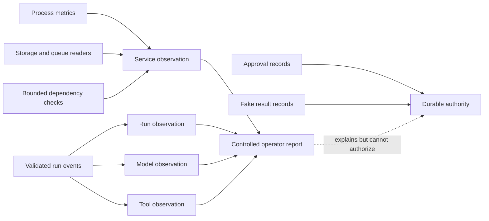
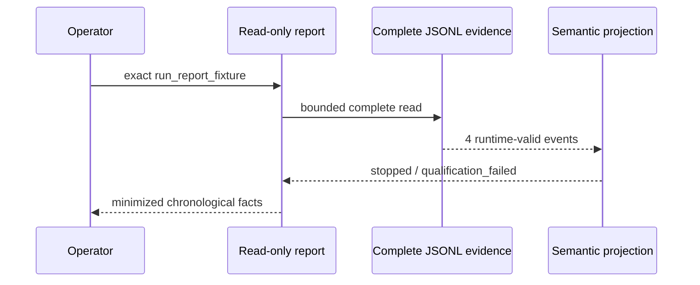

# Build Log - Week 4

[Week 1](build-log-week1.md) |
[Week 2](build-log-week2.md) |
[Week 3](build-log-week3.md) |
[Week 4](build-log-week4.md)

> Template only. This log is reserved for observable evidence from Tasks 06
> and 07. Replace each italic instruction after running the named work; never
> present planned behavior as an implemented control.

## Task 06 - Observe Failures and Practice Recovery

Task contract:
[06 - Observe Failures and Practice Recovery](todo/06-observability-and-incidents.md)

### Goal and Boundary

Session 01 adds a closed, read-only observability contract for four layers and
a controlled service snapshot collector. The collector is library-only: it is
not registered as a Pi tool and is not reachable through HTTP. `GET /health`
remains exactly `{"status":"ok"}`. Approval records and fake-result records
remain the only approval and effect authority.

Task `06` remains in progress until the run query, alerts, runbook, and five
incident drills in Sessions 02 through 04 have direct evidence.



### Complete Incident Timeline

Session 02 adds the safe chronological query used by later incident drills. The
preserved failed-run fixture follows `run_report_fixture` through start,
qualification attempt, timeout failure, and the exact durable
`qualification_failed` terminal. Session 04 will extend this section with the
five complete drill timelines and recovery outcomes.



### Run Query Output

Command contract:

```text
npm run report:run -- --run-id <exact-run-id> --event-log <operator-path> --format text|json
```

The command validates the run ID before filesystem access, accepts only a
resolved non-root regular file, rejects symlinks and evidence above 64 MiB,
validates the complete JSONL and semantic run projection, caps one report at
1,000 events, and never opens a write path. The event-log path is never emitted.

Preserved synthetic example:

```text
$ npm run report:run -- --run-id run_report_fixture --event-log tests/fixtures/run-report-failed.jsonl --format text
run=run_report_fixture status=stopped events=4 checkpoint=run_started authority=observed_only terminal=completed:qualification_failed
metrics elapsed=3000:milliseconds max_retry=1 tokens=0/0/0 cost=0:usd
001 at=2026-08-12T00:00:00.000Z layer=run event=run.started app=0.1.32 step=- retry=0 duration=unavailable:not_reported outcome=attempted permission=not_applicable effect=none error=- stop=- model=- prompt=- tool=- tokens=unavailable:not_reported cost=unavailable:not_reported
002 at=2026-08-12T00:00:01.000Z layer=domain event=qualification.attempted app=0.1.32 step=1 retry=0 duration=0:milliseconds outcome=attempted permission=not_applicable effect=none error=- stop=- model=synthetic-model-v1 prompt=synthetic-prompt-v1 tool=- tokens=0/0/0 cost=0:usd
003 at=2026-08-12T00:00:02.000Z layer=domain event=qualification.failed app=0.1.32 step=1 retry=1 duration=25:milliseconds outcome=failed permission=not_applicable effect=none error=qualification_timeout stop=- model=- prompt=- tool=- tokens=unavailable:not_reported cost=unavailable:not_reported
004 at=2026-08-12T00:00:03.000Z layer=terminal event=run.completed app=0.1.32 step=- retry=1 duration=30:milliseconds outcome=stopped permission=not_applicable effect=none error=qualification_timeout stop=qualification_failed model=- prompt=- tool=- tokens=unavailable:not_reported cost=unavailable:not_reported
```

JSON mode returns the same timeline and summary facts under a closed schema.
The report intentionally omits event IDs, actors, lead and draft identifiers,
arguments, hashes, receipts, idempotency keys, raw errors, payloads, paths,
URLs, and infrastructure details. `authority=observed_only` prevents an
approval or effect observation from being presented as durable authority.

### Alert Table

Session 03 adds a pure bounded evaluator over minimized observations. It has no
scheduler, notification transport, webhook, pager, HTTP route, Pi tool, or
durable mutation. `suppressed` retains the trigger evidence during cooldown;
required missing values are `unavailable`, never clear.

| Rule | Default trigger | Severity | Evidence | Cooldown | Safe operator action |
|------|-----------------|----------|----------|----------|----------------------|
| Repeated task failure | 3 failed/stopped runs | Warning | Run outcome count | 5 minutes | Inspect exact run reports |
| Stuck run | Running/pending at least 5 minutes | Critical | Maximum run duration | 5 minutes | Stop new requests and inspect run |
| Dangerous permission attempt | 1 forbidden/denied decision | Critical | Permission-decision count | 15 minutes | Preserve evidence and escalate |
| Cost spike | Available model cost sum at least USD 5 | Warning | Model cost | 15 minutes | Stop new requests and inspect usage |
| Unavailable dependency | 2 unavailable dependency samples | Critical | Dependency state | 5 minutes | Inspect dependency |
| Storage pressure | Utilization at least 85% | Critical | Used/capacity ratio | 15 minutes | Stop new requests and inspect storage |
| Queue pressure | Depth at least 100 | Warning | Queue depth | 5 minutes | Inspect queue |

The application has no queue, so its queue observation and alert result are
explicitly `not_applicable`. Successful retries below the failure threshold do
not alert. A dangerous permission denial remains visible as `triggered` or
`suppressed`.

### Redacted Observability View

| Layer | Correlation | Bounded fields | Explicit absence |
|-------|-------------|----------------|------------------|
| Service | Application version, environment, canonical time | Uptime, RSS, heap, CPU, storage, queue, dependency ID/state/duration/error | `unavailable` or `not_applicable` with finite reason |
| Run | Exact `runId` | Outcome, stop reason, duration, step count, retry count, error category | Tagged measurements and nullable finite error/stop fields |
| Model | Exact `runId` and step | Model/prompt version, outcome, duration, retry, tokens, cost, error | Tagged token/cost/duration availability |
| Tool | Exact `runId` and step | Tool/call identity, outcome, permission, side-effect category, duration, retry, error | Tagged duration and nullable finite error |

Fields intentionally absent from every observation include credentials,
provider payloads, raw errors, filesystem paths, private URLs, lead attributes,
draft bodies, full approval records, and fake-result receipts. Collector labels
are bounded identifiers, dependencies are limited to 20, and timeout cleanup is
mandatory for every dependency check.

Measured zero is represented as `{"status":"available","value":0,"unit":"..."}`.
Missing values never reuse zero: they are either
`{"status":"unavailable","reason":"..."}` or
`{"status":"not_applicable","reason":"..."}`.

### Incident Runbook

The canonical [Agent Incident Response](runbooks/agent-incident-response.md)
guide grounds every action in the current implementation:

- pause is external access/process/container control because no pause endpoint exists;
- inspect uses the exact read-only `report:run` command;
- retry is caller-controlled only for canonical transient storage/event storage
  refusal or an unstarted qualification with no known effect;
- resume exists only through the internal recovery library at a trusted exact checkpoint;
- compensation is unsupported and always operator-owned;
- corrupt authority, open attempts, and reservation-only effects preserve and escalate;
- terminal or already-completed effects stop without reopening or re-executing.

The guide is implemented and tested as documentation in Session 03. Session 04
will exercise its paths through the five required synthetic incident drills.

### Recovery Proof

_Record the timeout, invalid-model-response, restart, revoked-credential, and
duplicate-request drills, including observed recovery without state editing or
duplicate effects._

### Verification Output

Session 01 focused evidence:

- `npx tsc --noEmit`: pass.
- `npx tsx --test tests/observability.test.ts`: 20/20 pass.
- Local `GET /health`: exact `{"status":"ok"}` response.
- Exact production Pi allowlist regression: 1/1 pass.
- `npm run verify`: 293/293 tests and 18/18 production eval cases pass.
- `npm run test:coverage`: 97.72% lines, 85.60% branches, and 98.04% functions.
- `npm audit`: zero known vulnerabilities.

Session 02 focused evidence:

- `npx tsc --noEmit`: pass.
- `npx tsx --test tests/run-report.test.ts`: 23/23 pass.
- Preserved fixture text and JSON commands: pass with byte-identical input.
- Malformed, truncated, duplicate, out-of-order, missing-run, symlink, and
  invalid-input subprocess cases: fail visibly with no partial stdout.
- `npm run verify`: 316/316 tests and 18/18 production eval cases pass.
- `npm run test:coverage`: 97.65% lines, 85.74% branches, and 98.17% functions.
- `npm audit`: zero known vulnerabilities.

Session 03 focused evidence:

- `npx tsc --noEmit`: pass.
- `npx tsx --test tests/alerts.test.ts`: 22/22 pass.
- Exact thresholds, below-threshold retries, distinct-run counting, cooldown
  edges, unavailable values, absent queue, and protected-output cases: pass.
- `npm run verify`: 338/338 tests and 18/18 production eval cases pass.
- `npm run test:coverage`: 97.73% lines, 85.80% branches, and 98.29% functions.
- `npm audit`: zero known vulnerabilities.

The final Task `06` verification result will be recorded after Sessions 02
through 04 complete the query, alert, runbook, and drill evidence.

### Final Diff Review and Remaining Risk

_Record the logging, credentials, personal-data, alert, recovery, side-effect,
and documentation diff review plus remaining operational blind spots._

## Task 07 - Release Through Coolify

Task contract: [07 - Release Through Coolify](todo/07-coolify-release.md)

### Goal and Boundary

_State the authorized deployment scope, controlled exposure, operator-owned
decisions, and capabilities that remain unavailable._

### Infrastructure Decision Record

_Record the redacted compute, region, access, network, environment, secret,
backup, update, monitoring, pause, recovery, and rollback decisions._

### Deployment and Service Map

_Add a redacted Mermaid map of repository, image, Coolify, service, health,
persistent storage, provider, operator, and controlled client boundaries._

### Security-Gate Checklist

_Record authentication, authorization, tenant isolation, rate/body limits,
human approval operations, data lifecycle, alerting, and redaction results._

### Verification and Image Identity

_Record the clean revision, exact local verification result, reproducible image
command, and immutable image identifier without private registry details._

### Live Health and Run Timeline

_Record the redacted HTTPS health result and one controlled known-lead timeline
ending at `approval_pending` without a send claim._

### Restart and Restore Proof

_Record container restart persistence, backup restore commands, observed state,
recovery time, and missing steps without exposing private infrastructure._

### Rollback Timeline

_Record one intentional reversible failure, diagnosis, rollback command,
restored image identity, health result, and elapsed recovery time._

### Operator Guide

_Link the one-page operator handoff and record another operator's evidence that
the documented deploy, pause, restart, query, recovery, and stop paths work._

### Five-Minute Demo

_Record the problem and user, bounded architecture, happy path, one failure and
recovery, eval gate, cost or latency evidence, and next improvement._

### Final Diff Review and Remaining Risk

_Record the exposure, permissions, secrets, personal-data, persistence,
recovery, side-effect, screenshot, and documentation review plus open release
risks._
