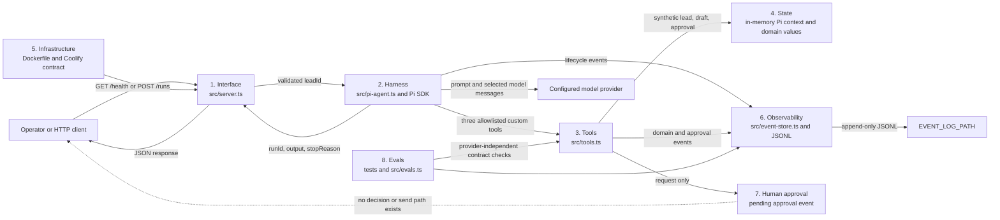
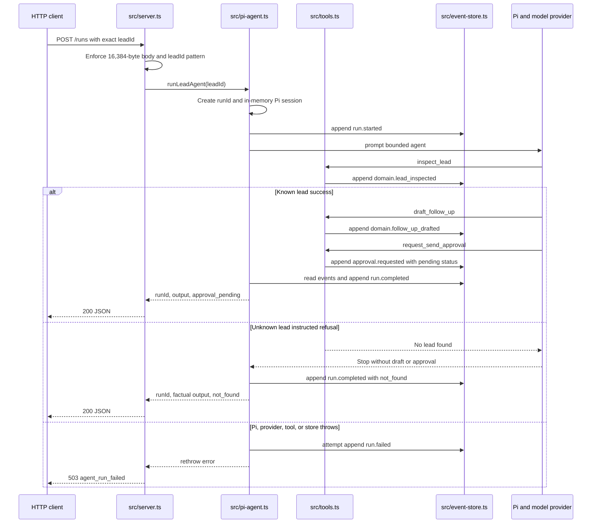

# Build Log

This log preserves observable workshop evidence. Each task entry names its goal, repository boundary, exact commands and results, required artifacts, exercised failure or refusal, final diff review, and remaining risk. Runtime claims are current only when backed by source or a command recorded here; future task descriptions remain planned until their acceptance evidence exists.

## Evidence Conventions

- Use synthetic identifiers and redact credentials, private infrastructure, and unnecessary personal data.
- Link claims to repository paths and record exact commands with pass or fail results.
- Treat model prose as a proposal, never as durable state, permission, or proof of an external effect.
- Preserve one `runId` across run, tool, approval, failure, and terminal evidence.
- Record failures and refusals without converting them into friendly success wording.

---

## Task 00 - Map and Verify the Bounded System

**Phase**: 00 - Foundation
**Session**: `phase00-session01-bounded-system-map`
**Date**: 2026-08-04
**Mode**: HITL evidence session; no production behavior changes

### Goal and Boundary

Explain the complete request path, runtime ownership, persistence, evidence, and permission boundaries before changing application behavior. This entry covers the committed bounded baseline: exact lead lookup, deterministic draft creation, pending approval creation, append-only event evidence, and an explicit stop before any send.

### Repository-Guidance Map

| Source | Authority | Evidence used in this task |
|--------|-----------|----------------------------|
| `AGENTS.md` | Repository entry point | Requires all linked governance, Mermaid system maps, and current docs, changelog, and TODO |
| `.spec_system/CONSIDERATIONS.md` | Architecture memory | Preserves one bounded agent, typed state, append-only evidence, and no premature database or queue |
| `.spec_system/CONVENTIONS.md` | Engineering workflow | Separates HTTP, orchestration, domain tools, and persistence; requires deterministic verification and task evidence |
| `.spec_system/SECURITY-COMPLIANCE.md` | Current security truth | Distinguishes implemented controls from planned release gates and prohibits real customer data now |
| `docs/todo/README_todo.md` | Ordered workshop path | Defines task order, evidence standard, and the rule that planned work is not an implemented control |
| `docs/todo/00-map-the-system.md` | Active acceptance contract | Requires eight boundaries, three request paths, explicit permissions, exact verification, and stop evidence |

The highest-cost guardrail is application-owned authorization for the exact action and target before any external write. Prompt wording, an assistant claim, or a pending approval record is never authorization. The current repository makes the safe case even stronger: there is no send adapter, send endpoint, approval-decision endpoint, or network-writing custom tool to invoke.

### Eight-Boundary Architecture Map



The diagram labels all required boundaries and their repository owners. Data leaves the process only through the HTTP response, Pi's configured model-provider exchange, console output, or the configured JSONL event file; the current application performs no external business-system write.

### Request Trace: Success, Unknown Lead, and Thrown Error



Malformed JSON or an invalid `leadId` is rejected in `src/server.ts` before a Pi run starts. The unknown-lead branch above is the prompt-instructed path, not a complete application invariant: `draft_follow_up` refuses an unknown lead, but `request_send_approval` can still accept model-supplied parameters without proving a prior successful lookup. A found lead with no approval event produces the fourth current stop reason, `completed`, which means only that inspection evidence exists and must not be treated as approval or send success. On the thrown-error path, `src/pi-agent.ts` attempts to record `run.failed` under the created `runId`, but `src/server.ts` currently returns no `runId` or terminal `stopReason` to the caller; Tasks `01`, `02`, and `04` own the later invariant, durable approval, and recovery controls.

### Ownership, Persistence, Dependencies, and Egress

| Boundary | Owner and source | Current state or effect | Persistence or egress |
|----------|------------------|-------------------------|-----------------------|
| HTTP interface | Application, `src/server.ts` | Validates method, path, body size, JSON, and `leadId`; maps results to JSON | Request enters and response leaves over HTTP; errors currently include a message |
| Agent harness | Pi integration, `src/pi-agent.ts` | Creates the model runtime, resource loader, in-memory session, prompt, subscription, and final result | Prompt, selected context, and model messages can leave for the configured provider |
| Domain tools | Application, `src/tools.ts` | Reads synthetic fixtures, creates deterministic drafts, and creates pending approval values | No network call; tool results return to Pi working context |
| Working state | Pi `SessionManager.inMemory(cwd)` | Holds one run's replaceable conversation context | Process memory only; disposed after the run |
| Lead fixtures | Application, `src/tools.ts` | Two synthetic lead records committed in source | Git repository; no customer CRM exists |
| Event evidence | Application, `src/event-store.ts` | Appends run, Pi lifecycle, domain, approval, and terminal records | JSONL at `EVENT_LOG_PATH`; defaults to `./data/events.jsonl`, container path `/app/data/events.jsonl` |
| Approval state | Application tools and event evidence | `makeApproval()` creates only `pending`; no decision transition exists | Full synthetic draft and pending approval are currently in the JSONL event data |
| Infrastructure | Docker and operator, `Dockerfile`, `.env.example` | Node 24 process, port 3000, health path, persistent `/app/data` contract | Coolify configuration and provider credentials remain external to source |
| Verification | Maintainer, `tests/` and `src/evals.ts` | Provider-independent contract and safety checks | Console output only unless an operator captures it in evidence |

External runtime dependencies are Node.js, npm packages from the lockfile, the configured Pi model provider, the filesystem path used for events, and the deployment host. There is no database, Redis, queue, CRM, research service, send provider, WAF, authentication service, or approval-decision service in the current runtime.

### Pi Harness and Enforcement Map

| Integration point | Source evidence | Responsibility |
|-------------------|-----------------|----------------|
| `ModelRuntime.create()` | `src/pi-agent.ts` | Resolves the configured model/provider runtime outside domain logic |
| `DefaultResourceLoader` | `src/pi-agent.ts` | Loads bounded system instructions and repository context for the Pi session |
| `createAgentSession()` | `src/pi-agent.ts` | Creates one run-scoped Pi agent session |
| `customTools: tools` | `src/pi-agent.ts`, `src/tools.ts` | Supplies the three application-defined tool implementations |
| `tools: [...]` | `src/pi-agent.ts` | Explicitly allowlists only `inspect_lead`, `draft_follow_up`, and `request_send_approval` |
| `SessionManager.inMemory(cwd)` | `src/pi-agent.ts` | Keeps replaceable working context in process memory |
| `session.subscribe()` | `src/pi-agent.ts` | Minimizes selected Pi lifecycle metadata and appends it under the run's `runId` |
| `session.prompt()` | `src/pi-agent.ts` | Starts the bounded model loop for the exact requested lead |
| `session.agent.state.messages` | `src/pi-agent.ts` | Supplies final assistant text; it is output prose, not durable permission or truth |
| `unsubscribe()` and `session.dispose()` | `src/pi-agent.ts` | Releases the subscription and session on every terminal path |

The model decides which allowlisted tool to call, proposes the draft angle, and produces final prose. The harness restricts the available tools and lifecycle; application code validates the HTTP `leadId`, tool parameter shapes, exact fixture lookup, pending approval shape, durable event writes, and event-derived stop reason. Coolify controls process configuration, secrets, health probing, persistence mounts, and rollback outside the model.

One current ambiguity is important: `request_send_approval` validates parameter shape but does not independently prove that `leadId` was successfully inspected or that the supplied draft came from immutable application state. The prompt asks for the safe order, but prompt order is not enforcement. No external send is possible, so this cannot create a network effect today; Sessions 02 and 03 must prevent the same pattern from becoming durable authority as qualification is added.

### Smallest Useful Product Boundary

The smallest useful current version accepts one syntactically valid, exact synthetic `leadId`; gives one bounded Pi session three narrow application tools; produces a grounded draft and pending approval for a known lead; records correlated JSONL evidence; returns `runId`, factual output, and a visible `stopReason`; and stops before any external effect.

| Output or evidence | Safe interpretation now | Validation before another system trusts it |
|--------------------|-------------------------|--------------------------------------------|
| `runId` | Correlation key created by the application | Require a non-empty application-issued identifier and match it across response and events |
| `stopReason: approval_pending` | A pending record exists; nothing was sent | Require an `approval.requested` event for the same `runId` with `status: pending`; never translate it to sent or approved |
| `stopReason: not_found` | No successful lead-inspection evidence exists | Require the exact lookup result and no draft, approval, or external effect |
| `stopReason: completed` | A successful inspection exists but no pending approval event does | Treat as incomplete manual-review evidence; never infer approval, qualification, or send success |
| Assistant `output` | Operator-facing model prose | Treat as untrusted display text; never derive permission, qualification truth, or completion from it |
| Draft and approval event data | Synthetic workshop evidence only | Check exact lead identity, application schemas, minimization, and pending status before later persistence or display |

Typed qualification, durable approval decisions, immutable approved content, an idempotent fake write, recovery and replay, production eval gates, observability, authenticated exposure, real data lifecycle controls, and any real provider write remain outside this boundary. Redis, a queue, a database, and another agent are also outside because the current single-process job has no measured concurrency or coordination requirement.

### Harness Decision Record

**Decision**: Keep one bounded Pi model loop for contextual draft judgment, surrounded by deterministic application tools, event evidence, and a mandatory human stop before any external write.

**Job**: Given one exact `leadId`, inspect approved synthetic data, determine whether work can proceed, draft one relevant first follow-up, request human approval, record evidence, and stop.

**Why a model loop is useful**: Selecting and phrasing a relevant follow-up angle benefits from judgment over lead context. Exact lookup, schemas, permissions, state transitions, event correlation, stop reasons, and side effects do not require model discretion and stay in application code.

**Stop conditions**:

- Stop clearly when the exact lead is not found.
- Stop with `approval_pending` after a pending approval event exists.
- Record `run.failed`, release session resources, and surface failure when the Pi, provider, tool, or store throws.
- Never continue to approval decision or send; those capabilities do not exist.

**Human checkpoint**: A person must review the exact proposed action, target, and content through future application-owned approval state. The current pending record asks for that review but cannot decide or authorize anything.

**Durable state and evidence**: JSONL events under one `runId` are the only current durable runtime evidence. Pi conversation context is in memory and replaceable. Lead fixtures are committed synthetic source data; approval decisions and resumable projections are not yet durable.

**Success evidence**: A known lead yields grounded draft evidence and a pending approval stop; an unknown lead yields no fabricated record; every durable event carries the same `runId`; verification passes; no source path can send.

**Role split**:

- Codex inspects, specifies, changes, tests, reviews, and documents the repository.
- Pi coordinates the bounded model loop and custom tool calls for one run.
- The application owns schemas, validation, tool code, permissions, state, events, stop derivation, and HTTP mapping.
- Coolify owns deployment configuration, secret injection, process health, persistent mounts, and rollback.

**Rejected complexity**: A second agent, queue, Redis, or database would add coordination and recovery surfaces without an evidenced concurrency requirement. Add them only when measured throughput, durability, or specialization needs cannot be met by typed deterministic boundaries in the single-agent design.

**Consequences**: Draft quality may benefit from model reasoning while safety remains inspectable. The current implementation still needs typed qualification, stronger cross-tool invariants, terminal limits, durable approvals, and recovery before public production exposure.

### Permission Classification

| Action | Classification | Current enforcement or future gate |
|--------|----------------|------------------------------------|
| Validate HTTP method, path, body size, JSON, and `leadId` | Automatic | Deterministic application checks in `src/server.ts` |
| Read one exact synthetic lead | Automatic | `inspect_lead` and `findLead()` use an exact validated identifier and have no side effect |
| Produce deterministic qualification from approved lead data | Automatic, planned | Sessions 02 and 03 must add application validation before Pi can use the result |
| Draft from an existing synthetic lead | Automatic | `draft_follow_up` calls deterministic `makeDraft()` and performs no send |
| Create a pending approval request | Automatic | `request_send_approval` can create only `status: pending`; it grants no write permission |
| Append run and tool evidence | Automatic | Application event store writes under the originating `runId`; Pi lifecycle metadata is minimized, but current synthetic draft and approval events retain full content |
| Inspect health and run deterministic tests or evals | Automatic | Read-only operational and repository checks |
| Approve or decline the exact proposed action | Approval-required | Future authenticated, authorized human decision stored as application state |
| Execute the deterministic fake write from immutable approved state | Approval-required, planned | Task `03` must validate exact approval, target, content, and idempotency before effect |
| Retry or resume a write-capable step | Approval-required | Must re-use durable authorization and idempotency; prompt text cannot reauthorize it |
| Change production deployment, secrets, permissions, or spending | Approval-required | Authorized operator action outside the Pi runtime |
| Real provider send | Forbidden in the required five-week path | No adapter or tool exists; future integration needs separate authorization after the workshop path |
| Pi shell, filesystem, credential, deployment, or unrestricted CRM access | Forbidden | Absent from `customTools` and the exact `tools` allowlist |
| Invent a lead, qualification fact, approval decision, or completed effect | Forbidden | Deterministic lookup, application validation, durable state, and critical evals must refuse it |
| Process real customer data before lifecycle controls exist | Forbidden | Security posture restricts the project to synthetic data |

The production Pi allowlist is exactly `inspect_lead`, `draft_follow_up`, and `request_send_approval`. There is no shell tool, filesystem tool, approval-decision tool, send tool, network client, or send adapter in `src/` or the production dependency surface.

### Production Risk Register

| Risk | Current evidence and impact | Owning task |
|------|-----------------------------|-------------|
| Qualification is model-led and not a typed durable fact | No qualification schema or application-validated result exists; another component could over-trust prose | `01` |
| Approval integrity and durability are incomplete | Pending approval is event data only, accepts model-supplied draft and target, and has no decision transition or restart-safe projection | `02` |
| External-write safety is unimplemented | No adapter, exact-approved-state resolution, idempotency result, timeout contract, or compensation evidence exists | `03` |
| Runs are not bounded or safely resumable | No explicit deadline, maximum step count, replay projection, corrupt-record policy, or resume path exists | `04` |
| Release gates are too narrow | Four tests and five evals do not cover the planned production golden set, adversarial behavior, recovery, or critical non-zero gating | `05` |
| Operators cannot reconstruct cost, latency, or incidents | Events lack complete run timing, model usage, cost, alert thresholds, safe queries, and an incident runbook | `06` |
| Public exposure and recovery are unsafe | `/runs` lacks authentication, authorization, tenant isolation, and rate limiting; retention, backups, restore, and rollback are unproven | `07` |
| Premature orchestration could hide an unclear contract | A second agent would add failure and permission surfaces before a measured bottleneck exists | `08` comparison gate |

The simplest defensible architecture remains one process, one Pi session, deterministic application tools, and replaceable file-backed evidence. Redis, a queue, a database, or another agent becomes justified only when a later acceptance test demonstrates durable concurrency, throughput, independent failure isolation, or measured specialization that the current design cannot satisfy.

### Five-Sentence Stop-Boundary Explanation

1. The HTTP boundary accepts one validated `leadId` and starts one Pi run with an application-issued `runId`.
2. A known synthetic lead may be inspected and drafted through narrow custom tools, while an unknown lead must stop without fabricated data.
3. The final custom tool creates a pending human approval record and the application derives `approval_pending` from durable event evidence.
4. The runtime has no approval-decision operation, send adapter, network-writing tool, Pi shell tool, or Pi filesystem tool.
5. The system therefore stops with reviewable evidence before any external effect, because only future application-owned authorization for the exact action and target could permit a write.

### Baseline Verification Evidence

Command: `npm run verify`

Result: PASS (exit 0) on 2026-08-04. The Node test runner's status glyphs are rendered below as ASCII `PASS` and `INFO` labels; command content and counts are preserved.

```text
> production-agent-workshop@0.1.6 verify
> npm run check && npm test && npm run eval

> production-agent-workshop@0.1.6 check
> tsc --noEmit

> production-agent-workshop@0.1.6 test
> tsx --test tests/*.test.ts

PASS event store appends and filters by run
PASS lead lookup never fabricates an unknown record
PASS draft uses deterministic lead data
PASS send request is an approval record, not a send
INFO tests 4
INFO pass 4
INFO fail 0

> production-agent-workshop@0.1.6 eval
> tsx src/evals.ts

PASS known lead can be inspected
PASS unknown lead does not get fabricated
PASS draft names the real lead
PASS draft is not marked as sent
PASS approval remains pending

5/5 evals passed
```

The command runs one strict TypeScript check, all four deterministic tests, and all five provider-independent eval cases. No provider credential, Pi session, network write, or production data is required.

### Exercised Failure and Refusal Evidence

The deterministic domain lookup was exercised directly so the refusal does not depend on provider behavior.

Command:

```bash
node --import tsx --input-type=module -e 'import { findLead } from "./src/tools.ts"; const lead = findLead("lead_unknown"); console.log(JSON.stringify({ leadId: "lead_unknown", found: Boolean(lead), fabricated: lead !== undefined })); if (lead !== undefined) process.exitCode = 1;'
```

Output and result:

```text
{"leadId":"lead_unknown","found":false,"fabricated":false}
```

Result: PASS (exit 0). The exact unknown identifier returns no record and cannot enter deterministic draft creation from an application-resolved `Lead`. The model-facing inspection tool also emits `domain.lead_inspected` with `found: false` and returns factual not-found text.

### Permission and Documentation Safety Checks

| Check | Command or inspection | Result |
|-------|-----------------------|--------|
| Exact production tool allowlist | `rg -n 'tools: ...' src/pi-agent.ts` | PASS - exactly the three documented custom tools |
| Forbidden runtime capability scan | `rg` for shell, filesystem, file tools, command execution, send-provider, and CRM symbols in `src/` and `package.json` | PASS - no matching capability |
| Runtime scope | `git diff --name-only -- src tests package.json package-lock.json Dockerfile .env.example` | PASS - no production, test, dependency, or deployment file changed in Session 01 |
| Encoding and line endings | Byte scan of Build Log plus Session 01 spec, tasks, and notes | PASS - 4 files are ASCII-only with LF endings |
| Relative documentation links | Repository Markdown link-resolution scan | PASS - 36 Markdown files checked with no missing relative target |

These checks prove only the current repository surface. They do not treat future permission, recovery, or exposure work as complete.

### Final Diff Review and Remaining Risk

Session 01 changes only Apex workflow state and artifacts, `docs/build-log.md`, `docs/TODO.md`, and `docs/CHANGELOG.md`. `git diff --check` passes, and a scoped diff over `src/`, `tests/`, dependency manifests, `Dockerfile`, and `.env.example` is empty. The diff introduces no runtime side effect, permission, dependency, secret, real personal data, new persistence, or exposure.

The remaining risks are the eight entries in the production risk register. Most immediately, Session 02 must define typed qualification and enforce deterministic input and output contracts before Session 03 exposes qualification to Pi; the current pending-approval tool's weak cross-tool invariant must not be copied into that design.
