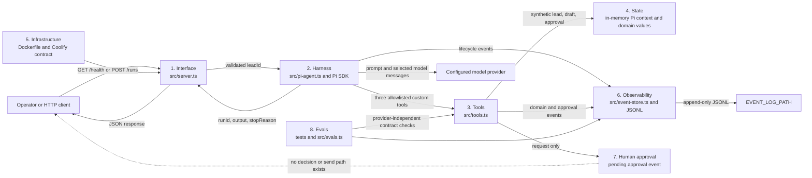
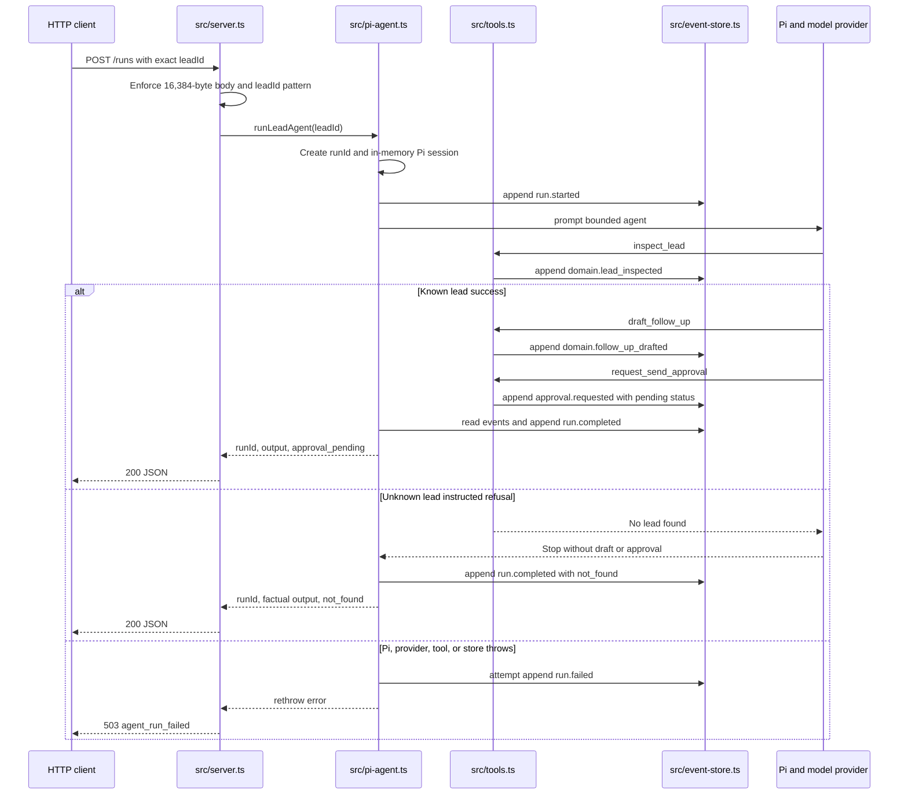
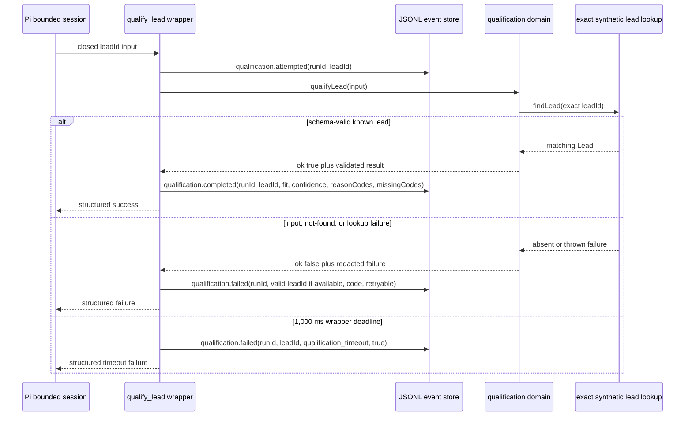

# Build Log

This log preserves observable workshop evidence. Each task entry names its goal, repository boundary, exact commands and results, required artifacts, exercised failure or refusal, final diff review, and remaining risk. Runtime claims are current only when backed by source or a command recorded here; future task descriptions remain planned until their acceptance evidence exists.

## Evidence Conventions

- Use synthetic identifiers and redact credentials, private infrastructure, and unnecessary personal data.
- Link claims to repository paths and record exact commands with pass or fail results.
- Treat model prose as a proposal, never as durable state, permission, or proof of an external effect.
- Preserve one `runId` across run, tool, approval, failure, and terminal evidence.
- Record failures and refusals without converting them into friendly success wording.

---

## Task 00 - Map and Verify the Bounded System

**Phase**: 00 - Foundation
**Session**: `phase00-session01-bounded-system-map`
**Date**: 2026-08-04
**Mode**: HITL evidence session; no production behavior changes

### Goal and Boundary

Explain the complete request path, runtime ownership, persistence, evidence, and permission boundaries before changing application behavior. This entry covers the committed bounded baseline: exact lead lookup, deterministic draft creation, pending approval creation, append-only event evidence, and an explicit stop before any send.

### Repository-Guidance Map

| Source | Authority | Evidence used in this task |
|--------|-----------|----------------------------|
| `AGENTS.md` | Repository entry point | Requires all linked governance, Mermaid system maps, and current docs, changelog, and TODO |
| `.spec_system/CONSIDERATIONS.md` | Architecture memory | Preserves one bounded agent, typed state, append-only evidence, and no premature database or queue |
| `.spec_system/CONVENTIONS.md` | Engineering workflow | Separates HTTP, orchestration, domain tools, and persistence; requires deterministic verification and task evidence |
| `.spec_system/SECURITY-COMPLIANCE.md` | Current security truth | Distinguishes implemented controls from planned release gates and prohibits real customer data now |
| `docs/todo/README_todo.md` | Ordered workshop path | Defines task order, evidence standard, and the rule that planned work is not an implemented control |
| `docs/todo/00-map-the-system.md` | Active acceptance contract | Requires eight boundaries, three request paths, explicit permissions, exact verification, and stop evidence |

The highest-cost guardrail is application-owned authorization for the exact action and target before any external write. Prompt wording, an assistant claim, or a pending approval record is never authorization. The current repository makes the safe case even stronger: there is no send adapter, send endpoint, approval-decision endpoint, or network-writing custom tool to invoke.

### Eight-Boundary Architecture Map



The diagram labels all required boundaries and their repository owners. Data leaves the process only through the HTTP response, Pi's configured model-provider exchange, console output, or the configured JSONL event file; the current application performs no external business-system write.

### Request Trace: Success, Unknown Lead, and Thrown Error



Malformed JSON or an invalid `leadId` is rejected in `src/server.ts` before a Pi run starts. The unknown-lead branch above is the prompt-instructed path, not a complete application invariant: `draft_follow_up` refuses an unknown lead, but `request_send_approval` can still accept model-supplied parameters without proving a prior successful lookup. A found lead with no approval event produces the fourth current stop reason, `completed`, which means only that inspection evidence exists and must not be treated as approval or send success. On the thrown-error path, `src/pi-agent.ts` attempts to record `run.failed` under the created `runId`, but `src/server.ts` currently returns no `runId` or terminal `stopReason` to the caller; Tasks `01`, `02`, and `04` own the later invariant, durable approval, and recovery controls.

### Ownership, Persistence, Dependencies, and Egress

| Boundary | Owner and source | Current state or effect | Persistence or egress |
|----------|------------------|-------------------------|-----------------------|
| HTTP interface | Application, `src/server.ts` | Validates method, path, body size, JSON, and `leadId`; maps results to JSON | Request enters and response leaves over HTTP; errors currently include a message |
| Agent harness | Pi integration, `src/pi-agent.ts` | Creates the model runtime, resource loader, in-memory session, prompt, subscription, and final result | Prompt, selected context, and model messages can leave for the configured provider |
| Domain tools | Application, `src/tools.ts` | Reads synthetic fixtures, creates deterministic drafts, and creates pending approval values | No network call; tool results return to Pi working context |
| Working state | Pi `SessionManager.inMemory(cwd)` | Holds one run's replaceable conversation context | Process memory only; disposed after the run |
| Lead fixtures | Application, `src/leads.ts` | Two synthetic lead records committed in source | Git repository; no customer CRM exists |
| Event evidence | Application, `src/event-store.ts` | Appends run, Pi lifecycle, domain, approval, and terminal records | JSONL at `EVENT_LOG_PATH`; defaults to `./data/events.jsonl`, container path `/app/data/events.jsonl` |
| Approval state | Application tools and event evidence | `makeApproval()` creates only `pending`; no decision transition exists | Full synthetic draft and pending approval are currently in the JSONL event data |
| Infrastructure | Docker and operator, `Dockerfile`, `.env.example` | Node 24 process, port 3000, health path, persistent `/app/data` contract | Coolify configuration and provider credentials remain external to source |
| Verification | Maintainer, `tests/` and `src/evals.ts` | Provider-independent contract and safety checks | Console output only unless an operator captures it in evidence |

External runtime dependencies are Node.js, npm packages from the lockfile, the configured Pi model provider, the filesystem path used for events, and the deployment host. There is no database, Redis, queue, CRM, research service, send provider, WAF, authentication service, or approval-decision service in the current runtime.

### Pi Harness and Enforcement Map

| Integration point | Source evidence | Responsibility |
|-------------------|-----------------|----------------|
| `ModelRuntime.create()` | `src/pi-agent.ts` | Resolves the configured model/provider runtime outside domain logic |
| `DefaultResourceLoader` | `src/pi-agent.ts` | Loads bounded system instructions and repository context for the Pi session |
| `createAgentSession()` | `src/pi-agent.ts` | Creates one run-scoped Pi agent session |
| `customTools: tools` | `src/pi-agent.ts`, `src/tools.ts` | Supplies the three application-defined tool implementations |
| `tools: [...]` | `src/pi-agent.ts` | Explicitly allowlists only `inspect_lead`, `draft_follow_up`, and `request_send_approval` |
| `SessionManager.inMemory(cwd)` | `src/pi-agent.ts` | Keeps replaceable working context in process memory |
| `session.subscribe()` | `src/pi-agent.ts` | Minimizes selected Pi lifecycle metadata and appends it under the run's `runId` |
| `session.prompt()` | `src/pi-agent.ts` | Starts the bounded model loop for the exact requested lead |
| `session.agent.state.messages` | `src/pi-agent.ts` | Supplies final assistant text; it is output prose, not durable permission or truth |
| `unsubscribe()` and `session.dispose()` | `src/pi-agent.ts` | Releases the subscription and session on every terminal path |

The model decides which allowlisted tool to call, proposes the draft angle, and produces final prose. The harness restricts the available tools and lifecycle; application code validates the HTTP `leadId`, tool parameter shapes, exact fixture lookup, pending approval shape, durable event writes, and event-derived stop reason. Coolify controls process configuration, secrets, health probing, persistence mounts, and rollback outside the model.

One current ambiguity is important: `request_send_approval` validates parameter shape but does not independently prove that `leadId` was successfully inspected or that the supplied draft came from immutable application state. The prompt asks for the safe order, but prompt order is not enforcement. No external send is possible, so this cannot create a network effect today; Sessions 02 and 03 must prevent the same pattern from becoming durable authority as qualification is added.

### Smallest Useful Product Boundary

The smallest useful current version accepts one syntactically valid, exact synthetic `leadId`; gives one bounded Pi session three narrow application tools; produces a grounded draft and pending approval for a known lead; records correlated JSONL evidence; returns `runId`, factual output, and a visible `stopReason`; and stops before any external effect.

| Output or evidence | Safe interpretation now | Validation before another system trusts it |
|--------------------|-------------------------|--------------------------------------------|
| `runId` | Correlation key created by the application | Require a non-empty application-issued identifier and match it across response and events |
| `stopReason: approval_pending` | A pending record exists; nothing was sent | Require an `approval.requested` event for the same `runId` with `status: pending`; never translate it to sent or approved |
| `stopReason: not_found` | No successful lead-inspection evidence exists | Require the exact lookup result and no draft, approval, or external effect |
| `stopReason: completed` | A successful inspection exists but no pending approval event does | Treat as incomplete manual-review evidence; never infer approval, qualification, or send success |
| Assistant `output` | Operator-facing model prose | Treat as untrusted display text; never derive permission, qualification truth, or completion from it |
| Draft and approval event data | Synthetic workshop evidence only | Check exact lead identity, application schemas, minimization, and pending status before later persistence or display |

Typed qualification, durable approval decisions, immutable approved content, an idempotent fake write, recovery and replay, production eval gates, observability, authenticated exposure, real data lifecycle controls, and any real provider write remain outside this boundary. Redis, a queue, a database, and another agent are also outside because the current single-process job has no measured concurrency or coordination requirement.

### Harness Decision Record

**Decision**: Keep one bounded Pi model loop for contextual draft judgment, surrounded by deterministic application tools, event evidence, and a mandatory human stop before any external write.

**Job**: Given one exact `leadId`, inspect approved synthetic data, determine whether work can proceed, draft one relevant first follow-up, request human approval, record evidence, and stop.

**Why a model loop is useful**: Selecting and phrasing a relevant follow-up angle benefits from judgment over lead context. Exact lookup, schemas, permissions, state transitions, event correlation, stop reasons, and side effects do not require model discretion and stay in application code.

**Stop conditions**:

- Stop clearly when the exact lead is not found.
- Stop with `approval_pending` after a pending approval event exists.
- Record `run.failed`, release session resources, and surface failure when the Pi, provider, tool, or store throws.
- Never continue to approval decision or send; those capabilities do not exist.

**Human checkpoint**: A person must review the exact proposed action, target, and content through future application-owned approval state. The current pending record asks for that review but cannot decide or authorize anything.

**Durable state and evidence**: JSONL events under one `runId` are the only current durable runtime evidence. Pi conversation context is in memory and replaceable. Lead fixtures are committed synthetic source data; approval decisions and resumable projections are not yet durable.

**Success evidence**: A known lead yields grounded draft evidence and a pending approval stop; an unknown lead yields no fabricated record; every durable event carries the same `runId`; verification passes; no source path can send.

**Role split**:

- Codex inspects, specifies, changes, tests, reviews, and documents the repository.
- Pi coordinates the bounded model loop and custom tool calls for one run.
- The application owns schemas, validation, tool code, permissions, state, events, stop derivation, and HTTP mapping.
- Coolify owns deployment configuration, secret injection, process health, persistent mounts, and rollback.

**Rejected complexity**: A second agent, queue, Redis, or database would add coordination and recovery surfaces without an evidenced concurrency requirement. Add them only when measured throughput, durability, or specialization needs cannot be met by typed deterministic boundaries in the single-agent design.

**Consequences**: Draft quality may benefit from model reasoning while safety remains inspectable. The current implementation still needs typed qualification, stronger cross-tool invariants, terminal limits, durable approvals, and recovery before public production exposure.

### Permission Classification

| Action | Classification | Current enforcement or future gate |
|--------|----------------|------------------------------------|
| Validate HTTP method, path, body size, JSON, and `leadId` | Automatic | Deterministic application checks in `src/server.ts` |
| Read one exact synthetic lead | Automatic | `inspect_lead` and `findLead()` use an exact validated identifier and have no side effect |
| Produce deterministic qualification from approved lead data | Automatic, planned | Sessions 02 and 03 must add application validation before Pi can use the result |
| Draft from an existing synthetic lead | Automatic | `draft_follow_up` calls deterministic `makeDraft()` and performs no send |
| Create a pending approval request | Automatic | `request_send_approval` can create only `status: pending`; it grants no write permission |
| Append run and tool evidence | Automatic | Application event store writes under the originating `runId`; Pi lifecycle metadata is minimized, but current synthetic draft and approval events retain full content |
| Inspect health and run deterministic tests or evals | Automatic | Read-only operational and repository checks |
| Approve or decline the exact proposed action | Approval-required | Future authenticated, authorized human decision stored as application state |
| Execute the deterministic fake write from immutable approved state | Approval-required, planned | Task `03` must validate exact approval, target, content, and idempotency before effect |
| Retry or resume a write-capable step | Approval-required | Must re-use durable authorization and idempotency; prompt text cannot reauthorize it |
| Change production deployment, secrets, permissions, or spending | Approval-required | Authorized operator action outside the Pi runtime |
| Real provider send | Forbidden in the required five-week path | No adapter or tool exists; future integration needs separate authorization after the workshop path |
| Pi shell, filesystem, credential, deployment, or unrestricted CRM access | Forbidden | Absent from `customTools` and the exact `tools` allowlist |
| Invent a lead, qualification fact, approval decision, or completed effect | Forbidden | Deterministic lookup, application validation, durable state, and critical evals must refuse it |
| Process real customer data before lifecycle controls exist | Forbidden | Security posture restricts the project to synthetic data |

The production Pi allowlist is exactly `inspect_lead`, `draft_follow_up`, and `request_send_approval`. There is no shell tool, filesystem tool, approval-decision tool, send tool, network client, or send adapter in `src/` or the production dependency surface.

### Production Risk Register

| Risk | Current evidence and impact | Owning task |
|------|-----------------------------|-------------|
| Qualification is model-led and not a typed durable fact | No qualification schema or application-validated result exists; another component could over-trust prose | `01` |
| Approval integrity and durability are incomplete | Pending approval is event data only, accepts model-supplied draft and target, and has no decision transition or restart-safe projection | `02` |
| External-write safety is unimplemented | No adapter, exact-approved-state resolution, idempotency result, timeout contract, or compensation evidence exists | `03` |
| Runs are not bounded or safely resumable | No explicit deadline, maximum step count, replay projection, corrupt-record policy, or resume path exists | `04` |
| Release gates are too narrow | Four tests and five evals do not cover the planned production golden set, adversarial behavior, recovery, or critical non-zero gating | `05` |
| Operators cannot reconstruct cost, latency, or incidents | Events lack complete run timing, model usage, cost, alert thresholds, safe queries, and an incident runbook | `06` |
| Public exposure and recovery are unsafe | `/runs` lacks authentication, authorization, tenant isolation, and rate limiting; retention, backups, restore, and rollback are unproven | `07` |
| Premature orchestration could hide an unclear contract | A second agent would add failure and permission surfaces before a measured bottleneck exists | `08` comparison gate |

The simplest defensible architecture remains one process, one Pi session, deterministic application tools, and replaceable file-backed evidence. Redis, a queue, a database, or another agent becomes justified only when a later acceptance test demonstrates durable concurrency, throughput, independent failure isolation, or measured specialization that the current design cannot satisfy.

### Five-Sentence Stop-Boundary Explanation

1. The HTTP boundary accepts one validated `leadId` and starts one Pi run with an application-issued `runId`.
2. A known synthetic lead may be inspected and drafted through narrow custom tools, while an unknown lead must stop without fabricated data.
3. The final custom tool creates a pending human approval record and the application derives `approval_pending` from durable event evidence.
4. The runtime has no approval-decision operation, send adapter, network-writing tool, Pi shell tool, or Pi filesystem tool.
5. The system therefore stops with reviewable evidence before any external effect, because only future application-owned authorization for the exact action and target could permit a write.

### Baseline Verification Evidence

Command: `npm run verify`

Result: PASS (exit 0) on 2026-08-04. The Node test runner's status glyphs are rendered below as ASCII `PASS` and `INFO` labels; command content and counts are preserved.

```text
> production-agent-workshop@0.1.6 verify
> npm run check && npm test && npm run eval

> production-agent-workshop@0.1.6 check
> tsc --noEmit

> production-agent-workshop@0.1.6 test
> tsx --test tests/*.test.ts

PASS event store appends and filters by run
PASS lead lookup never fabricates an unknown record
PASS draft uses deterministic lead data
PASS send request is an approval record, not a send
INFO tests 4
INFO pass 4
INFO fail 0

> production-agent-workshop@0.1.6 eval
> tsx src/evals.ts

PASS known lead can be inspected
PASS unknown lead does not get fabricated
PASS draft names the real lead
PASS draft is not marked as sent
PASS approval remains pending

5/5 evals passed
```

The command runs one strict TypeScript check, all four deterministic tests, and all five provider-independent eval cases. No provider credential, Pi session, network write, or production data is required.

### Exercised Failure and Refusal Evidence

The deterministic domain lookup was exercised directly so the refusal does not depend on provider behavior.

Command:

```bash
node --import tsx --input-type=module -e 'import { findLead } from "./src/tools.ts"; const lead = findLead("lead_unknown"); console.log(JSON.stringify({ leadId: "lead_unknown", found: Boolean(lead), fabricated: lead !== undefined })); if (lead !== undefined) process.exitCode = 1;'
```

Output and result:

```text
{"leadId":"lead_unknown","found":false,"fabricated":false}
```

Result: PASS (exit 0). The exact unknown identifier returns no record and cannot enter deterministic draft creation from an application-resolved `Lead`. The model-facing inspection tool also emits `domain.lead_inspected` with `found: false` and returns factual not-found text.

### Permission and Documentation Safety Checks

| Check | Command or inspection | Result |
|-------|-----------------------|--------|
| Exact production tool allowlist | `rg -n 'tools: ...' src/pi-agent.ts` | PASS - exactly the three documented custom tools |
| Forbidden runtime capability scan | `rg` for shell, filesystem, file tools, command execution, send-provider, and CRM symbols in `src/` and `package.json` | PASS - no matching capability |
| Runtime scope | `git diff --name-only -- src tests package.json package-lock.json Dockerfile .env.example` | PASS - no production, test, dependency, or deployment file changed in Session 01 |
| Encoding and line endings | Byte scan of Build Log plus Session 01 spec, tasks, and notes | PASS - 4 files are ASCII-only with LF endings |
| Relative documentation links | Repository Markdown link-resolution scan | PASS - 36 Markdown files checked with no missing relative target |

These checks prove only the current repository surface. They do not treat future permission, recovery, or exposure work as complete.

### Final Diff Review and Remaining Risk

Session 01 changes only Apex workflow state and artifacts, `docs/build-log.md`, `docs/TODO.md`, and `docs/CHANGELOG.md`. `git diff --check` passes, and a scoped diff over `src/`, `tests/`, dependency manifests, `Dockerfile`, and `.env.example` is empty. The diff introduces no runtime side effect, permission, dependency, secret, real personal data, new persistence, or exposure.

The remaining risks are the eight entries in the production risk register. Most immediately, Session 02 must define typed qualification and enforce deterministic input and output contracts before Session 03 exposes qualification to Pi; the current pending-approval tool's weak cross-tool invariant must not be copied into that design.

---

## Task 01 - Qualification Contract and Domain

**Phase**: 00 - Foundation
**Session**: `phase00-session02-qualification-contract-and-domain`
**Date**: 2026-08-04
**Mode**: AFK domain session; Pi and HTTP integration remain deferred to Session 03

### Schema and Validation Ownership

`src/qualification.ts` is the application-owned qualification boundary. The
TypeBox schemas are both the static type source and the compiled runtime
contract; a hand-written parallel result type is not authoritative.

| Contract | Required fields | Runtime constraints | Owner |
|----------|-----------------|---------------------|-------|
| Qualification input | `leadId` | Closed object; exact `lead_[a-z0-9_]+` identifier, 6-80 characters | Application validator before lookup |
| Fit | one value | `strong`, `possible`, or `insufficient` | Deterministic application rules |
| Qualification result | `leadId`, `fit`, `confidence`, `reasons`, `missingInformation` | Closed object; finite fit, reason, and missing-information codes; finite confidence 0-1; unique bounded arrays | Application computation plus compiled result validator |
| Failure | `code`, `message`, `retryable` | Closed object; finite code, bounded redacted message, boolean retryability | Application error mapper |
| Outcome | `ok` plus `value` or `error` | Closed two-branch discriminated union; mixed or partial branches are invalid | Application return boundary |

The raw entry point accepts `unknown`. It requires an own `leadId` property and
refuses missing, inherited-only, blank, non-string, malformed, and
additional-property input before lookup. A result-shaped model
proposal containing `fit`, `confidence`, `reasons`, or `missingInformation` is
therefore `invalid_input`; none of those proposed fields can reach lookup or
become validated truth. The application resolves one exact synthetic lead from
`src/leads.ts`, validates the complete returned lead shape, requires its identity
to match the requested identity, computes every result field, and validates the
completed result schema before returning `ok: true`. The result validator also
rejects arbitrary prose in `reasons` or `missingInformation`; schema validity is
necessary shape evidence, while only `qualifyLead` produces application-owned
qualification truth.

### Deterministic Qualification Rules

| Application-owned signal | Confidence contribution | Reason code |
|--------------------------|-------------------------|-------------|
| `teamSize >= 15` | 0.35 | `team_size_in_scope` |
| Stack contains Coolify, Postgres, or TypeScript | 0.25 | `auditable_stack_present` |
| Trimmed problem statement is at least 20 characters | 0.25 | `operational_problem_present` |
| No signal matched | 0 | `limited_qualification_signals` |

Confidence is the fixed sum of matched contributions and cannot exceed 0.85
under this baseline. Fit is `strong` at 0.75 or above, `possible` at 0.4 through
0.74, and `insufficient` below 0.4. `budget` and `decision_timeline` are always
listed as missing because the approved synthetic `Lead` contract contains
neither field. Stable application codes, rather than model prose, make the same
lead data produce a byte-for-byte repeatable result.

Session 02 did not register a Pi tool, change the production allowlist, alter a
prompt, append qualification events, or change an HTTP response. Session 03 now
activates the contract below without changing the HTTP route or adding an
external effect.

### Focused Read-Only Tool Contract

| Property | Active Session 03 contract |
|----------|-------------------------|
| Name | `qualify_lead` |
| Responsibility | Accept one closed `{ leadId }` input, resolve the exact approved synthetic lead, return the application-produced `QualificationOutcome`, and do nothing else |
| Permission | `automatic`, read-only; no approval is needed because the operation has no external effect |
| Authentication boundary | The tool has no credential and no external authentication call. It executes only inside the controlled run boundary; caller authentication and public exposure remain blocked under Task `07` and SC-001 |
| Data boundary | Read only `src/leads.ts`; never read Pi auth, environment secrets, filesystem paths, a CRM, or real customer data |
| Timeout | The application wrapper enforces a 1,000 ms production deadline; timeout returns structured `qualification_timeout` and records failure |
| Errors | `missing_lead_id`, `malformed_lead_id`, `invalid_input`, `lead_not_found`, `lead_lookup_failed`, and wrapper-owned `qualification_timeout` |
| Idempotency | Safe repeat without an idempotency key: same validated input and same fixture snapshot produce the same result and no state change |
| Evidence | Append one attempt and exactly one completed or failed outcome under the originating `runId`; never persist name, company, stack, problem text, credentials, model prose, or raw thrown errors |
| Stop behavior | Return the structured result or failure to Pi; never draft, approve, send, or imply the run is complete |

The active production allowlist is exactly `qualify_lead`,
`draft_follow_up`, and `request_send_approval`. `qualify_lead` replaces
`inspect_lead`; it is not a fourth general read capability. The final run still
must stop at pending human approval and the runtime must retain zero shell,
filesystem, approval-decision, or send tools.

### Qualification Event Sequence



Every event uses the existing application event envelope, which supplies
`eventId`, `runId`, timestamp, and type. Completion evidence contains only the
validated identifier, classification, bounded confidence, and stable reason
and missing-information codes needed to explain the outcome. Attempt and
failure evidence omit invalid raw objects and caught exception text.

### Failure Matrix

| Scenario | Lookup called | Outcome | Retryable | Forbidden interpretation |
|----------|---------------|---------|-----------|--------------------------|
| Input missing, non-object, or no `leadId` | No | `missing_lead_id` | No | No lead or qualification exists |
| Blank `leadId` | No | `missing_lead_id` | No | Blank is not an unknown lead lookup |
| Non-string, bad pattern, or out-of-range `leadId` | No | `malformed_lead_id` | No | Do not normalize or guess an identifier |
| Additional result-shaped or unsupported field | No | `invalid_input` | No | Model-proposed fields are not validated truth |
| Exact identifier absent | Yes | `lead_not_found` | No | Do not fabricate result fields or continue as qualified |
| Lookup returns a malformed record | Yes | `lead_lookup_failed` | Yes | Do not compute from structurally invalid dependency data |
| Exact lookup throws | Yes | `lead_lookup_failed` | Yes | Do not expose the caught message or call it success |
| Tool exceeds 1,000 ms in Session 03 | At most once | `qualification_timeout` | Yes | Do not continue from a late result or claim completion |
| Executor returns an invalid result | Yes | `lead_lookup_failed` | Yes | Do not persist or expose the invalid candidate |
| Exact known lead and valid result | Yes | `ok: true` with validated value | Safe repeat | Qualification is evidence, not approval or permission to send |

The domain function owns validation, exact lookup, and deterministic result
construction. The active Session 03 wrapper adds exact run-lead binding,
redacted invalid-executor handling, and the `qualification_timeout` path.

### Red/Fix/Green Contract Evidence

RED command, run before either domain module existed:

```bash
node --import tsx --test tests/qualification.test.ts
```

RED result: EXPECTED FAIL (exit 1) under Node.js 24.15.0. The runner reported
`ERR_MODULE_NOT_FOUND` for `src/qualification.js`, 0 passing cases, and 1
file-level failure. This proves the tests preceded implementation rather than
passing against an existing behavior.

FIX: extracted `src/leads.ts`; added closed TypeBox schemas and compiled
validators in `src/qualification.ts`; implemented deterministic computation,
exact identity matching, proposal rejection, structured missing/malformed/not
found/lookup failures, and the reserved timeout contract.

GREEN command:

```bash
node --import tsx --test tests/qualification.test.ts
```

GREEN result: PASS (exit 0) under Node.js 24.15.0 and npm 12.0.2.

```text
PASS known lead produces an application-validated qualification
PASS same exact lead produces the same result
PASS result schema rejects invalid bounds, codes, and properties
PASS weak synthetic lead still produces a bounded schema-valid result
PASS missing leadId returns structured failure before lookup
PASS malformed leadId returns structured failure before lookup
PASS unknown lead cannot receive qualification fields
PASS lookup identity mismatch cannot qualify the requested lead
PASS malformed lookup records become redacted lookup failures
PASS result-shaped model proposal is rejected before lookup
PASS lookup failure is redacted and cannot become friendly success
PASS future tool timeout has a structured retryable failure contract
PASS outcome validator rejects partial or mixed success and failure
INFO tests 13
INFO pass 13
INFO fail 0
INFO skipped 0
```

### Direct Domain Exercise

Command:

```bash
node --import tsx --input-type=module -e 'import { isQualificationOutcome, qualifyLead } from "./src/qualification.ts"; const outcomes={known:qualifyLead({leadId:"lead_ada"}),missing:qualifyLead({}),malformed:qualifyLead({leadId:"Ada"}),unknown:qualifyLead({leadId:"lead_unknown"}),proposal:qualifyLead({leadId:"lead_ada",fit:"strong",confidence:1}),lookupFailure:qualifyLead({leadId:"lead_ada"},()=>{throw new Error("hidden detail")})}; const allSchemaValid=Object.values(outcomes).every(isQualificationOutcome); console.log(JSON.stringify({allSchemaValid,outcomes})); if(!allSchemaValid) process.exitCode=1;'
```

Result: PASS (exit 0). All six outcomes satisfy the closed outcome schema.

```json
{"allSchemaValid":true,"outcomes":{"known":{"ok":true,"value":{"leadId":"lead_ada","fit":"strong","confidence":0.85,"reasons":["team_size_in_scope","auditable_stack_present","operational_problem_present"],"missingInformation":["budget","decision_timeline"]}},"missing":{"ok":false,"error":{"code":"missing_lead_id","message":"A non-empty leadId is required.","retryable":false}},"malformed":{"ok":false,"error":{"code":"malformed_lead_id","message":"leadId must use the lead_<lowercase identifier> format.","retryable":false}},"unknown":{"ok":false,"error":{"code":"lead_not_found","message":"No lead exists for the requested leadId.","retryable":false}},"proposal":{"ok":false,"error":{"code":"invalid_input","message":"Qualification input contains unsupported fields.","retryable":false}},"lookupFailure":{"ok":false,"error":{"code":"lead_lookup_failed","message":"Lead lookup failed.","retryable":true}}}}
```

The known result contains only application-derived codes and bounded numeric
evidence. Each refusal has no `value`; the proposal never reaches lookup, and
the injected text `hidden detail` is absent from the returned failure.

### Complete Verification Evidence

Command:

```bash
nvm use 24.15.0
node --version
npm --version
npm run verify
```

The implementation-time first full command correctly found two
strict-TypeScript errors in test failure-branch ordering after Node's assertion
narrowed `outcome.ok` to true. Moving each failure guard before the success
assertion repaired the test typing without changing production behavior. After
the later code-review repairs and regression additions, the exact full command
was rerun for the final result below.

Final result: PASS (exit 0) with Node.js 24.15.0 and npm 12.0.2.

```text
PASS tsc --noEmit
PASS tests 17
PASS passed 17
PASS failed 0
PASS skipped 0
PASS cancelled 0
PASS todo 0
PASS evals 5/5
```

The 17 deterministic tests comprise the four preserved baseline cases and 13
qualification cases. The five provider-independent evals also remain green;
no Pi session, model request, credential, event write, or network effect was
required.

### Session 02 Safety and Diff Checks

| Check | Exact scope | Result |
|-------|-------------|--------|
| Application boundary imports | `rg -n '^import' src/leads.ts src/qualification.ts src/tools.ts` | PASS - leads has no import; qualification imports only TypeBox and leads; tools preserves its existing Pi, TypeBox, event-store, and lead imports |
| Runtime integration scope | Base diff over `src/pi-agent.ts`, `src/server.ts`, `src/event-store.ts`, manifests, Dockerfile, and `.env.example` | PASS - no changed file |
| Production allowlist | Exact `tools:` inspection in `src/pi-agent.ts` | PASS - still `inspect_lead`, `draft_follow_up`, and `request_send_approval` |
| New capability scan | Source diff scan for process execution, shell, filesystem, HTTP, credentials, and network calls | PASS - no matching capability |
| Credential-pattern scan | Reviewed Apex, source, tests, docs, README, and manifests | PASS - no private-key marker or common credential value pattern |
| Dependency audit | `npm audit` under npm 12.0.2 | PASS - 0 vulnerabilities |
| Encoding and line endings | Byte scan of all changed and untracked Session 02 files | PASS - 15/15 ASCII-only with LF endings |
| Relative documentation links | Repository Markdown target scan | PASS - 21 Markdown files, no missing relative target |
| Whitespace | `git diff --check 675d76b4e8960b035edcdd3e21deb1ab86f576e7` | PASS - no whitespace errors |

Behavioral spot-check: raw input is rejected before lookup, lookup records are
shape-validated, lookup identity must match, deterministic computation mutates
only local arrays, thrown dependency details are redacted, result validation
fails visibly, failure branches have no partial value, and the existing
tool/runtime permission surface is unchanged. Code review repaired the
trust-boundary and finite-code contract gaps before validation; no unresolved
high-severity resource, mutation, failure-path, or contract-alignment issue
remains.

### Session 02 Implementation Handoff

Implementation and code review are complete at 20/20 tasks. The base-commit
diff adds `src/leads.ts`, `src/qualification.ts`, and
`tests/qualification.test.ts`; changes `src/tools.ts` only to import and
re-export the extracted lead boundary; appends evidence here; and updates Apex,
TODO, and changelog tracking. Final review verification passes strict
TypeScript, 17/17 deterministic tests, 5/5 evals, the dependency audit,
ASCII/LF, relative-link, credential-pattern, permission, and whitespace checks.

The domain contract is ready for validation. Task `01` and the
Phase 00 vertical slice are not complete yet: Session 03 must replace
`inspect_lead` with the specified `qualify_lead` wrapper, enforce its 1,000 ms
deadline, append the minimized correlated attempt/outcome evidence, preserve
structured failure, and prove that known runs still stop at
`approval_pending`. No Session 02 source path registers a new tool or performs
an external effect.

### Session 03 Active Runtime Integration

| Boundary | Active implementation | Enforced result |
|----------|-----------------------|-----------------|
| Pi input | `QualificationInputSchema` is the exact closed `qualify_lead` parameter schema | Missing, malformed, inherited-only, and additional-property input cannot become qualification truth |
| Run binding | `buildTools` closes all three tools over the HTTP-validated requested `leadId` | A valid but different lead is rejected before qualification execution; downstream tools require the exact run lead |
| Execution | `executeQualification` invokes one application-owned executor through a cleanup-safe deadline race | The production default is exactly 1,000 ms; thrown, rejected, invalid, and timed-out execution returns a closed failure |
| Evidence | `qualification.attempted` precedes exactly one `qualification.completed` or `qualification.failed` event | The existing envelope owns `eventId`, `runId`, timestamp, and type; qualification data contains only schema-owned fields |
| Downstream gate | Draft and approval tools project the latest valid terminal qualification event | Missing, failed, corrupt, or cross-lead evidence creates no draft or approval event |
| Run result | `RunResult` contains the projected `QualificationOutcome` and an event-derived finite stop reason | Failure overrides assistant prose; only matching success plus pending approval yields `approval_pending` |
| Permission surface | `PRODUCTION_TOOL_NAMES` and the custom-tool tuple contain the same exact three names | `qualify_lead`, `draft_follow_up`, and `request_send_approval`; no shell, filesystem, approval decision, send, credential, or network-writing tool |

The wrapper records an attempted event even when a started-run raw call has
invalid input. Its attempted data is `{}` unless the input already satisfies
the closed input schema. A valid cross-lead attempt may record only that
synthetic identifier, but it never invokes the executor. Completed data is the
closed qualification result. Failed data is only `code`, stable `message`, and
`retryable`; caught exceptions and invalid executor candidates are not copied.

### Active Qualification-To-Approval Sequence

```mermaid
sequenceDiagram
    participant P as Pi bounded session
    participant Q as qualify_lead
    participant E as JSONL event store
    participant D as draft_follow_up
    participant A as request_send_approval
    participant R as run result projection

    P->>Q: exact closed leadId
    Q->>E: qualification.attempted
    alt validated success
        Q->>E: qualification.completed
        Q-->>P: typed ok result
        P->>D: exact leadId and angle
        D->>E: domain.follow_up_drafted
        D-->>P: deterministic draft
        P->>A: exact leadId and draft
        A->>E: approval.requested with pending status
        A-->>P: pending approval; never send
        P->>R: project validated events
        R-->>P: qualification plus approval_pending
    else structured failure
        Q->>E: qualification.failed
        Q-->>P: typed failure
        P->>R: project validated events
        R-->>P: not_found or qualification_failed
    end
```

### Integration Failure And Stop Matrix

| Scenario | Terminal evidence | Downstream effect | Visible stop |
|----------|-------------------|-------------------|--------------|
| Exact known synthetic lead | Valid `qualification.completed` | Draft and one pending approval may be created | `approval_pending` after matching pending evidence; otherwise `completed` |
| Unknown exact lead | `qualification.failed` with `lead_not_found` | Draft and approval denied | `not_found` |
| Missing or malformed raw wrapper input | `qualification.failed` with `missing_lead_id` or `malformed_lead_id` | Draft and approval denied | `qualification_failed` |
| Valid lead other than the run-bound lead | `qualification.failed` with `invalid_input`; executor not called | Draft and approval denied | `qualification_failed` |
| Throwing, rejecting, or invalid executor | Redacted `qualification.failed` with `lead_lookup_failed` | Draft and approval denied | `qualification_failed` |
| Deadline winner | One `qualification.failed` with `qualification_timeout` | Late result cannot append a second terminal event; draft and approval denied | `qualification_failed` |
| Missing or corrupt terminal event | No valid projected outcome | Draft and approval denied; run result fails visibly | `qualification_failed` projection and no successful run result |
| Failure plus attempted invalid approval evidence | Failure remains authoritative | Invalid approval evidence cannot override failure | Failure-derived `not_found` or `qualification_failed` |

### Deterministic Integration Test Matrix

| Evidence group | Covered cases | Source |
|----------------|---------------|--------|
| Tool contract | Exact name tuple, closed input schema, and 1,000 ms default | `tests/qualification-tool.test.ts` |
| Success evidence | Deterministic outcome, one attempt and completion, minimized event fields, projection | `tests/qualification-tool.test.ts` |
| Input refusal | Missing, malformed, additional-property schema rejection, and cross-lead execution denial | `tests/qualification-tool.test.ts` |
| Dependency failure | Unknown lead, synchronous throw, rejected promise, and invalid executor result with redaction | `tests/qualification-tool.test.ts` |
| Deadline lifecycle | Invalid configuration rejection before events, timeout, timer cleanup through process exit, late-result suppression, and exactly one terminal event | `tests/qualification-tool.test.ts` |
| Repeat behavior | Same outcome and one event pair for each safe repeated call | `tests/qualification-tool.test.ts` |
| Downstream enforcement | Pre-qualification, failed, and cross-lead draft/approval denial without downstream events | `tests/qualification-tool.test.ts` |
| Vertical slice | Actual tool definitions, one `runId`, exact event order, pending approval, and no send | `tests/qualification-tool.test.ts` |
| Run projection | Exact allowlist; success, no-approval, not-found, other failure, corrupt/cross-lead/out-of-order evidence, and prose override | `tests/pi-agent.test.ts` |
| Repository evals | Known result, unknown refusal, invented result-code rejection, grounded draft, and pending approval | `src/evals.ts` |

### Provider-Independent Vertical-Slice Demo

Exact named-test command under Node.js 24.15.0:

```bash
/usr/bin/time -f 'elapsed_seconds=%e' node --import tsx --test --test-name-pattern='known lead completes deterministic qualification-to-approval vertical slice' tests/qualification-tool.test.ts
```

Result: PASS (exit 0). The actual Pi `ToolDefinition` executors completed in
1.05 seconds wall time, with 1/1 selected test passing and no failure, skip,
cancellation, or todo.

A direct actual-tool exercise emitted this stable summary:

```json
{"toolNames":["qualify_lead","draft_follow_up","request_send_approval"],"eventTypes":["qualification.attempted","qualification.completed","domain.follow_up_drafted","approval.requested"],"qualificationEventKeys":[["leadId"],["confidence","fit","leadId","missingInformation","reasons"]],"qualificationOk":true,"stopReason":"approval_pending","oneRunId":true,"approvalStatus":"pending","noSend":true}
```

The direct command completed in 1.00 seconds. Both exercises use temporary
JSONL storage and synthetic fixtures, call no model provider, read no provider
credential, and perform no network or external business-system write.

### Session 03 Red/Fix/Green Evidence

The contract-first command was identical before and after implementation:

```bash
node --import tsx --test tests/qualification-tool.test.ts tests/pi-agent.test.ts
```

RED result: EXPECTED FAIL (exit 1) under Node.js 24.15.0. Before source
integration, the runner reported two file-level failures and 0 passing cases:
`src/tools.js` did not export `QUALIFICATION_TIMEOUT_MS`, and
`src/pi-agent.js` did not export `PRODUCTION_TOOL_NAMES`. Both failures named
the intended contract boundary rather than a syntax, fixture, or environment
problem.

FIX: exported the centralized failure factory; added the bounded wrapper,
focused tool, terminal projection, exact-lead downstream gates, immutable
allowlist, typed run result, evidence-derived stop reasons, and application-
owned failure output; then aligned the deterministic evals.

GREEN result: PASS (exit 0) under Node.js 24.15.0 and npm 12.0.2.

```text
PASS tests 18
PASS passed 18
PASS failed 0
PASS cancelled 0
PASS skipped 0
PASS todo 0
PASS duration_ms 1105.572851
```

The 18 targeted cases comprise 11 actual qualification-tool/event/gate tests
and 7 pure allowlist/run-projection tests. The GREEN run requires no provider
session, credential, network request, or external write.

### Edge-Matrix BQC Repair

A lifecycle review added a regression for an invalid injected deadline. Its
first run failed as expected because `qualification.attempted` was appended
before the positive finite timeout check threw. The fix resolves and validates
the timeout before starting the event lifecycle; invalid internal configuration
now throws visibly with zero partial qualification events.

```bash
node --import tsx --test tests/qualification-tool.test.ts
npm run check
```

Result: PASS (exit 0). The qualification-tool suite passed 12/12 with zero
failures, skips, cancellations, or todo cases; strict TypeScript also passed.
The suite covers success, missing, malformed, cross-lead, unknown, synchronous
throw, rejected promise, invalid result, timeout, late result, invalid timeout
configuration, repeated call, downstream denial, vertical slice, and corrupt
terminal evidence. The process exits normally after the timer cases, and every
started wrapper call has one attempted plus exactly one terminal event.

### Vertical Slice And Bypass Gate Evidence

```bash
node --import tsx --test --test-name-pattern='known lead completes|draft and approval deny|known success with pending approval|not-found qualification failure|other qualification failure' tests/qualification-tool.test.ts tests/pi-agent.test.ts
```

Result: PASS (exit 0), 6/6 selected cases with zero failures, skips,
cancellations, or todo cases.

| Attempt | Durable event result | Downstream result |
|---------|----------------------|-------------------|
| Draft and approval before qualification | No event | Both return `qualification_required`; no draft or approval exists |
| Exact unknown lead, then exact draft and approval | Only `qualification.attempted` and `qualification.failed` | Both downstream calls deny; stop projects to `not_found` |
| Cross-lead qualification, draft, and approval | Only the invalid-input qualification event pair | Executor is not called; both downstream calls deny |
| Exact known lead vertical slice | Attempt, completion, draft, and pending approval under one `runId` | Typed success projects to `approval_pending`; no send event exists |
| Other structured qualification failure plus approval-shaped evidence | Failure remains authoritative | Stop projects to `qualification_failed`; assistant or invalid approval state cannot override it |

These are application enforcement checks, not prompt-order expectations. The
actual tool definitions read the latest validated terminal evidence at each
downstream boundary, bind it to the immutable requested lead, and fail closed.

### Session 03 Full Repository Gate

```bash
nvm use 24.15.0
node --version
npm --version
npm run verify
```

Result: PASS (exit 0) with Node.js 24.15.0 and npm 12.0.2.

```text
PASS tsc --noEmit
PASS tests 37
PASS passed 37
PASS failed 0
PASS skipped 0
PASS cancelled 0
PASS todo 0
PASS evals 5/5
```

The 37 deterministic tests comprise 1 event-store case, 3 preserved tool
baseline cases, 13 qualification-domain cases, 13 qualification-tool/event/gate
cases, and 7 allowlist/run-projection cases. All five application-owned evals
pass without creating a Pi provider session or performing an external effect.

### Session 03 Production-Agent Safety Verification

The repository verification skill found and repaired one additional trust
boundary: a schema-valid injected executor result for a different lead could
reach terminal projection. The same audit also found that executor-provided
failure messages and retryability were accepted even when their code was valid.
Contract-first regressions failed 3/3 before repair. The wrapper now rejects a
cross-lead success as redacted `lead_lookup_failed`, canonicalizes every failure
from its application-owned code, and requires the requested run lead during
terminal event projection. Test temporary directories are removed in an
`after` hook.

| Verification | Exact command or scope | Result |
|--------------|------------------------|--------|
| Strict TypeScript | `npm run check` | PASS |
| Deterministic tests | `npm test` | PASS - 39/39; 0 failed, skipped, cancelled, or todo |
| Deterministic evals | `npm run eval` | PASS - 5/5 |
| Dependency audit | `npm audit` with npm 12.0.2 | PASS - 0 vulnerabilities |
| Production allowlist | Runtime import plus `src/pi-agent.ts` and `src/tools.ts` inspection | PASS - exact three qualification, draft, and approval-request tools |
| New capability and side-effect scan | Added `src/` lines since Session 03 base | PASS - no new process, shell, filesystem, network, server, or external-write primitive |
| Credential scan | 16 changed files, excluding lockfile integrity metadata | PASS - no private-key or common credential-value signature |
| Personal contact scan | `src/` and `tests/` email-like values | PASS - 0; fixtures remain explicitly synthetic |
| Qualification minimization | Success, raw-invalid, dependency-failure, timeout, and direct vertical tests | PASS - only schema-owned fields; no caught detail or lead profile text |
| Run and stop evidence | Wrapper, run projection, and vertical tests | PASS - stable `runId`, terminal qualification, failure precedence, and visible stop |
| ASCII and LF | Byte scan of all 16 changed files | PASS |
| Markdown links | Repository scan of 51 tracked Markdown files | PASS - 0 missing relative targets |
| Whitespace | `git diff --check 0071b0fffac70d8d62685eaf9875454f8903fabe` | PASS |
| Strict Phase 00 cutoff | Base-diff path scan | PASS - 0 Phase 01 artifacts changed or created |

Relevant BQC categories pass: timers and test directories are released;
sequential tool definitions and deterministic event pairs prevent duplicate
terminal writes; schema checks plus exact lead identity enforce trust at the
wrapper, projection, draft, and approval boundaries; dependency and timeout
failures are caller-visible and redacted; and event, tool, run-result, and stop
contracts use the same finite application-owned types.

Remaining risks are unchanged and explicit: approval decisions and durable
transitions, send authorization/idempotency, run-wide recovery/deadlines,
public exposure controls, data lifecycle, and operational evidence belong to
Tasks `02` through `07`. No external send capability or real-data permission
was introduced.

### Session 03 Implementation Completion Audit And Handoff

The final base-diff review added one last state-ordering regression. Before the
repair, a pending approval event that appeared before the latest successful
qualification incorrectly produced `approval_pending`. The expected RED case
failed 1/1. `deriveRunStopReason` now considers pending approval evidence only
after the latest qualification terminal, and the targeted case passes.

| Task `01` requirement | Authoritative implementation evidence | Completion proof |
|-----------------------|---------------------------------------|------------------|
| Typed deterministic result | Closed schemas and computation in `src/qualification.ts` | Domain schema/determinism tests pass |
| Focused read-only Pi tool | `createQualificationTool` and exact immutable runtime allowlist | Tool-definition and allowlist tests pass; tool count is three |
| Exact input and run identity | Closed Pi schema, raw wrapper validation, executor-output identity, requested-lead projection | Missing, malformed, additional, cross-input, cross-output, and corrupt-event tests fail closed |
| Bounded execution and structured errors | 1,000 ms default, timer cleanup, application failure factory, and canonicalized dependency outcomes | Throw, reject, invalid result, noncanonical failure, timeout, late result, and invalid-config tests pass |
| Correlated minimized evidence | Attempt plus one terminal event through the existing event envelope | Exact event order, keys, redaction, repeat, and one-`runId` assertions pass |
| Downstream enforcement | Latest exact-lead success gates both draft and pending approval | Pre-qualification, post-failure, cross-lead, and out-of-order bypass cases pass |
| Typed run outcome and visible stop | `RunResult.qualification`, requested-lead projection, failure precedence, and post-qualification approval order | `not_found`, `qualification_failed`, `completed`, and `approval_pending` tests pass |
| Pending approval without send | Existing pending record remains the terminal product boundary | Vertical slice ends at pending, contains no send event, and adds no write capability |
| Required workshop evidence | Runtime/event/failure/test matrices, RED/FIX/GREEN, safety checks, and timed demo in this log | Named actual-tool slice completes in 1.05 seconds; final repository gate passes |

Final implementation command:

```bash
nvm use 24.15.0
node --version
npm --version
npm run verify
```

Result: PASS (exit 0) with Node.js 24.15.0 and npm 12.0.2: strict
TypeScript, 40/40 deterministic tests, and 5/5 evals pass with zero failed,
skipped, cancelled, or todo cases. The complete Session 03 diff contains no
dependency, HTTP route, database, queue, Redis, provider call, deployment,
external-write, real-data, or fourth-tool change.

Implementation is complete at 23/23 tasks and ready for Apex `creview`. The
strict cutoff is preserved: no Phase 01 file was created or changed, and no
Phase 01 PRD, session, task checklist, or implementation plan was produced.

### Session 03 Code Review And Repair

Apex `creview` reviewed the complete 17-file final surface from base commit
`0071b0fffac70d8d62685eaf9875454f8903fabe`, including checkpoint commit
`ca77081` and all worktree changes. It found 0 critical, 0 high, 1 medium, and
1 low issue; both were repaired.

| Severity | Finding | Repair and evidence |
|----------|---------|---------------------|
| Medium | The exported allowlist was TypeScript-readonly but mutable at runtime | Wrapped the exact tuple in `Object.freeze`; expected RED failed 1/1 and targeted GREEN passed 1/1 with `Object.isFrozen` |
| Low | Actual-tool tests did not compare Pi JSON text with typed `details` | Added exact success and failure channel-parity assertions; 2/2 selected cases passed |

Post-repair `npm run verify` passes strict TypeScript, 40/40 tests, and 5/5
evals under Node.js 24.15.0/npm 12.0.2; `npm audit` reports zero
vulnerabilities. Linter and formatter checks are N/A because the repository
configures neither. The full report is in the Session 03 `code-review.md`.

Review is complete with no unresolved finding or blocker. The next Apex
command is `validate`; no Phase 01 artifact was created or changed.

### Session 03 Validation Gate

Apex `validate` independently verified the resolved review gate, 23/23 tasks,
10/10 declared deliverables, ASCII/LF, strict TypeScript, 40/40 tests, 5/5
evals, all 22 success criteria, conventions, security/GDPR, BQC, and the strict
Phase 00 cutoff. Database/schema alignment and UI product-surface checks are
N/A with direct base-diff evidence: no DB-layer or UI artifact changed.

Security is PASS with zero finding; GDPR is N/A because the session adds no
real personal-data processing and uses only documented synthetic fixtures.
Behavioral quality is PASS with zero violation across the qualification
domain, tool/wrapper, run projection, and both focused test files.

Validation result: PASS. No validation fix or unresolved blocker remains. The
next Apex command is `updateprd`; Session 03 remains the current session until
that command performs completion bookkeeping. No Phase 01 artifact was created
or changed.
