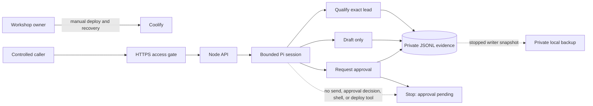

# Week 4 Controlled Release - Five-Minute Demo

Use text only. Do not show private URLs, credentials, run IDs, approval IDs,
full drafts, provider responses, or raw logs.

## 0:00-0:40 - Problem And User

An agency operator needs a useful first follow-up for one known lead without an
agent inventing facts or sending on its own. Submit the committed synthetic
fixture `lead_ada`. Explain that success means a grounded qualification, one
draft, one pending human approval, and a visible stop.

## 0:40-1:30 - Bounded Architecture



Say plainly: Pi proposes model actions; application code validates the lead,
permissions, approval, and evidence; the workshop owner controls Coolify.

## 1:30-2:20 - Happy Path And Parity

Show the redacted facts, not the response body:

- local and deployed HTTP result: 200;
- qualification: strong fit at 0.85 confidence, with the same three validated
  reasons and the same two missing-information fields;
- exactly one draft and one pending approval;
- business events: `run.started` -> `qualification.attempted` ->
  `qualification.completed` -> `domain.follow_up_drafted` ->
  `approval.requested` -> `run.completed`;
- stop: `approval_pending`; output: no message was sent;
- safe report: `waiting_for_approval`, `observed_only`.

The draft check proves one validated exact-lead draft on each side, not
byte-identical model wording. Full draft text and hashes stay private.

The local request measured 24,831 ms, 6,038 input tokens, 486 output tokens,
and USD 0.04477. The deployed request measured 10,768 ms; its report confirmed
token and cost data were available, but the numeric values were not copied out
of the private target log. These are two smoke observations, not an SLA.

## 2:20-3:20 - Failure And Recovery

The historical provider failure stopped reproducing, so the drill used a
well-formed nonexistent source revision. Coolify rejected it in 3,422 ms before
replacing the healthy container or changing the volume. The owner then deployed
the saved full revision without a forced rebuild. Recovery took 67,550 ms and
proved package version, health, prior pending approval, and a fresh no-send
smoke. Automatic deploy is now off.

## 3:20-4:10 - Restore And Eval Gate

A stopped-writer snapshot was copied to the private workstation. Restoring 2
files, 64 records, and 44,018 bytes took 227 ms; restore plus local health took
1,486 ms. Checksums and private modes matched and the source remained unchanged.

Run or show the final summary from:

```bash
npm run verify
```

The gate includes formatting, lint, strict types, all deterministic tests, and
all 18 production evals. Any critical mismatch exits non-zero.

## 4:10-5:00 - Limits And Next Improvement

This is a controlled synthetic workshop, not public production. It has no
public caller identity, tenant isolation, public human-decision route, real-data
lifecycle, real send, multi-replica persistence, automated remote backup, or
external on-call delivery.

Next, run the required Phase 04 typed-handoff experiment. Keep the extra
component only if measured success, safety, latency, cost, explainability, and
operating complexity improve over this single-agent baseline.
