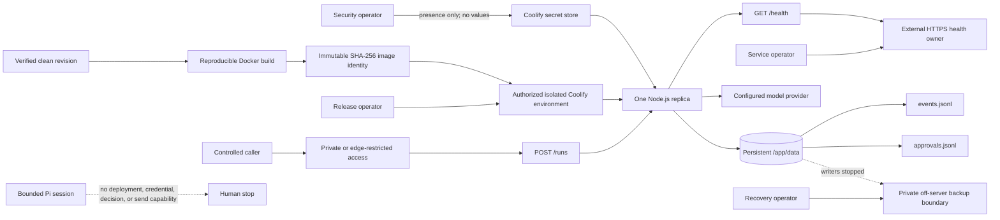

# Controlled Release Contract

## Current Verdict

Repository policy: implemented and locally testable.

Coolify target readiness: **READY** with all 15 checks passing against the
authorized controlled workshop target. Direct evidence proves controlled
exposure, target authorization, exact source and image, bounded runtime,
operator decisions, provider secret ownership, isolation, persistence, health,
monitoring, workstation backup ownership, incident ownership, and rollback
reservation. This document does not authorize another target mutation.

The default release posture is controlled:

- `/health` may be checked externally over HTTPS;
- `/runs` remains private or edge-restricted;
- one replica owns the current append-only file boundary;
- only committed synthetic fixtures may be used;
- provider and platform credentials stay in the authorized secret store;
- deployment, secret rotation, restore activation, and rollback remain
  operator actions outside Pi.

## System And Trust Map



No hostname, address, registry path, Coolify identifier, operator name,
credential, or provider response belongs in repository evidence.

## Preflight Command

The command accepts exactly one JSON object on stdin, no arguments, and at most
64 KiB:

```bash
npm run preflight:release < redacted-release-evidence.json
```

Exit codes:

| Exit | Meaning | Output |
|------|---------|--------|
| 0 | All policy and target-readiness checks pass | One closed result on stdout |
| 1 | Input is valid but one or more checks are blocked | One closed result on stdout |
| 2 | Command or input contract is invalid | One canonical failure on stderr |

The output contains only the exposure mode, source revision, optional image
digest, fixed check identifiers/statuses/reasons, and `targetMutationAllowed:
false`. It never echoes the request. A ready result permits the separately
authorized Session 06 workflow to begin; it does not deploy anything.

The checked-in
[`release-preflight-incomplete.json`](../fixtures/release-preflight-incomplete.json)
is intentionally blocked. It documents the finite shape without impersonating
source verification, an image build, operator confirmation, or target evidence.

The checked-in
[`release-preflight-current-target.json`](../fixtures/release-preflight-current-target.json)
is the current redacted target snapshot. It records only the reviewed revision,
immutable image digest, finite booleans and enums, and no target address,
Coolify identifier, credential, operator name, or arbitrary console output. It
exits zero only because every operator-owned workshop prerequisite was directly
confirmed or exercised.

## Infrastructure Decision Record

The input must contain these exact entries in order. Roles identify a duty, not
a person. Evidence slots identify a fixed Week 4 section, not a path or URL.

| Decision | Responsible role | Validation method | Evidence slot | Required fact |
|----------|------------------|-------------------|---------------|---------------|
| Capacity | `release_operator` | Target console | `infrastructure.capacity` | CPU, memory, and disk fit the measured single-replica envelope |
| Region and data location | `security_operator` | Lifecycle review | `infrastructure.location` | Selected location matches the synthetic-only and future governance boundary |
| Non-root administration | `security_operator` | Access review | `infrastructure.administration` | Routine administration does not depend on shared root access |
| SSH and firewall | `security_operator` | Access review | `infrastructure.network` | Key-based access and minimal inbound ports are confirmed |
| DNS and HTTPS | `platform_operator` | External check | `infrastructure.https` | Ownership and certificate path are assigned without recording the domain |
| Coolify access | `security_operator` | Access review | `infrastructure.coolify_access` | Authorized roles and revocation path are confirmed |
| Environment isolation | `platform_operator` | Target console | `infrastructure.environment` | The project/environment does not share an unreviewed client boundary |
| Secret rotation and revocation | `security_operator` | Secret-store review | `infrastructure.secrets` | Presence, owner, rotation, and revocation are confirmed without reading values |
| Data retention | `security_operator` | Lifecycle review | `infrastructure.lifecycle` | Synthetic-only, retention, reset, and backup handling remain explicit |
| Off-server backup | `recovery_operator` | Restore-plan review | `infrastructure.backup` | Destination, schedule, retention, owner, and exercise cadence are assigned |
| Monitoring and alerts | `service_operator` | Monitoring review | `infrastructure.monitoring` | Health and Task `06` alert ownership are assigned |
| Pause and recovery | `service_operator` | Runbook review | `infrastructure.incident` | Pause, inspect, retry/resume, escalation, and stop owners are assigned |
| Update and rollback | `release_operator` | Rollback-plan review | `infrastructure.rollback` | Update approval and last-verified-image rollback ownership are assigned |

Any missing, reordered, remapped, or unconfirmed entry blocks
`decisions_confirmed`.

## Pre-Public Security Matrix

The process-wide application rate gate is capacity protection only. HTTPS,
dashboard reachability, or a healthy container is not caller authentication.

| Gate | Controlled `/runs` evidence | Public `/runs` evidence |
|------|-----------------------------|-------------------------|
| Authentication | Route not exposed beyond the controlled boundary | Directly confirmed |
| Authorization | Route not exposed beyond the controlled boundary | Directly confirmed |
| Tenant isolation | Route not exposed; synthetic single-workspace use only | Directly confirmed |
| Trusted proxy identity | Application trusts no forwarding header | Directly confirmed |
| Shared principal-aware rate | Route not exposed; process limiter remains capacity-only | Directly confirmed |
| Body-size controls | Application limit is exactly 16,384 bytes | Application and edge controls directly confirmed |
| Human decisions | No public approval-decision endpoint | Authorized durable human boundary directly confirmed |
| Data lifecycle | Synthetic-only manual lifecycle remains enforced | Full collection, retention, export, erasure, backup, and transfer controls confirmed |
| WAF and edge | Private route, or confirmed edge restriction | Public edge policy directly confirmed |
| Alert delivery | Local rules and runbook only | Deployed delivery and response ownership directly confirmed |

For controlled mode, `/runs=public` is always blocked. For public mode,
anything except `confirmed` for all ten gates is blocked. This validates a
hypothetical contract only; the current application is not public-ready.

## Exact Runtime Contract

| Item | Required value or evidence | Why |
|------|----------------------------|-----|
| Source revision | Full lowercase 40-character Git revision | Ties review and build to one source identity |
| Working tree | Clean | Prevents unreviewed build input |
| Repository verification | Passed | Requires format, lint, strict types, tests, and eval gate |
| Critical evals | 18/18 | No critical case may be waived |
| Incident drills | 5/5 | Release uses the proved recovery boundary |
| Image | Recorded `sha256:` digest | Tags and source names are mutable |
| Container port | 3000 | Matches Docker and health contracts |
| Replicas | 1 | JSONL stores and process rate state are single-process |
| Data mount | `/app/data` | Matches the declared persistent volume |
| Event path | `/app/data/events.jsonl` | Required durable run evidence |
| Approval path | `/app/data/approvals.jsonl` | Required approval authority |
| Request body | 16,384 bytes | Matches application admission control |
| Run bounds | Deadline and step limits configured | Prevents unbounded sessions |
| Rate bound | Process limit configured | Retains capacity control without claiming abuse protection |
| Secrets | Coolify secret store, no submitted values | Keeps credentials out of evidence and images |

Changing a path, adding a replica, or omitting a bound blocks
`runtime_bounded`; it is not normalized to a safe-looking default.

## Target Readiness Checks

All of these must be directly confirmed for the selected target:

1. target authorization;
2. isolated environment;
3. persistent storage configuration;
4. external health-check ownership;
5. monitoring configuration;
6. private off-server backup ownership;
7. pause ownership;
8. recovery ownership; and
9. a reserved last-verified rollback image.

Secret readiness additionally requires the platform secret store, provider
credential presence, and rotation/revocation procedures. Presence is a boolean
attestation; the preflight has no field for a credential or secret name.

## Operator Workflow

1. Select one reviewed clean revision and run the complete repository gate.
2. Build from the committed Dockerfile and record only the immutable digest.
3. Complete the decision record using authorized platform views, keeping all
   private values outside the request and repository.
4. Select `controlled` exposure unless the complete public security matrix has
   direct evidence. Keep `/runs` private or edge-restricted.
5. Confirm the exact one-replica runtime, paths, storage, and secret boundary.
6. Confirm target, health, monitoring, backup, incident, and rollback ownership.
7. Pipe the redacted JSON request to the preflight command.
8. If any check is blocked, stop before target mutation and resolve only through
   the responsible operator role. Do not edit output or infer a pass.
9. If every check passes, preserve the minimized result and begin Session 06
   through the authorized Coolify operator boundary.

## Unsupported Claims And Remaining Risk

The current direct evidence does not prove:

- a restored backup activated as a running service or a completed rollback;
- deployed alert delivery or an external on-call service beyond the workshop
  owner's direct responsibility;
- public authentication, authorization, tenant isolation, shared quota, or a
  production-grade WAF policy;
- multi-replica safety, real-data governance, a public human-decision path, or a
  real external effect.

Those claims require direct redacted evidence in Sessions 07 and 08. Until
then, the production infrastructure exceptions and cumulative security
findings remain open.
