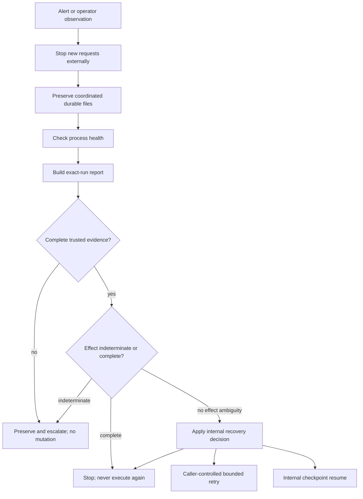

# Agent Incident Response

## Scope And Safety Boundary

Use this runbook for the repository's controlled synthetic-data agent. It
covers the local health check, exact-run report, deterministic alert results,
and the internal recovery decisions proven by tests. It does not establish a
production on-call rotation, response SLA, alert delivery service, pause
endpoint, approval interface, recovery CLI, compensation executor, or real
external-effect recovery.

Do not paste credentials, provider auth state, private URLs, filesystem paths,
full event records, lead attributes, draft content, approval records, or effect
receipts into tickets or chat. Do not manually edit JSONL evidence.

## First Response

1. Pause intake outside the application. Restrict access to `/runs` or stop the
   process/container. There is no application pause endpoint.
2. Preserve the event, approval, and fake-result files and the exact `runId`
   before changing runtime state. Stop all writers before taking a snapshot.
3. Do not automatically retry. In particular, never retry a reservation-only,
   attempted, or otherwise indeterminate effect.
4. Inspect process health, then reconstruct the one affected run through the
   read-only report.
5. Follow the recovery decision returned from complete durable evidence. If
   evidence is corrupt, incomplete after an attempted effect, cross-run,
   duplicated, conflicting, or authority-mismatched, preserve and escalate.



## Inspect

### Process Health

```bash
curl --fail http://127.0.0.1:3000/health
```

An HTTP 200 response with `{"status":"ok"}` proves only that the process can
serve this lightweight endpoint. It does not prove provider availability,
persistence, approval authority, or recovery safety.

### One Exact Run

Run the report against a preserved event-log copy or a stopped-writer source:

```bash
npm run report:run -- \
  --run-id <exact-run-id> \
  --event-log <operator-controlled-event-log> \
  --format text
```

Use `--format json` for a machine-readable form. The report validates the
complete JSONL history and semantic projection before success, is bounded to
1,000 events, and does not write. Any `corrupt_evidence`, `invalid_run_history`,
`run_not_found`, or evidence-limit refusal is an escalation condition, not a
reason to parse or repair records manually.

### Repository Gate

```bash
npm run verify
npm audit --audit-level=low
```

These commands separate deterministic source/dependency failures from runtime
and provider failures. They do not diagnose a particular deployed process.

## Alert Interpretation

`src/alerts.ts` evaluates a caller-supplied, minimized observation window. It is
a pure library: there is no scheduler, notification provider, webhook, pager,
HTTP route, Pi tool, or background worker. `suppressed` remains visible trigger
evidence; it means only that the configured cooldown has not elapsed.

| Rule | Default trigger | Severity | Evidence | Suppression | Safe operator action |
|------|-----------------|----------|----------|-------------|----------------------|
| Repeated task failure | 3 failed/stopped runs in the window | Warning | Run outcome count | 5 minutes | Inspect exact run reports |
| Stuck run | Running/pending duration at least 5 minutes | Critical | Maximum run duration | 5 minutes | Stop new requests and inspect the run |
| Dangerous permission attempt | 1 forbidden/denied tool decision | Critical | Permission-decision count | 15 minutes | Preserve evidence and escalate |
| Cost spike | Available model cost sum at least USD 5 | Warning | Model-cost sum | 15 minutes | Stop new requests and inspect usage |
| Unavailable dependency | 2 unavailable dependency samples | Critical | Dependency-state count | 5 minutes | Inspect the dependency |
| Storage pressure | Utilization at least 85% | Critical | Maximum used/capacity ratio | 15 minutes | Stop new requests and inspect storage |
| Queue pressure | Depth at least 100 | Warning | Maximum queue depth | 5 minutes | Inspect the queue |

The current application has no queue, so queue pressure is
`not_applicable:queue_not_configured`. Required but missing observations or
measurements return `unavailable`; they never silently become clear. Successful
retries do not count as repeated task failures, even when `retryCount` is
nonzero. A denied dangerous permission remains either `triggered` or
`suppressed`, never erased.

## Recovery Actions

The recovery application is an internal library. It has no operator-facing
HTTP endpoint, Pi tool, or CLI. The table below describes what an authorized
application integration may do after preserving and validating all coordinated
stores; it is not a command surface.

| Action | When it is safe | Implemented behavior | Operator rule |
|--------|-----------------|----------------------|---------------|
| Pause | Before inspection or when critical evidence is unsafe | No in-app pause; access/process/container control is external | Stop new requests outside the app and preserve evidence |
| Inspect | For every incident with a `runId` | Read-only exact-run report | Use the report command; never grep and infer authority from raw records |
| Retry | Canonical transient storage/event storage refusal, or `qualification_incomplete`, with no known effect | Returns `action: retry`; no automatic worker invokes it | Retry only through the bounded original application path after the cause is resolved |
| Resume | Trusted qualification, draft, or pending-approval checkpoint with exact cross-store identity and no effect ambiguity | Internal `RecoveryApplication.recover` resumes synchronously under the same `runId` | No operator transport exists; use only an authorized application integration |
| Compensate | Only a verified completed effect plus an explicit operator plan | Unsupported; policy says `supported: false` and fake results say `manual_review_required` | Do not compensate automatically or manufacture a result |
| Escalate | Corrupt/interrupted/duplicate/conflicting evidence, authority mismatch, open qualification attempt, missing exact draft, or indeterminate effect | Returns `action: escalate` without repairing evidence | Preserve all coordinated files and report only redacted categories |
| Stop | Failed/incompatible terminal, invalid request, not-found/failed qualification, or verified completed effect | Returns `action: stop` and does not reopen the run | Perform no further run, approval, or effect mutation |

### Exact No-Retry Rules

Never retry or re-execute when any of these is true:

- the fake-result authority contains only a reservation;
- an effect was attempted but no matching durable completion proves its result;
- the event view and approval/effect authority disagree;
- evidence is corrupt, interrupted, duplicated, out of order, conflicting, or
  cross-run;
- a completed effect result already exists; or
- a late provider result arrives after the application-owned terminal won.

Reservation-only and attempted-without-result states are
`effect_indeterminate`: preserve and escalate. A durable completed result is
`effect_completed`: stop and return to the existing authority. Neither state
permits another approval or adapter invocation.

### Exact Escalation Rules

Escalate with zero durable mutation when:

- an exact-run report cannot validate the whole history;
- approval or effect authority cannot be matched exactly to projected events;
- a qualification attempt is open and therefore indeterminate;
- required replaceable draft content is absent or does not match its durable
  SHA-256 evidence;
- an unavailable required measurement prevents safe alert classification; or
- a credential, private endpoint, or secret may have been exposed.

For a suspected vulnerability or credential exposure, follow
[SECURITY.md](../../SECURITY.md) and rotate credentials through the owning
provider. Do not include the secret in the report.

## Common Failure Paths

| Observation | Classification | Response |
|-------------|----------------|----------|
| `/health` fails | Process/container unavailable | Preserve storage, inspect platform/process logs, restart only after evidence is safe |
| `deadline_exceeded` | Whole-run deadline won | Inspect the last step; ignore late provider output |
| `step_limit_exceeded` | Model/tool start budget reached | Inspect step sequence; do not raise the bound without review |
| `dependency_failed` | Session, prompt, provider, lifecycle, or application boundary failed | Inspect canonical category; do not infer success |
| `approval_pending` | Human decision required | Stop; no approval-decision interface exists |
| `effect_indeterminate` | Reservation/attempt without trustworthy completion | Preserve and escalate; never retry or compensate |
| `effect_completed` | Durable fake result proves prior completion | Stop; never execute again |
| Structural/authority mismatch | Durable sources disagree | Preserve and escalate; no manual repair |
| Snapshot/checksum refusal | Backup evidence untrusted | Keep source and snapshot separate; do not activate |

## Incident Record

Record only the revision, environment category, exact `runId` when available,
alert rule/status/severity, report stop reason, finite error category, commands
run, and their redacted outcomes. Production ownership, alert delivery, and
response timing remain deployment decisions for later Phase 03 sessions.

## Synthetic Drill Command

Run the five fixed provider-independent incident exercises with:

```bash
npm run drill:incidents
```

The command accepts no arguments. It executes the predeclared tool-timeout,
invalid-model, restart, credential-unavailable, and duplicate-request cases in
isolated temporary directories. Each case must pass its existing production
eval score, safe exact-run report, default alert decision, and runbook action.
It emits one minimized JSON suite and removes the temporary evidence before
returning. A successful synthetic drill does not prove a live provider,
deployment, production on-call, external alert, or operator transport.

The duplicate drill illustrates the authority boundary: the event-only report
remains `effect_indeterminate`, while separate minimized effect-authority
evidence proves one total fake effect and the duplicate result. Never reinterpret
the observed-only report as completed effect authority.

The broader service, backup, and credential guide remains at
[Incident Response](incident-response.md).
