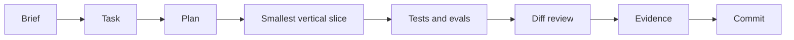

# Workshop Path

This repository is both a completed bounded reference and a set of progressive agent-engineering tasks.

## How to Use It

1. Fork the repository.
2. Run `npm ci` and `npm run verify`.
3. Read `docs/todo/client-brief.md`, `AGENTS.md`, and the governance files it links.
4. Read `docs/todo/README_todo.md` and complete the numbered files in order.
5. Work on one task at a time and use Plan mode for non-trivial changes.
6. Invoke `$verify-production-agent` before declaring a task complete.
7. Record observable evidence in the
   [active weekly Build Log](../todo/README_todo.md#build-logs) and commit it
   with the change.

## Suggested Prompt

```text
Goal: Complete docs/todo/01-qualification-contract.md.
Context: Read AGENTS.md, docs/todo/client-brief.md, docs/todo/README_todo.md, the active task, and relevant source and test files.
Constraints: Work on this task only. Preserve the tool allowlist and approval boundary. Do not read secrets.
Done when: The acceptance criteria are demonstrated and $verify-production-agent passes.
```

## Learning Loop



The tasks move from understanding to typed behavior, durable approval, controlled writes, recovery, evals, observability, deployment, and a required evidence-based handoff experiment.

## Five-Week Schedule

| Week | Tasks | Outcome |
|------|-------|---------|
| 1 | `#00` System map, `#01` Qualification contract | Understand the boundaries and add explicit qualification |
| 2 | `#02` Durable approvals, `#03` Idempotent send | Build a real human gate and safe write boundary |
| 3 | `#04` Recovery and replay, `#05` Production evals | Make runs resumable and critical behavior measurable |
| 4 | `#06` Observability and incidents, `#07` Coolify release | Diagnose, recover, deploy, restart, and roll back |
| 5 | `#08` Typed handoff experiment | Complete the comparison and keep added orchestration only when evidence justifies it |

## Getting Support

Use the weekly Skool support thread or open a dedicated topic. Start every question with the support tag from the active task:

```text
[W2][#03] Duplicate send test returns a new result
```

Include:

1. your goal;
2. what you expected;
3. what happened;
4. the exact command or failing eval;
5. the smallest relevant code or event excerpt;
6. what you already tried.

Never paste API keys, `.env` contents, Pi auth files, customer data, private URLs, or complete production logs.
